# 01 Introduction to Linux, GACRAC, and AFNI

## Introduction to Linux

Linux is an operating system similar to Windows or macOS, but unlike the latter, Linux does not rely on a graphical interface. This means all operations need to be performed through the terminal using commands. For example, if you want to navigate into a folder, on a Windows system, you can simply click on it. However, in Linux, you would need to use the `cd` command to achieve the same task. If you’re not familiar with Windows or command-line tools, you might find Linux a bit challenging at first. But once you get the hang of it, you’ll discover that Linux is extremely efficient and well-suited for work, especially in programming, server management, and other technical tasks.


## Syntax

Here are some common Linux commands. My suggestion is to practice them frequently... If you have other needs but are unsure how to achieve them, you can search online for more information. This is a good resource to [get start](https://andysbrainbook.readthedocs.io/en/latest/unix/Unix_Intro.html).

### Useful Command

`*` is a wildcard, and it is used to represent zero or more characters in file and directory names.

`Ctrl + Shift + C` : copy

`Ctrl + Shift + V` : paste

`Ctrl+U`: delete the current line of the syntax

`Ctrl+L` or `clear`: clean up the terminal

`Ctrl+C` : cancel or terminate your command

**Path Related Syntax**

```bash
cd # enter directory
cd - # switch to the previous directory
cd ~ # go back to the home directory
cd ..   # go to the parent directory
cd ../  # go to the parent directory (same as cd ..)
cd ../../  # go two levels up

pwd # print working directory

pushd  # save current directory on stack and switch to another directory
popd  # return to the previous directory from stack
```

**Create, move, find, delete file or folder**

```bash
mv folder_or_file ../  # move file/folder to parent directory
mv folder_or_file /another_path/  # move file/folder to another path
mv file1 file2 # rename file1 to file2 in the same directory
mv file1 /path/file2 # move file1 to the documents directory and rename it to file2

mkdir folder # create folder in current path
mkdir -p dir1/dir2/dir3 # Creates the directory structure dir1/dir2/dir3

cp file_or_folder /path/  # copy file/folder to the specified path
cp file1 file2 # copy file1 to file2. If file2 exists, it will be overwritten
cp file1 file2 /path/ # copy multiple files to a directory
cp -r dir1/ /path/ # copy a directory and its contents recursively
cp -i file1 file2 # copy a file and prompt before overwriting, check if the file2 already exists
cp file . # copy file to your current directory

ls # list all files
ls -aR /path/to/folder # list all files and folders, and the files in the sub-folder

find /path/to/folder # find all files in the path
find /path/to/folder -type d # only show folders
find /path/to/folder -type f # only show files
find a* # find all files in the current directory that start with 'a'

# Very dangerous! Use with caution:
rm some_file # delete a specific file
rm junk* # delete all files that start with 'junk' in the current directory
rm -rf folder # recursively and forcefully delete a folder and its contents

touch file # create new file
rmdir folder # Delete empty folders
```

### Statement

```bash
# Note that the syntax for assignment may vary between different environments, such as bash and tcsh
sub=sub01
# use `$` to extract variable
echo $sub

# for loop to create folder
# `-w` ensures that the returned file names have the same length, such as 01, 02, ... 11, 12
for i in $(seq -w 1 12) 
do
  mkdir sub$i
done

# if statement to determine if a file exists
if [[ -e sub01 ]]; then
echo "sub01 already exists" # echo is similar to print() in bash
else
mkdir sub01
fi
```

### Permission

When you work in a high-performance computing (HPC) environment with multiple users, you may need to **grant permissions** to allow others to access your files or folders. Permissions determine who can read, write, or execute a file.

In Linux, you can modify the permissions using the `chmod` (change mode) command. After changing the permissions, the file or directory may be highlighted in **green** when listed with commands like `ls` (depending on your terminal settings). This often indicates that the file has executable permissions or has been modified recently.

**Key Permissions:**

- **Read (r)**: Allows viewing the content of a file.
- **Write (w)**: Allows modifying the content of a file.
- **Execute (x)**: Allows executing a file as a program or script.

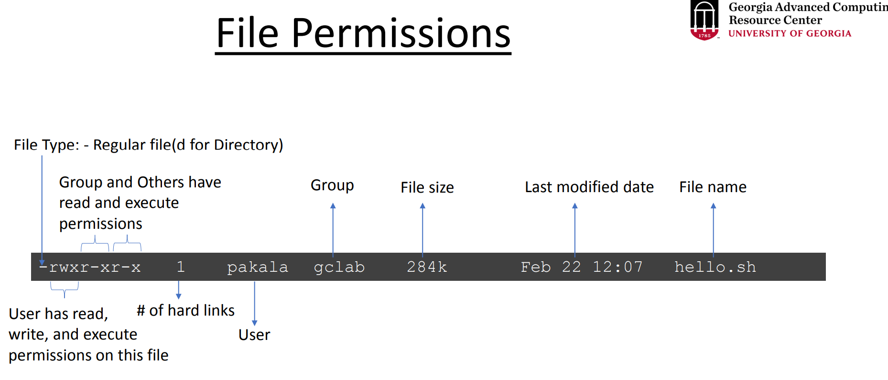

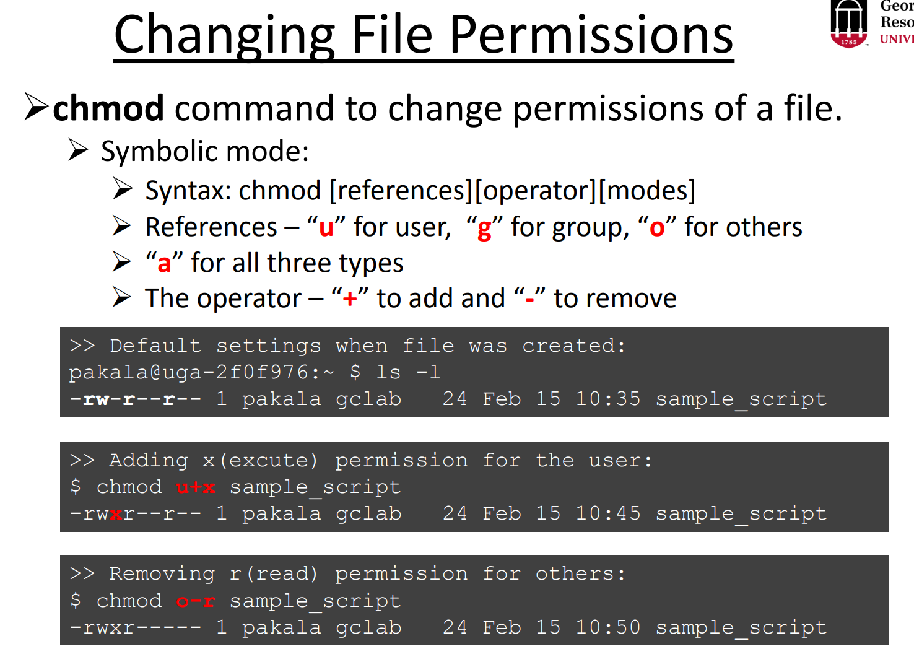

```bash
# list files and directories in a detailed (long) format, including permissions, ownership, file size, and date
ls -l

# give execute permission to the group
chmod g+x file_folder

# give read, write, and execute permission to the group (all files in the directory)
chmod -R g+x file_folder/

# give all permission of the file or folder to other people (maybe everyone)
chmod -R 777 file_folder
```

## Resource

GACRAC provides free training on Linux:

https://wiki.gacrc.uga.edu/wiki/Training#Linux_Training_for_New_Cluster_Users

https://kaltura.uga.edu/playlist/dedicated/176125031/1_uwkiealj/1_81u2kfi2


# Introduction to [GACRAC](https://gacrc.uga.edu/)

Simply put, GACRAC functions as a remote supercomputer where you submit tasks ([jobs](https://wiki.gacrc.uga.edu/wiki/OnDemand#Jobs)), and high-performance computing (HPC) resources process them for you.

- [Clusters](https://wiki.gacrc.uga.edu/wiki/OnDemand#Clusters) are equivalent to accessing a remote Linux environment, primarily through the command line (similar to using the Ubuntu Terminal).
- To get access to HPC, you will need to log in to [Sapelo2](https://wiki.gacrc.uga.edu/wiki/Connecting#Connecting_to_Sapelo2) by using PUTTY (or other tools) or [OnDemand](https://wiki.gacrc.uga.edu/wiki/OnDemand).
    - **VPN** is needed to connect to Sapelo2 from off-campus (outside the UGA main campus).
    - No matter what, you'll eventually log in through the terminal. Even if you're using OnDemand, this is still true because OnDemand is essentially a web-based GUI interface, but it allows you to open a terminal window within it.
    - [Interactive Apps](https://wiki.gacrc.uga.edu/wiki/OnDemand#My_Interactive_Sessions), act as a graphical user interface (GUI), like an Xfce desktop environment, allowing you to use applications through a graphical interface rather than the command line.
- Some command: [https://wiki.gacrc.uga.edu/wiki/Quick_Reference_Guide#Slurm](https://wiki.gacrc.uga.edu/wiki/Quick_Reference_Guide#Slurm)

## [Work Place](https://wiki.gacrc.uga.edu/wiki/Disk_Storage)

- **Home Storage**
    - Your own workspace, you can do whatever you want in this space. However, it is important to note the storage space here is very limited, so it is best to store “permanent” files, such as your scripts.
- **Work Storage**
    - A shared space for the lab, so that you can work together with your team. I don’t recommend processing data here, as any errors in your script could potentially mess things up. Instead, I suggest storing the already processed data here.
- **Scratch Storage**
    - Again, it's a workspace, but the storage is temporary (30 days). You can work with the data on it, but remember to export the results to your lab， project, or personal workspace.
- **Project Storage**
    - It is a separate storage system: you **cannot** use `cd` to enter the `/project/*` folder. You need to use GLOBUS to transfer data.

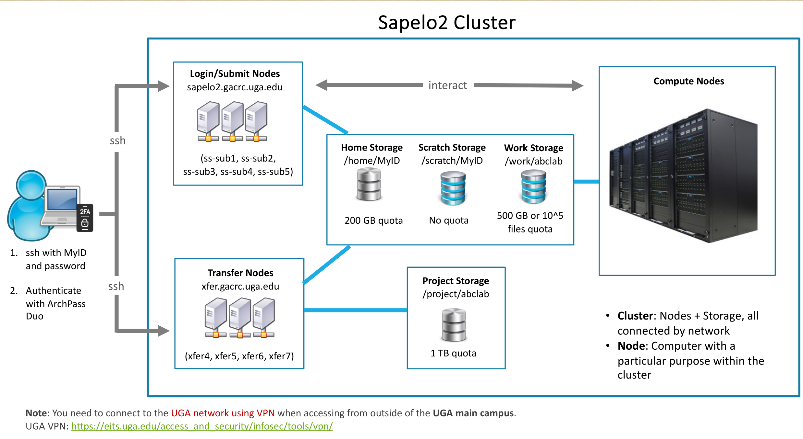

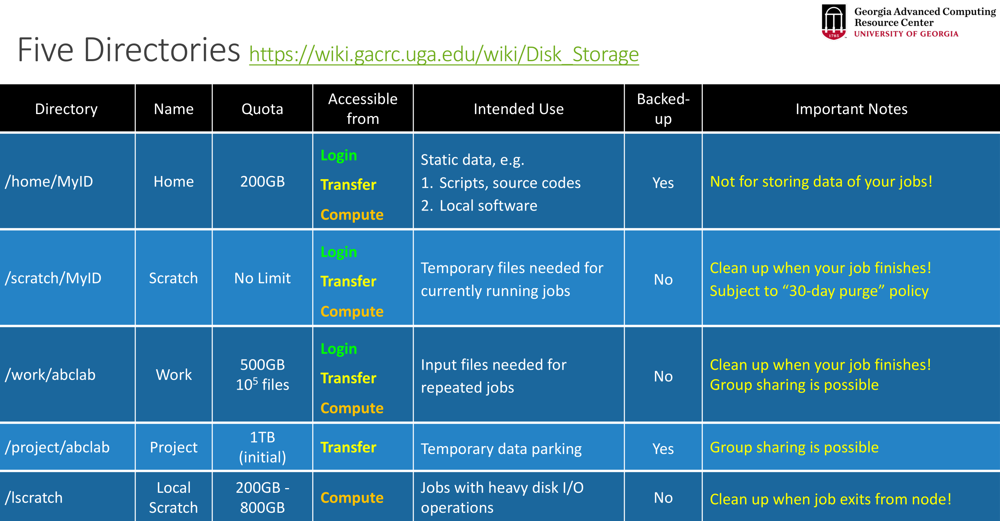

## [OnDemand](https://wiki.gacrc.uga.edu/wiki/OnDemand) System

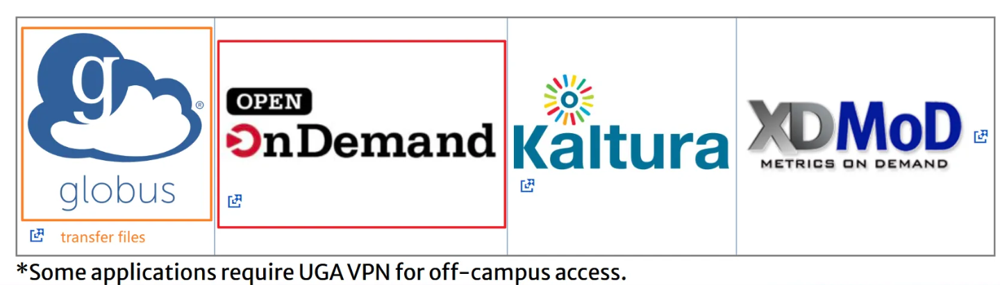

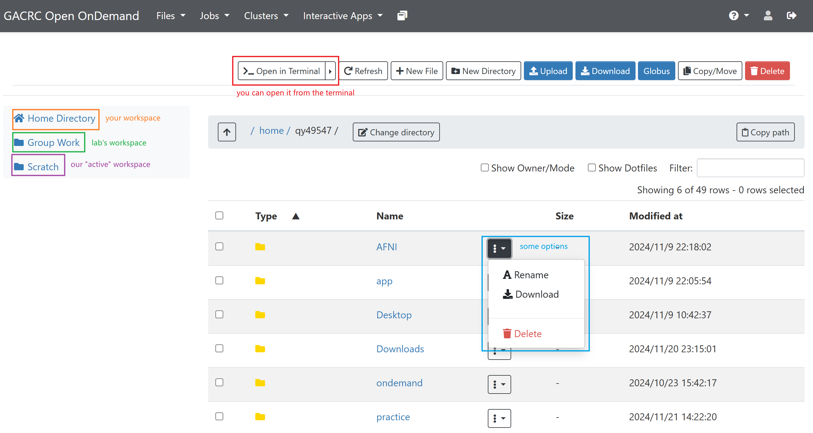

## Open X Desktop

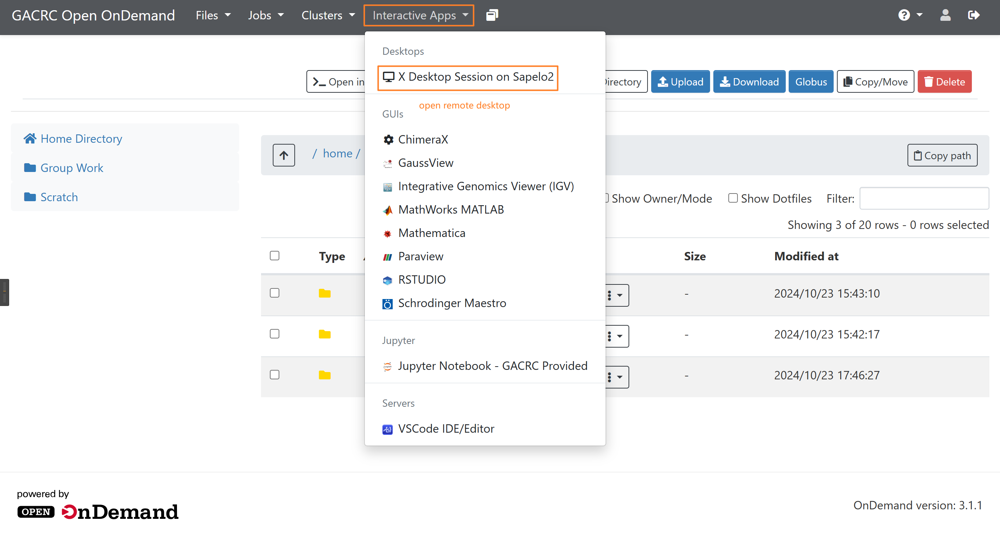

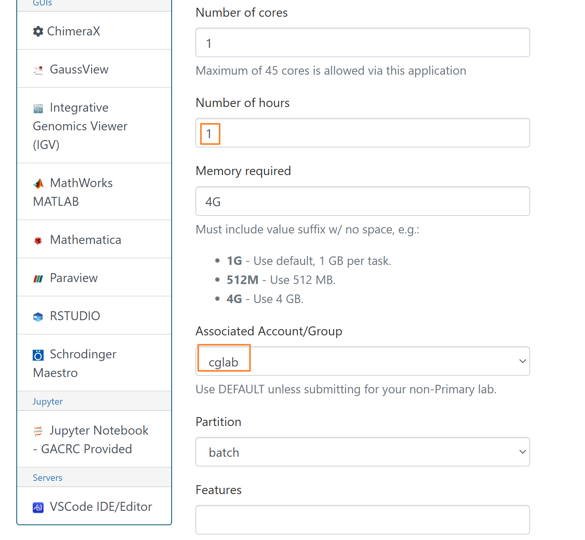

Then click launch

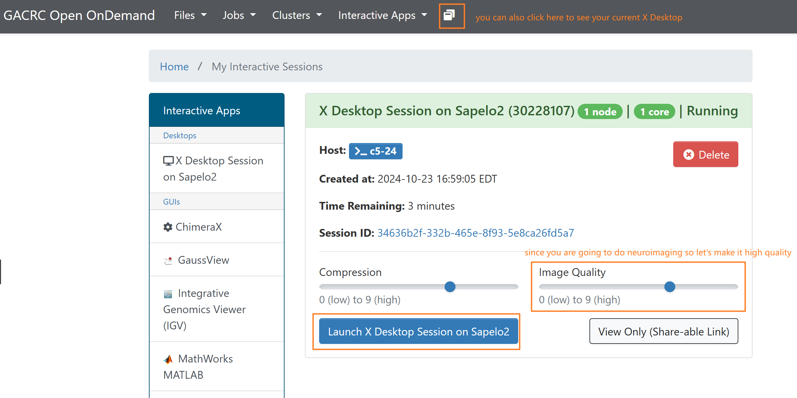

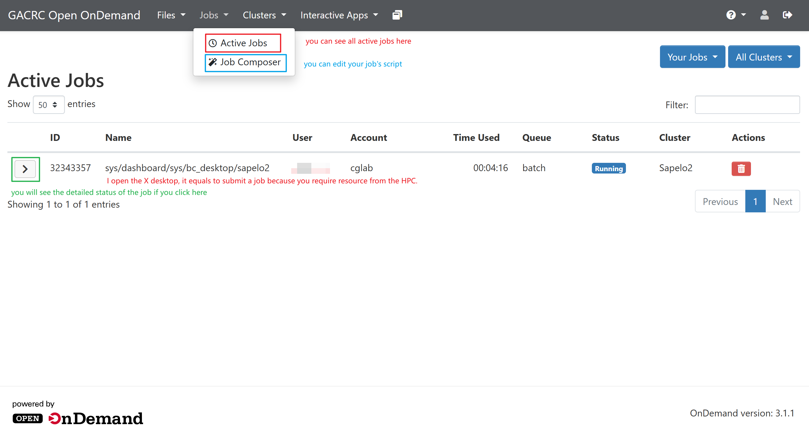

# Introduction to [AFNI](https://afni.nimh.nih.gov/)

AFNI is an open-source and free software that must be run in a Linux environment. Compared to other software, the great thing about AFNI is that all operations are essentially script-based, which requires you to be comfortable writing code or calling scripts. But because AFNI is completely script-based, you don't need to do any additional manual work once you've scripted the implementation of the pipeline. AFNI saves the results of each step, which are completely transparent and easy to access. *If you struggle with using commands or writing scripts, the first two weeks will be painful ...…*


Let's take it step by step. So far, I think the best introductory material is [**Andy’s Brain Book**](https://andysbrainbook.readthedocs.io/en/latest/AFNI/AFNI_Overview.html), followed by the official [**AFNI YouTube tutorials**](https://www.youtube.com/c/afnibootcamp) (which are very detailed and cover many topics!). Although MIT offered a series of [lectures](https://cbmm.mit.edu/afni) in 2018, this workshop is more suitable for those who are already familiar with both fMRI principles and programming, as the lectures progress very quickly. Other resources you can go to [00 fMRI Resource](00%20fMRI%20Resource%202c961e79edc8427f9bdcc45f46f0051b.md) 

The official AFNI website provides detailed explanations of the code, and it also offers a [forum](https://discuss.afni.nimh.nih.gov/) where users can ask questions and get support. You can find all the programs and topics [here](https://afni.nimh.nih.gov/pub/dist/doc/htmldoc/programs/main_toc.html). Operation for [GUI](https://afni.nimh.nih.gov/pub/dist/doc/htmldoc/afniandafni/main_toc.html).

## Open Terminal in Xfce and Load AFNI

```bash
# choose the workspace you want to go
cd /home/MyID # this is your own work space
cd /work/cglab/ # this is group work space

ml spider AFNI # find the software you want to use
ml AFNI/24.3.06-foss-2023a # Load a module into your working environment
afni # load the software. AFNI will read the file in your current path

# use afni to read some file
afni ../file name

# Show the detailed code
echo
```

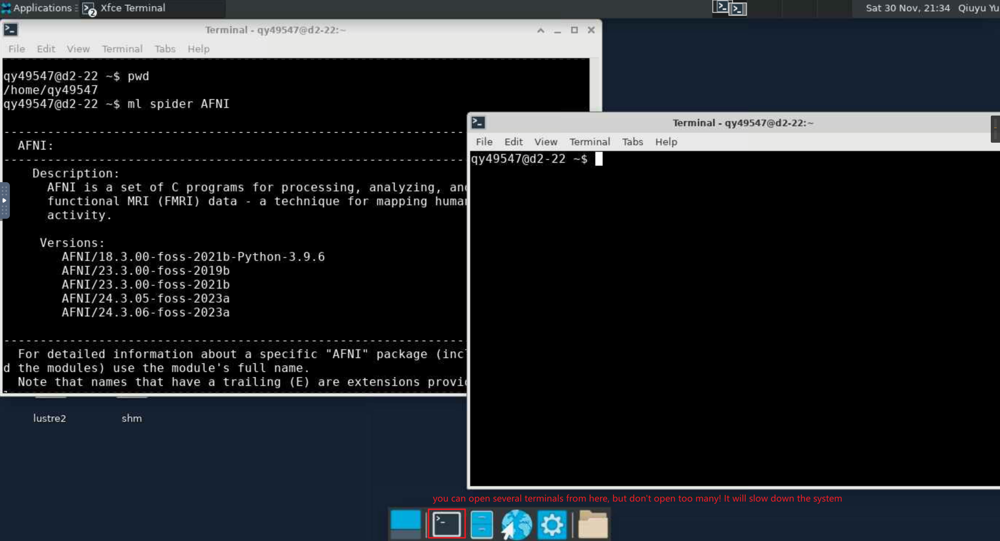

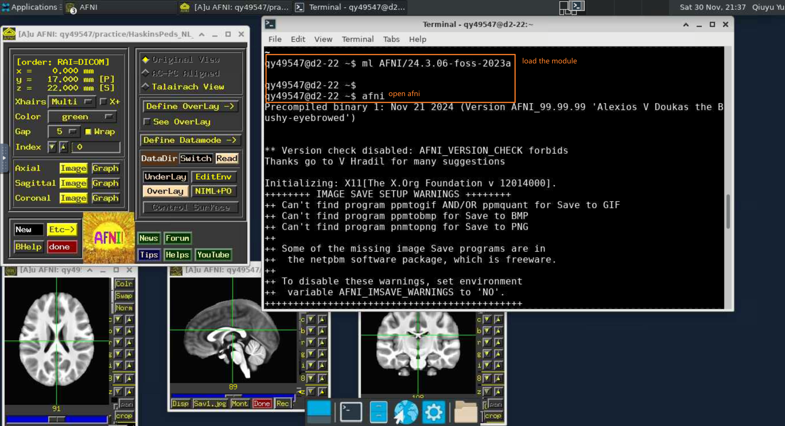

# Submit a Job

Next, I will introduce how to create and edit scripts, as well as how to optimize your script execution and reduce run time using HPC.

## Create, edit and run the Script

### From Visual Studio Code

I would suggest editing the scripts in Visual Studio Code, Jupyter, or whatever software. You can search Apps from [here](https://ondemand.gacrc.uga.edu/pun/sys/dashboard/apps/index).

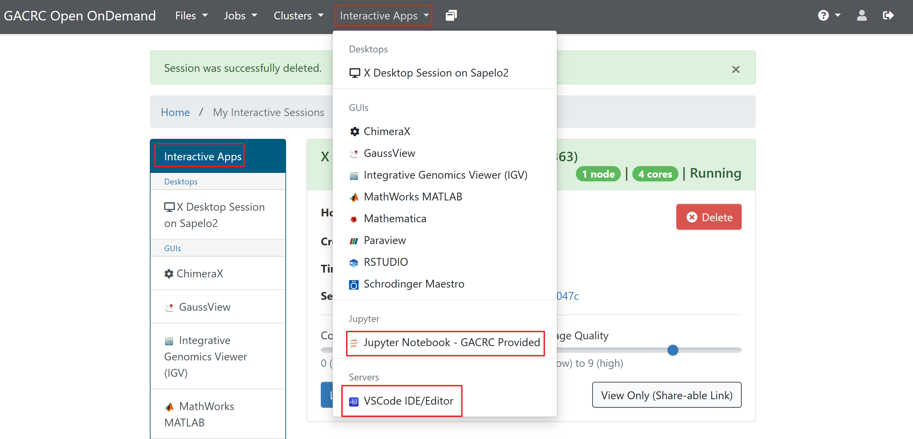

You can change the path and go to the lab workspace.

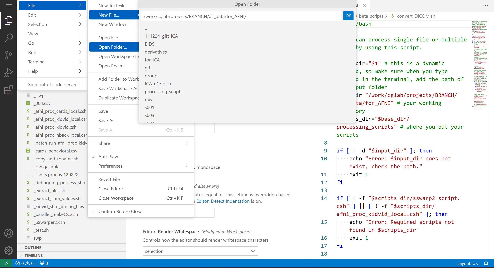


### From Terminal

If you use `nano` command: use `Ctrl+Shift+C`  and `Ctrl+Shift+V`  to copy and paste, `Ctrl+O` to save the changes, press `Y` and then press `Enter` to save your file, and finally use `Ctrl+X` to exit. `Ctrl+K` to delete the current line of code; press `Ctrl+Shift+^` to select multiple lines. Notably, the **cursor** can't be used by the mouse here, you can only use the up, down, left and right keys to move your cursor.

- `nano` is more beginner-friendly and easy to use for quick edits, whereas `vim` is a more advanced text editor that requires learning commands and modes (like Insert mode and Command mode).
- When using `nano` or `vim`, **always ensure your script has execute permissions** (using `chmod +x script.sh`) if you intend to run it directly with `./script.sh`.
- If you often face issues with DOS/Windows line endings (carriage return characters), the `dos2unix` and `mac2unix` commands are very helpful for converting files to Linux-compatible formats.

```bash
# create a new script
touch script.sh # use `touch` to create a new script
nano script.sh # create a new script, or edit this script in `nano`
chmod +x script.sh # give execute permission to the script

# convert to Dos/Windows file(script) to linux format if terminal cannot read it
dos2unix script.sh
# convert to Dos/Windows file(script) to linux format if terminal cannot read it
mac2unix script.sh

# read the script in terminal
cat script 

# run the script in the terminal
./script.sh
# if your script requires a path argument, you can add it like this
./script.sh /path/ 
```

If you use `vim` command, it will be kind of different.

```python
vim script  # edit the script in `vim`

:q  # exit the script without saving changes (if no changes are made, `vim` will exit right away)
:wq  # save changes and exit `vim`
:x  # save and exit (same as `:wq`)

# To enter insert mode in `vim`, press `i`
# To exit insert mode, press `Esc`
```

## [**Running a Job**](https://wiki.gacrc.uga.edu/wiki/Running_Jobs_on_Sapelo2#top)

There are several ways to process the data by running the script:

1. **Processing a single subject:** 
According to our pipeline, we can copy the script to the directory containing the data to be processed, and then use `cd` to navigate into the corresponding directory to run the script. However, this approach is typically suitable for processing a single subject, and it requires repeatedly entering that directory. If you want to process multiple subjects, you would need to open multiple terminals.
2. **For multiple subjects:** 
    1. Run the script from the workDir by using…. You need to enter the subjects' numeric IDs in the terminal and separate them with spaces. 
    2. To handle multiple subjects more efficiently, you can write a secondary script to run your main (or individual subject) script. In this secondary script, you can create array jobs to process multiple subjects simultaneously, which can significantly save time by allowing concurrent processing. Submitting a job from Sapelo2 requires modifying the script, but this approach is highly beneficial for parallel tasks. In essence, HPC environments like **`SLURM`** allow multiple subjects to be processed simultaneously, optimizing the overall workflow.
        1. Array jobs allow you to submit a series of similar jobs (e.g., for multiple subjects) in a batch, which can be run in parallel, making the process much faster than handling each job manually.
        2. Array jobs are commonly used in job schedulers like SLURM or PBS, where you can specify the number of tasks (one for each subject) and the job scheduler will automatically allocate resources for them to run concurrently.

### Submit and Monitor a Job

When you finish writing the script, using `sbatch` to submit it. 

```bash
# submit the job
sbatch sub.sh

# check job status
squeue --me
sq --me

# cancel a job
scancel jobID

# Check running or finished job status
sacct -X
sacct-gacrc -X
```

After processing the data, [check resource utilization](https://wiki.gacrc.uga.edu/wiki/Monitoring_Jobs_on_Sapelo2) to reduce the wastage of requested resources, for example, request less CPUs.

```bash
# Check resource usage of finished jobs
seff jobID
```

You also access it from Jobs-Active Jobs:

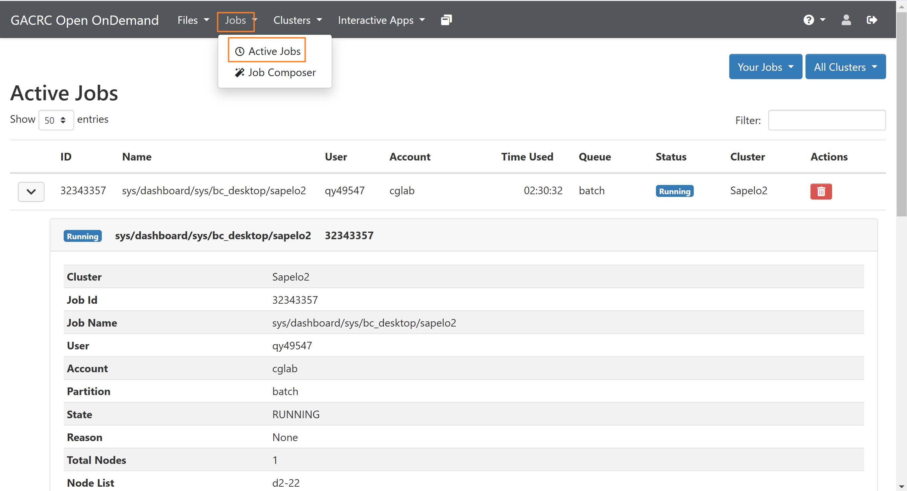

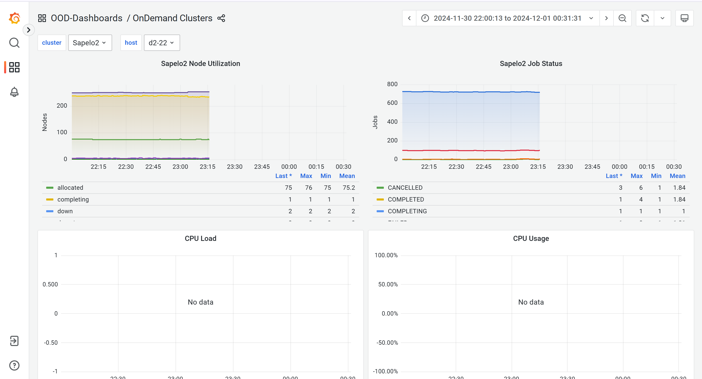

## **Task Parallelism**

**AFNI** relies heavily on [**OpenMP** rather than MPI](https://stackoverflow.com/questions/32464084/what-are-the-differences-between-mpi-and-openmp), as it is primarily single-threaded (meaning it does not directly benefit from multiple tasks or nodes). When processing a single subject, it's more efficient to use fewer tasks (perhaps just one) and allocate more CPU resources per task. However, when processing multiple subjects simultaneously, **array jobs** are a better option, as they allow you to process subjects in parallel without needing to utilize multiple nodes or tasks.

When you use a `for` loop to process multiple subjects in AFNI, the loop will process each subject **sequentially**. This means that the tasks for all subjects will be run one after another, and the system will only process one subject at a time. Even if you're running the loop on an HPC system, the tasks will still run serially, unless you explicitly set up parallelism within the loop itself (which can be complex and resource-intensive).

```bash
# list programs that use openMI in AFNI (you need to open AFNI first)
cat list_omp_compiled.txt

# require 40 CPU and 160GB memeory
interact -c 40 --mem 160gb -p batch

# load module if you use MPI, right now we probably will not use it
ml OpenMPI/4.1.4-GCC-11.3.0

# choose 1 task, every task has 40 CPUs
srun --ntasks=1 --cpus-per-task=15 --export=ALL ./sswarp2_temporary.sh
# choose 1 node, 4 task per node, every task has 20 CPUs
srun --nodes=1 --ntasks-per-node=4 --cpus-per-task=20 --export=ALL ./script

# GNU parallel
parallel ./script.csh ::: 122 041 047 057 059 065
```

**Reference:**

[https://youtu.be/bpeNBQmUlxk?si=weV8PGXLB9XhEtcc](https://youtu.be/bpeNBQmUlxk?si=weV8PGXLB9XhEtcc)

[https://discuss.afni.nimh.nih.gov/t/parallel-processing-and-use-of-multiple-cpus/3418](https://discuss.afni.nimh.nih.gov/t/parallel-processing-and-use-of-multiple-cpus/3418)

[https://discuss.afni.nimh.nih.gov/t/multiple-jobs-parallel-processing-3dqwarp/1211](https://discuss.afni.nimh.nih.gov/t/multiple-jobs-parallel-processing-3dqwarp/1211)

### Different Kinds of Jobs

- [**OpenMP (Multi-Thread) Job**](https://wiki.gacrc.uga.edu/wiki/Running_Jobs_on_Sapelo2#OpenMP_(Multi-Thread)_Job)
    - A job that uses multi-threading within a single node, leveraging multiple cores to execute tasks in parallel.
- [**MPI Job**](https://wiki.gacrc.uga.edu/wiki/Running_Jobs_on_Sapelo2#MPI_Job)
    - MPI job distributes computing across multiple nodes. Computational task runs in multiple processes on multiple nodes, using many more CPU cores
- [**Hybrid MPI/shared-memory using OpenMPI**](https://wiki.gacrc.uga.edu/wiki/Running_Jobs_on_Sapelo2#Hybrid_MPI/shared-memory_using_OpenMPI)
    - A job that combines MPI for inter-node communication and shared memory (e.g., OpenMP) for intra-node parallelism. It uses a mix of distributed and shared memory models.
- [**Array job**](https://wiki.gacrc.uga.edu/wiki/Array_Jobs)
    - A batch submission of similar jobs (e.g., one per dataset or subject), where each job is independent. The HPC scheduler assigns resources and executes the jobs in parallel.

**OpenMP** is like hiring many workers to work on the same site. They share the same tools (shared memory) and can easily communicate with each other. It’s fast but limited by the size of the site and the tools available.

**MPI** is like hiring several independent teams, each working on their own site with their own tools (independent memory). They need to communicate via radios or file transfers (message passing) to coordinate. It’s scalable but slower due to the communication overhead.

> **Tips from GACRAC Team:**
> 
> - Understand PARALLEL CAPABILITY of the software that you run in your job
>     - Can it run in a shared-memory job using multiple threads in parallel?
>     - Can it run in a distributed-memory job using multiple MPI processes in parallel, using multiple compute nodes?
>     - Have you read the documentation of the software provided by the developers for any advice on the computing resources the software can utilize to run in parallel tasks?
>     - Jobs that cannot run with multiple cores or across multiple nodes will NOT run faster if more than one core or more than one node are requested!
> - Understand PARALLEL SCALABILITY if the software is a parallel capable software
>     - Don’t start with too many cores, unless you already know that the application scales well. Do resource scaling-up by yourself.
>     - If you are running an application in a multi-threaded job using multi-cores, please test it with a low number of cores, then increase the number of cores to see how well the application parallelizes (can be approximately tested by dividing the CPU time by the wall-clock runtime (job elapsed time), sacct-gacrc -X -j <jobID>).
>     - The optimal number of cores depends on the application and the data size. You should not assume that a multi-threaded job will always run faster with more cores, as that is sometimes not the case.

# Set up Environment

```bash
qy49547@c5-10 091.results$ export AFNI_GLOBAL_SESSION=/home/qy49547/afni_atlases_dist
qy49547@c5-10 091.results$ echo $AFNI_GLOBAL_SESSION
/home/qy49547/afni_atlases_dist

```

# [Transfer Files](https://wiki.gacrc.uga.edu/wiki/Transferring_Files)

## Using Transfer Nodes
Log into transfer node first, use your VPN if you are off-campus
```bash
ssh qy49547@xfer.gacrc.uga.edu

cp -r /home/qy49547/practice/rawdata_12_05_2024/zip_files/s*.gz /project/cglab/BRANCH/DataTransfers/BRANCH_downloads
```
Give permission to lab members and then copy files:
```bash
qy49547@ra7-11 scripts$ umask 0002
qy49547@ra7-11 scripts$ cd /work/cglab/projects/BRANCH/all_data/for_AFNI
qy49547@ra7-11 for_AFNI$ mkdir BRANCH_W1
qy49547@ra7-11 BRANCH_W1$ rsync -a --info=progress2 /scratch/qy49547/archive /work/cglab/projects/BRANCH/all_data/for_AFNI/BRANCH_W1/
1,037,255,286,073 100%  178.62MB/s    1:32:17 (xfr#72864, to-chk=0/76463)   

```

## [Globus](https://wiki.gacrc.uga.edu/wiki/Globus)
We typically back up data to Globus, and GACRAC provides detailed tutorials. Additionally, you can run Globus from a shell environment using the [Globus Command Line Interface (CLI)](https://wiki.gacrc.uga.edu/wiki/Globus-CLI).