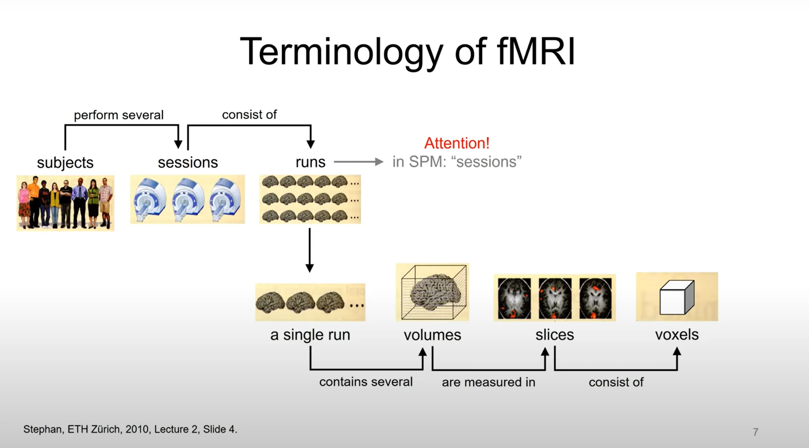

# 02 Reconstruction: Convert 2D images to 3D (anatomical) or 4D (functional)

## Why do we need to convert the files: Scan Principles

Imagine that you are slicing strange-shaped potatoes: usually, we gradually cut from the end with the smallest diameter to the centre and finally to the other side until all the potatoes are sliced completely. Sometimes we find that the slices are very thick, and another thing we can do is to make another cut in the centre of the slice until all the slices are of uniform thickness. Of course, you can also dice the potatoes.

- Here, the potato is **volume**, the process of slicing the potatoes mirrors the way each MRI scan is done (compartmentalized).
- **TR (repetition time, normally 2s -3s)** is the time spent on the whole potato, I mean whole volume (time interval between successive excitation pulses), it is the whole time from the first slice to the last slice. TR will also influence the acquisition time of the entire volume (3D dataset).
- Sliced potatoes represent **slices**.
    - Thinner slices mean higher spatial resolution - but this is usually determined by the machine, e.g. a 7T instrument has a higher resolution than a 3T.
    - In some fMRI scanning protocols, the acquisition of slices of an image may be staggered (Interleaved Acquisition), e.g., even-numbered slices are acquired first, followed by odd-numbered slices, to reduce mutual interference (e.g., [signal cross-talk](https://mriquestions.com/cross-talk.html)) between adjacent slices.
- Diced potato is the **voxel.** Normally more voxels mean more spatial resolution and higher data quality.



[https://youtu.be/vcDm_fdNews?si=5TA9rYNa03hDxHmS](https://youtu.be/vcDm_fdNews?si=5TA9rYNa03hDxHmS)

## File Format - from DICOM to Nifti

Early on, different processing software or MRI equipment would have different data formats, and currently the most common is the **NIFTI (nii)** format. NIFTI has 3D and 4D (including time) formats, serving structural and functional images respectively.

> The major formats for which AFNI is programmed are:
> 
> 
> ++ AFNI formatted datasets, in .HEAD and .BRIK pairs of files;
> 
> ++ NIfTI-1 formatted datasets, in .nii or .nii.gz files.
> 
> [https://afni.nimh.nih.gov/pub/dist/doc/program_help/README.afnigui.html](https://afni.nimh.nih.gov/pub/dist/doc/program_help/README.afnigui.html)
> 

### **HEAD/BRIK files**

`HEAD` File: Including meta information, such as dimensions, voxel sizes, data types, etc.

`BRIK` File: This is a matrix binary data that contains the actual image data. 

### JSON/NIfTI (nii.gz ) files

Similar to HEAD/BRIK files, JSON files provides meta information as well, and matrix data (imaging), NIfTi also provides some scanning information, but less detailed then JSON files.

## Brain Imaging Data Structure (BIDS)

The [BIDS](https://bids-specification.readthedocs.io/en/stable/) format is currently a widely adopted method for managing MRI data. A standardized management format significantly aids both data processing and the reproducibility of results. Currently, numerous [tools](https://bids.neuroimaging.io/tools/index.html) offer reconstruction from DICOM files to NIfTI files, along with BIDS validation.

Next, I will demonstrate how to use one of the BIDS tools, [dcm2bids](https://unfmontreal.github.io/Dcm2Bids/3.2.0/). 

1. Download the **Singularity**, noting that on HPC systems, you should use `Apptainer` instead of `Docker` for downloading and [installation](https://unfmontreal.github.io/Dcm2Bids/3.2.0/get-started/install/).
2. Construct [scaffolding](https://unfmontreal.github.io/Dcm2Bids/3.2.0/tutorial/first-steps/#scaffolding) and configure files with `dcm2bids_scaffold` ****command. The JSON and tsv files are required, otherwise, the subsequent processing may fail.
3. Building the [configuration file](https://unfmontreal.github.io/Dcm2Bids/3.2.0/tutorial/first-steps/#setting-up-the-configuration-file) to filter files requiring reconstruction (typically the “SeriesDescription” field extracted from JSON files) and rename the files.

Below are the basic configuration file settings and Slurm scripts:

```json
{
  "descriptions": [
    {
      "id": "anat_T1w",
      "datatype": "anat",
      "suffix": "T1w",
      "criteria": {
        "SeriesDescription": "*T1*"
      }
    },
    {
      "id": "task_rest",
      "datatype": "func",
      "suffix": "bold",
      "custom_entities": "task-rest",
      "criteria": {
        "SeriesDescription": "*RS*"
      }
    },
    {
      "id": "fmap_pm1_fmap",
      "datatype": "fmap",
      "suffix": "phase1",
      "criteria": {
        "SeriesDescription": "PM1",
        "ImageType": ["ORIGINAL", "PRIMARY", "OTHER", "PHASE"]
      }
    },
    {
      "id": "fmap_pm1_magnitude1",
      "datatype": "fmap",
      "suffix": "magnitude1",
      "criteria": {
        "SeriesDescription": "PM1",
        "ImageType": ["ORIGINAL", "PRIMARY", "OTHER"]
      }
    },
    {
      "id": "fmap_pm2_fmap",
      "datatype": "fmap",
      "suffix": "phase2",
      "criteria": {
        "SeriesDescription": "PM2",
        "ImageType": ["ORIGINAL", "PRIMARY", "OTHER", "PHASE"]
      }
    },
    {
      "id": "fmap_pm2_magnitude1",
      "datatype": "fmap",
      "suffix": "magnitude2",
      "criteria": {
        "SeriesDescription": "PM2",
        "ImageType": ["ORIGINAL", "PRIMARY", "OTHER"]
      }
    },
    {
      "id": "task_NBACK",
      "datatype": "func",
      "suffix": "bold",
      "custom_entities": "task-nback",
      "criteria": {
        "SeriesDescription": "*NB*"
      }
    },
    {
      "id": "dwi_DTI",
      "datatype": "dwi",
      "suffix": "dwi",
      "criteria": {
        "SeriesDescription": "*DTI*"
      }
    }
  ]
}
```

Reconstruct the DICOM files within the `s${subject}` folder.

- `-o`: output directory.
- `-d`: DICOM directory(ies) or archive(s).
- `-c`: config file we set before.
- `-s`: session or wave number.
- `--force_dcm2bids`: overwrite previous temporary dcm2bids output if it exists.
- `--clobber`: overwrite output if it exists.
- `-p`: participant IDs, useful when processing multiple participants.
- `-auto_extract_entities`: if set, it will automatically try to extract entity information [task, dir, echo] based on the suffix and datatype.
- `--bids_validate`: this command simultaneously verifies files in the temporary folder and reports errors, so I've paused its use.
- For more information, see [https://unfmontreal.github.io/Dcm2Bids/3.2.0/how-to/use-main-commands/](https://unfmontreal.github.io/Dcm2Bids/3.2.0/how-to/use-main-commands/)

```bash
#!/bin/bash
#SBATCH --job-name=convert_BIDS       # Job name
#SBATCH --partition=batch             # Partition (queue) name
#SBATCH --ntasks=1                    # Run a single task	
#SBATCH --cpus-per-task=20            # Number of CPU cores per task
#SBATCH --mem=20gb                    # Job memory request
#SBATCH --time=01:00:00               # Time limit hrs:min:sec
#SBATCH --output=/scratch/%u/workDir/log/convert_BIDS/convert_BIDS_%A-%a.out
#SBATCH --error=/scratch/%u/workDir/log/convert_BIDS/convert_BIDS_%A-%a.err
#SBATCH --array=1-3%20                    # Array range: DONT FORGET TO CHANGE!!!

subjects=(001 004 005)
subject=${subjects[$((SLURM_ARRAY_TASK_ID - 1))]}

INPUT_DIR=/scratch/qy49547/workDir/rawdata/unzip/s${subject}
OUTPUT_DIR=/scratch/qy49547/workDir/rawdata/BIDS
CONFIG_DIR=/home/qy49547/Desktop/scripts/BIDS
CONTAINER=/work/cglab/containers
WAVE="01"

singularity run \
                -e --containall \
                -B ${INPUT_DIR}:/dicoms:ro \
                -B ${CONFIG_DIR}/config.json:/config.json:ro \
                -B ${OUTPUT_DIR}:/bids \
  ${CONTAINER}/dcm2bids_3.2.0.sif \
  -o /bids \
  -d /dicoms \
  -c /config.json \
  -s ${WAVE} \
  --force_dcm2bids \
  --auto_extract_entities \
  -p ${subject} \
  --clobber
```

# AFNI Syntax

Below I am going to introduce three ways of converting 2D images into 3D (or 4D) images in AFNI. We will use [**dcm2niix_afni](https://www.nitrc.org/plugins/mwiki/index.php/dcm2nii:MainPage)** program in AFNI. ****I believe dcm2niix_afni offers more flexibility compared to dcm2niix, especially when you have your own naming convention. However, for the following sections, I recommend focusing solely on mastering the use of dcm2niix_afni and how to interpret header information. 

**`dcm2niix_afni`** is easy to write and understand, in `Dimon` script you only need to modify the subject IDs and output or input directory. You can also use `dicom_hinfo` to read the head information of each DICOM file.

## [**dcm2niix_afni**](https://www.nitrc.org/plugins/mwiki/index.php/dcm2nii:MainPage)

### Options:

- **`-b y/n`**: Whether to generate a JSON sidecar file in BIDS format. `y` means generate, `n` means do not generate.
- **`-z y/n`**: Whether to compress the generated NIfTI file. `y` means compress (generate `.nii.gz`), `n` means do not compress (generate `.nii`).
- `-o` : output directory (omit to save to input folder)
- `-f` : filename (%a=antenna (coil) name, %b=basename, %c=comments, **%d=description**, %e=echo number, %f=folder name, %g=accession number, **%i=ID of patient**, %j=seriesInstanceUID, %k=studyInstanceUID, %m=manufacturer, %n=name of patient, %o=mediaObjectInstanceUID, %p=protocol, %r=instance number, **%s=series number**, %t=time, %u=acquisition number, %v=vendor, %x=study ID; **%z=sequence name**; default '%f_%p_%t_%s')

**For more options:**

[https://afni.nimh.nih.gov/pub/dist/doc/htmldoc/programs/alpha/dcm2niix_afni_sphx.html#ahelp-dcm2niix-afni](https://afni.nimh.nih.gov/pub/dist/doc/htmldoc/programs/alpha/dcm2niix_afni_sphx.html#ahelp-dcm2niix-afni)

[https://github.com/rordenlab/dcm2niix](https://github.com/rordenlab/dcm2niix)

### Examples

```bash
# We use the dataset from `/home/Qiuyu/AFNI_data6/DICOM_T1/` to reconstruct structural files
dcm2niix_afni -f %f_%i  -o /home/Qiuyu/Practice/Reconstruction/ /home/Qiuyu/AFNI_data6/DICOM_T1/

# We use the dataset from `/home/Qiuyu/AFNI_data6/EPI_run1/` to reconstruct functional files
dcm2niix_afni -f %f_%i  -o /home/Qiuyu/Practice/Reconstruction/ /home/Qiuyu/AFNI_data6/EPI_run1/
```

Other Examples

```bash
dcm2niix_afni /Users/chris/dir
# Converts DICOM files located in /Users/chris/dir to NIfTI format using default settings. 
# The output is saved in the same or current directory.

dcm2niix_afni -o output_directory input_directory
# extract data from input folder and then convert them and output them

dcm2niix_afni -c "my comment" /Users/chris/dir
# adds the comment "my comment" to the output NIfTI header.

dcm2niix_afni -o /users/cr/outdir/ -z y ~/dicomdir
# ~/dicomdir: input directory
# Converts DICOM files in ~/dicomdir to compressed NIfTI format (.nii.gz), 
# -z y: saves the output files in /users/cr/outdir/.

dcm2niix_afni -f %p_%s -b y -ba n ~/dicomdir 
# names the files using the Patient's name and Series number (%p_%s), 
# generates BIDS JSON sidecar files (-b y), and skips BIDS anatomical JSON (-ba n).

dcm2niix_afni -f mystudy%s ~/dicomdir
# names the output files with the prefix "mystudy" followed by the Series number.

dcm2niix_afni -o "~/dir with spaces/dir" ~/dicomdir
# saves the output files in a directory with spaces in its path ("~/dir with spaces/dir").
```

### Read the nii file in AFNI

```bash
# use `afni` and file name. You don't need to go to the directory
afni EPI_run_13141592.nii
```

## Multiple Participants

```bash
dcm2niix_afni -d 2 /path/to/parent_directory
# -d : directory search depth. Convert DICOMs in sub-folders of in_folder? (0..9, default 5)
```

Or you can use `for` loop

```bash
#!/bin/bash

# Define the parent directory that contains all the subfolders (subjects)
parent_directory="/path/to/your/parent_directory"

# Loop through each subfolder in the parent directory
for subject_dir in "$parent_directory"/*; do
    if [ -d "$subject_dir" ]; then 
        # Run dcm2niix_afni for each subject directory
        dcm2niix_afni -o "$subject_dir/NIfTI_output" "$subject_dir"
        
        # Optional: You can customize the dcm2niix_afni command further, for example:
        # dcm2niix_afni -o "$subject_dir/NIfTI_output" -z y -f %p_%s "$subject_dir"
    fi
done
```

## [Dimon Program](https://afni.nimh.nih.gov/pub/dist/doc/htmldoc/programs/classified_progs.html#dicom-info-and-conversion)

Dimon is a program (`run_Dimon.csh` script) to generate a `to3d` script based on the original parameters (2D input image). If you use `to3d` you have to input a lot of parameters, which is complicated. It is in `/home/your user name/AFNI_data6/DICOM_T1` folder (I am using the data and script provided by AFNI here ).

```bash
cd AFNI_data6
cd DICOM_T1/
```

Let us take a look at it first

```bash
# read the script
cat run_Dimon.csh

# Edit the script, press :q to quit
vim run_Dimon.csh

# Run the script - we will do it after we read the script
csh run_Dimon.csh
# or
./run_Dimon.csh
```

Copy the `run_Dimon.csh` script and go to the directory of the file you want to work on. But here let us process the DICOM files in the DICOM_T1 folder first.

```bash
#!/bin/tcsh

## Get the list of unique image files
## * The reason for doing this unique image list
##   is that sometimes multiple copies of the same
##   image are output by DICOM server software,
##   and that is confusing to the Dimon program.
## * The uniq_images program will make a list of
##   images that are not identical.

## * uniq_images is an AFNI package program.
## Make a unique list of the files， here it chooses all 'I+number' files
## change I*[0123456789] - depends on your original files
uniq_images I*[0123456789] > uniq_image_list.txt

## Run Dimon to read in the files and create a NIFTI format dataset

## * the list of input files is from uniq_images
## * the output filename prefix will be T1.3D
## * the output file will be stored in the directory
##     above this one
## * the input files will be sorted by acquisition time,
##     not by filename
## * if the DICOM header has duplicate elements, use
#      the last copy found, not the first

# the input files list
Dimon -infile_list uniq_image_list.txt \\
      # create nifti files
      -gert_create_dataset             \\
      -gert_write_as_nifti             \\
      # how you want to name them: T1.3D，
      # the generated NIfTI file name will start with T1.3D
      -gert_to3d_prefix T1.3D          \\
      # which folder do you want to put  
      # ".." means the parent directory    
      -gert_outdir ..                  \\
      # Keep DICOM files in their original order. 
      # This is important to maintain the chronological order of the data.
      -dicom_org                       \\
      # Select the last element of the DICOM file name 
      # (e.g. sequence number or image number) as the basis for sorting
      -use_last_elem                   \\
      # Save processing detalis
      -save_details Dimon.details      \\
      # Quit if encounter an error
      -gert_quit_on_err

## delete the list of unique images

\\rm uniq_image_list.txt
```

`-dicom_org` : Tells Dimon to organize the image files by the information stored in their DICOM headers, rather than by filenames. This step usually fixes problems with slices being out of order when the scanner (or PACS) creates the filenames

### For Multiple Participants

```bash
#!/bin/tcsh

# Define the parent directory containing all subjects
set parent_directory = "/path/to/parent_directory"

# Loop through each subject directory in the parent directory
foreach subject_dir (`ls $parent_directory`) # list all subfolders
    if (-d "$parent_directory/$subject_dir") then
        set dicom_dir = "$parent_directory/$subject_dir/dicom_data" # create the path for DICOM files

        if (-d "$dicom_dir") then
            # Change to the subject's dicom_data directory
            cd $dicom_dir

            # Get the list of unique image files
            uniq_images DICOM_files] > uniq_image_list.txt

            # Run Dimon to process the files
            Dimon -infile_list uniq_image_list.txt \\
                  -gert_create_dataset             \\
                  -gert_write_as_nifti             \\
                  -gert_to3d_prefix T1.3D          \\
                  -gert_outdir ..                  \\
                  -dicom_org                       \\
                  -use_last_elem                   \\
                  -save_details Dimon.details      \\
                  -gert_quit_on_err

            # Delete the list of unique images
            \rm uniq_image_list.txt
        else
            echo "Warning: $dicom_dir does not exist. Skipping..."
        endif
    else
        echo "Warning: $parent_directory/$subject_dir is not a directory. Skipping..."
    endif
end
```

### [`dicom_hdr`](https://afni.nimh.nih.gov/pub/dist/doc/htmldoc/programs/alpha/dicom_hinfo_sphx.html#ahelp-dicom-hinfo) Finding information in the DICOM header of an image file

```bash
dicom_hdr I9900000 | more # read I9900000's information
```

## `to3d`

`to3d` probably is the oldest program, and AFNI do not recommend people use it unless you have to because you have to tell to3d the voxel dimension, the number of voxels, the orientation, the voxel size, etc.

The to3d script can achieve the same effect, but using the Dimon file directly can check the script parameters, and check if the raw data parameters are the same as the MRI scan parameters.

## T1 3D Script

```bash
#!/bin/tcsh

# This script was automatically generated by 'Dimon'.
# Please modify the following options for your own evil uses.

set OutlierCheck = ''         # use '-skip_outliers' to skip
set OutDir       = '..'     # output directory for datasets

#---------- make sure output directory exists ----------
test -d $OutDir || mkdir -p $OutDir

#------- create dataset for run #801 -------
to3d -quit_on_err -prefix T1.3D.nii  \\  # if encounter error then quit
# Use the to3d command to convert the MRI data to 3D NIfTI format and specify the output file name as T1.3D.nii
     -use_last_elem                \\
     # Use the last element of each slice for conversion, which may be to exclude unwanted data or noise.
     -@ < dimon.files.run.801
     # Reads an additional list of parameters or input files from the dimon.files.run.801 file

mv T1.3D.nii $OutDir
```

## T2* 3D Script

```bash
#!/bin/tcsh

# This script was automatically generated by 'Dimon'.
# Please modify the following options for your own evil uses.

set OutlierCheck = ''         # use '-skip_outliers' to skip
set OutDir       = '..'     # output directory for datasets

#---------- make sure output directory exists ----------
test -d $OutDir || mkdir -p $OutDir

#------- create dataset for run #3 -------
to3d -quit_on_err -prefix epi_r1.nii  \\
# use to3d, output file name as epi_r1.nii. Quit if encounter error
     -time:zt 34 67 3.0sec alt+z       \
     # Specify time axis information:
     # - 34 represents the number of time points (z axis, because we scan along z axis).
     # - 67 represents the number of slices (t).
     # - 3.0sec represents the repetition time (TR) for each time point.
     # - alt+z indicates that slices are acquired in an alternating order from bottom to top (alternating order).
     -use_last_elem                    \
     # Use the last element of the file list (if applicable) 
     -@ < dimon.files.run.003
     # Input file or script (e.g., a file containing a list of data files to be processed)

mv epi_r1.nii $OutDir
```

# [`3dinfo`](https://afni.nimh.nih.gov/pub/dist/doc/htmldoc/programs/alpha/3dinfo_sphx.html#ahelp-3dinfo) Read Dataset Meta Information

```bash
3dinfo DICOM_T1i.nii
cat DICOM_T1i.json
```

# Resource and Reference

[https://cloud.wikis.utexas.edu/wiki/spaces/~mvf327/pages/70002385/Converting+raw+DICOMs+to+anatomical+and+functional+images](https://cloud.wikis.utexas.edu/wiki/spaces/~mvf327/pages/70002385/Converting+raw+DICOMs+to+anatomical+and+functional+images)

[https://afni.nimh.nih.gov/pub/dist/doc/htmldoc/nifti/main_toc.html](https://afni.nimh.nih.gov/pub/dist/doc/htmldoc/nifti/main_toc.html)

[https://afni.nimh.nih.gov/pub/dist/doc/htmldoc/programs/classified_progs.html#dicom-info-and-conversion](https://afni.nimh.nih.gov/pub/dist/doc/htmldoc/programs/classified_progs.html#dicom-info-and-conversion)

[https://cbmm.mit.edu/video/02-afni-fmri-and-dimon-2-2](https://cbmm.mit.edu/video/02-afni-fmri-and-dimon-2-2)

[**NIFTI and BRIK/HEAD: Similarities, differences and mappings](**[https://afni.nimh.nih.gov/pub/dist/doc/htmldoc/nifti/notes.html](https://afni.nimh.nih.gov/pub/dist/doc/htmldoc/nifti/notes.html))

[https://afni.nimh.nih.gov/pub/dist/ASTON/afni01_intro.pdf](https://afni.nimh.nih.gov/pub/dist/ASTON/afni01_intro.pdf)

**Chapter 7** Wager, T. D., & Lindquist, M. A. (2015). Principles of fMRI. *New York: Leanpub*, *4*, 115.

[https://neurostars.org/t/meaning-and-order-of-magnitude-of-tr-for-structural-vs-functional-images/4111/2](https://neurostars.org/t/meaning-and-order-of-magnitude-of-tr-for-structural-vs-functional-images/4111/2)
[https://www.newbi4fmri.com/tutorial-1-data](https://www.newbi4fmri.com/tutorial-1-data)

[https://docs.ccv.brown.edu/bnc-user-manual/bids/introduction-to-bids](https://docs.ccv.brown.edu/bnc-user-manual/bids/introduction-to-bids)

### Video

[https://youtu.be/OuRdQJMU5ro?si=GkrFicf5Wmsu-EFK](https://youtu.be/OuRdQJMU5ro?si=GkrFicf5Wmsu-EFK)