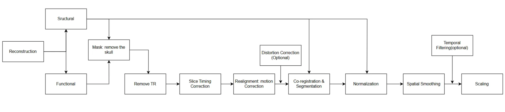
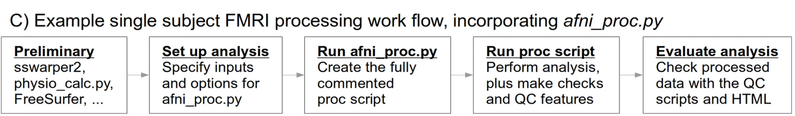
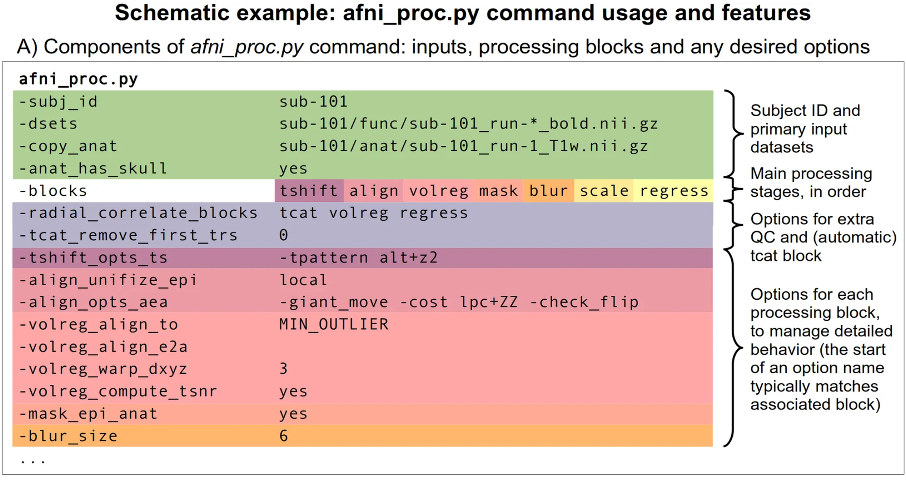

# 03 Preprocessing & afni_proc.py
# Preprocessing

Preprocessing includes a lot of steps to reduce the variability of the data. Our final goal is to increase signal-to-noise ratio (SNR) because when you collect data, noise will come up from both the participants and the MRI device.

General preprocessing including reconstruction (convert 2D images to 3D or 4D), slice-timing correction, motion correction, co-registration of structural and functional images, normalization to standard space, and spatial smoothing, but what steps need to be done depends on your experiments and data.

:::{note}
Why we need to do preprocessing [^1]:
- minimize the influence of data acquisition and physiological artifacts,
- check statistical assumptions and transform the data to meet these assumptions
- standardize the location of brain regions across different subjects to achieve validity and sensitivity in group analysis.
:::


## Workflow 





:::{note}
AFNI's Pipeline [^2]:
- Automatic blocks*setup and initialization; not user specified, always used*
    - **setup:** check args, set run list, make output directory, copy stim files
    - **tcat:** copy input datasets and remove unwanted initial TRs
- Default blocks*standard steps; user may skip, modify or rearrange*
    - **shift:** slice timing alignment on volumes
    - **volreg:** volume registration (for reduction of subject motion effects)
    - **blur:** blur each volume (default is 4 mm FWHM)
    - **mask:** create a “brain” mask from the EPI data
    - **scale:** scale each run mean to 100, for each voxel (max of 200)a
    - **regress:** regression analysis (stimulus model, filter, censor, etc.)
- Optional blocks*default is to not apply these blocks, but the user can add*
    - **align:** align EPI and anatomy (linear affine)
    - **combine:** combine echoes into one
    - **despike:** truncate spikes in each voxel’s time series
    - **empty:** placeholder for some other user command
    - **ricor:** RETROICORb - removal of cardiac/respiratory regressors
    - **surf:** project volumetric data into the surface domain (via SUMAc)
    - **tlrc:** warp anatomical volume to a standard space or template
- Implicit blocks*not user-specified, but performed when appropriate*
    - **blip:** perform B0 distortion correction
    - **outcount:** temporal outlier detection
    - **QC_review:** generate QC review scripts and HTML report (APQC HTML)
    - **anat_unif:** anatomical uniformity correction
:::

# Noise from Participants

## Remove TR

fMRI measures brain activity indirectly by tracking changes in blood flow, which are linked to neuronal activity through the blood-oxygen-level-dependent (BOLD) signal. When a stimulus is presented, there is often a delay between the neural response and the corresponding BOLD signal due to the time it takes for blood flow to change in response to neural activity, meaning that it takes some time for neural activity to transition from baseline to an 'active' state. Additionally, at the beginning of an fMRI scanning session, the MRI signal can be unstable as the magnetic fields and scanner components reach equilibrium. This period is known as the "transient phase."

To ensure that the data analyzed reflect a stable baseline and accurate neural activity, researchers often discard the initial few time points (TRs, or time repetitions) of the fMRI time series. The exact number of TRs discarded can vary (often around 0 to 10) depending on the study design and the stability of the scanner.

:::{warning}
In `afni_proc.py`, if remove TRs, you need to modify the time series files (stimulus) as well to make sure they match with each other.

[https://discuss.afni.nimh.nih.gov/t/errors-running-afni-proc-py/3081/4](https://discuss.afni.nimh.nih.gov/t/errors-running-afni-proc-py/3081/4)

[https://discuss.afni.nimh.nih.gov/t/uber-subject-py-remove-trs-compensate-in-stimfile/1110/2](https://discuss.afni.nimh.nih.gov/t/uber-subject-py-remove-trs-compensate-in-stimfile/1110/2)

[https://discuss.afni.nimh.nih.gov/t/correcting-time-files-when-removing-xtrs/747/2](https://discuss.afni.nimh.nih.gov/t/correcting-time-files-when-removing-xtrs/747/2)
:::

## [Motion Correction (Realign)](https://www.newbi4fmri.com/tutorial-5-motion)

- Despite researchers taking various measures to reduce head motion, such as training and using head restraints, it is impossible to expect participants to remain completely still during scanning. This is especially true in studies involving children, where maintaining data quality at even a moderate level is already considered good. In fact, a head movement of 0.3 mm is considered significant; essentially, participants' breathing can introduce noise.
- But what will happen if we don’t do motion correction?
    - **Motion correction contaminates the data.** For instance, if we measure the signal from region A in the 1st s and the participant moves their head, by the 2nd s, the signal that was supposed to be in region A might shift to region B, which will further cause spurious activations—this is not the result we want. Also, it will cause the activation or loss of the brain's edges.
- We can correct head motion by using a reference slice (realignment, such as the first or a mean slice, or the volume that has the least outliners of voxels) and aligning subsequent time series images through translation and rotation to match this reference (rigid body transformation:  a spatial transformation that does not change the size or shape of an object; it has three translational parameters and three rotational parameters; Huettel et al., 2004).
    - In a three-dimensional coordinate system, objects, including the head, can move along the x, y, and z axes, and the head may also rotate. However, this method can only eliminate minor head movements and cannot fully remove complex spin-history artifacts or completely eliminate noise from head motion.

:::{note} Additional Reading
:class: dropdown
Greene, D. J., Koller, J. M., Hampton, J. M., Wesevich, V., Van, A. N., Nguyen, A. L., Hoyt, C. R., McIntyre, L., Earl, E. A., Klein, R. L., Shimony, J. S., Petersen, S. E., Schlaggar, B. L., Fair, D. A., & Dosenbach, N. U. (2018). Behavioral interventions for reducing head motion during MRI scans in children. *NeuroImage*, *171*, 234-245. https://doi.org/10.1016/j.neuroimage.2018.01.023
    
Jones, T. B., Bandettini, P. A., & Birn, R. M. (2008). Integration of motion correction and physiological noise regression in fMRI. *NeuroImage*, *42*(2), 582-590. https://doi.org/10.1016/j.neuroimage.2008.05.019
    
Zaitsev, M., Akin, B., LeVan, P., & Knowles, B. R. (2017). Prospective motion correction in functional MRI. *NeuroImage*, *154*, 33-42. https://doi.org/10.1016/j.neuroimage.2016.11.014
    
Godenschweger F, Kägebein U, Stucht D, Yarach U, Sciarra A, Yakupov R, Lüsebrink F, Schulze P, Speck O. Motion correction in MRI of the brain. Phys Med Biol. 2016 Mar 7;61(5):R32-56. doi: 10.1088/0031-9155/61/5/R32. Epub 2016 Feb 11. PMID: 26864183; PMCID: PMC4930872.
:::

## [Temporal Filtering](https://www.newbi4fmri.com/tutorial-6-filtering) and Physiological Noise

- Temporal filtering can remove some noise components, including low-frequency scanner drift (signal strength changes over time due to the scanner itself) and physiological noise. These factors may be mixed to different frequencies, so temporal filtering should be used with caution.
    - For example, in fast event-related design the task and respiration would be at similar frequencies; long interval blocked designs will be influenced by scanner shift.
    - Physiological activities, such as heartbeat, breathing, and pulse, can generate noise in fMRI data. In earlier studies, researchers often used regression models to remove this noise. However, more recent research has shifted away from attempting to remove these physiological noises.

:::{note} Additional Reading
:class: dropdown

Hutton, C., Josephs, O., Stadler, J., Featherstone, E., Reid, A., Speck, O., Bernarding, J., & Weiskopf, N. (2011). The impact of physiological noise correction on fMRI at 7 T. *NeuroImage*, *57*(1), 101-112. https://doi.org/10.1016/j.neuroimage.2011.04.018
    
Kopel, R., Sladky, R., Laub, P., Koush, Y., Robineau, F., Hutton, C., Weiskopf, N., Vuilleumier, P., De Ville, D. V., & Scharnowski, F. (2019). No time for drifting: Comparing performance and applicability of signal detrending algorithms for real-time fMRI. *Neuroimage*, *191*, 421-429. https://doi.org/10.1016/j.neuroimage.2019.02.058
    
Davey, C. E., Grayden, D. B., Egan, G. F., & Johnston, L. A. (2013). Filtering induces correlation in fMRI resting state data. *NeuroImage*, *64*, 728-740. https://doi.org/10.1016/j.neuroimage.2012.08.022
:::

# Noise from MRI Scanner

## Slice-timing correction (temporal interpolation)

- The MRI machine performs scans in a compartmentalized way: one slice at a time at TR intervals, which means we collect the slices from different time series.
    - One type of collection is a continuous collection of slices, i.e. 1, 2, 3... Another type of acquisition is interleaved slice acquisition to prevent cross-slice excitation, i.e., 1, 3, 5... .2, 4, 6 ...
- Current technology is not capable of scanning many slices simultaneously, which means some slices will be collected later than other slices. We need to reduce the error caused by the scans by taking one of the (usually the first or the middle one) slices as a reference and doing correction, as current statistical analyses are based on having all scans occurring at the same time.
- temporal interpolation is not perfect because it may include confounding factors (eg. high frequency artefacts, heartbeat and respiration).
    - Another way is to create separate analysis models for each slice by using **slice-specific modeling** or **slice-wise analysis.**
- *For structural MRI scans, slice acquisition is typically done in a single pass, so **slice timing correction** is generally not applied to structural MRI scans.*

:::{note} Additional Reading
:class: dropdown

Sladky, R., Friston, K. J., Tröstl, J., Cunnington, R., Moser, E., & Windischberger, C. (2011). Slice-timing effects and their correction in functional MRI. *NeuroImage*, *58*(2), 588-594. https://doi.org/10.1016/j.neuroimage.2011.06.078
    
Risk, B. B., Kociuba, M. C., & Rowe, D. B. (2018). Impacts of simultaneous multislice acquisition on sensitivity and specificity in fMRI. *NeuroImage*, *172*, 538-553. https://doi.org/10.1016/j.neuroimage.2018.01.078
    
Parker, D. B., & Razlighi, Q. R. (2019). The Benefit of Slice Timing Correction in Common fMRI Preprocessing Pipelines. *Frontiers in Neuroscience*, *13*, 465275. https://doi.org/10.3389/fnins.2019.00821
:::

## Co-registration

- It's known that structural scans (T1) are much clearer than functional scans (T2*). To facilitate data analysis later on, one of the preprocessing steps we take is to align the structural images with the functional images. Specifically, we co-register the individual structural image to the first or the mean functional image, using the structural image as the template. The structural image acts as a clear layer or template that provides a reference for the blurrier functional image, allowing us to visualize the task activations of individual subjects more clearly.
- Additionally, this step prepares the data for subsequent normalization, as the structural and functional images are now aligned in the same state.
    - *It's somewhat like creating or projecting a character into a 2D game from the real world. While the in-game version character may not be as realistic as the real-world one, it can perform more actions in the virtual world. When you control this character, that's akin to the process of registration.*

### [Segmentation](https://andysbrainbook.readthedocs.io/en/latest/SPM/SPM_Short_Course/SPM_04_Preprocessing/04_SPM_Segmentation.html)

- Dividing the structural brain images into different tissue regions, such as gray matter (GM), white matter (WM), and cerebrospinal fluid (CSF), increases the utility of subsequent normalization and quality control.


## Normalization

- In social science research, we often use widely accepted measurement tools, such as scales, because they possess good reliability and validity. Moreover, this provides a foundation for reproducibility, allowing subsequent researchers to compare results when conducting similar experiments without introducing bias from using different research tools.
- In this context, spatial normalization is analogous to using widely accepted scales, aligning the spatial structure of different subjects to a standard space. While the basic structure of each person’s brain is similar (except for the pathological brain structures), there may be differences in shape. Using a common/standardized template or atlas space can reduce variability in brain morphology during scanning, ensuring that the voxel structures are comparable or similar across subjects.
- It is important to note, however, that like scales, different populations need to use different templates. For example, the templates used for adult subjects (e.g., MNI atlas) differ from those used for children.
- *Think about the limitations of normalization.*

## [Spatial Smoothing](https://www.newbi4fmri.com/tutorial-6-filtering)

- Benefits: increasing the signal-to-noise ratio versus reducing multiple comparisons by using a Gaussian filter.
    - Increase SNR: We assume that all voxels are spatially correlated because of functional similarities between neighboring brain regions, which can also help predict whether neighboring voxels are activated. Smoothing can average noise across neighboring voxels and thus reduce noise and increase SNR. This is particularly useful in voxel-wise analyses where each voxel is analyzed individually across the brain, but ROI analysis will not be influenced too much.
    - Decrease Multiple comparisons: Due to the introduction of spatial correlation between neighboring voxels, independent tests and random noise (isolated voxels) are reduced.
- Using relatively large or small smoothing kernels will influence results. Normally the range is from 4 mm to 10 mm.
    - If the filter is too big, relevant activations may be suppressed below the significance threshold; if the filter is too small, the increase in SNR will be negligible and the spatial resolution will be decreased.

```{figure} images/03/blur.png
:label: blur
:align: center

The [image](https://support.brainvoyager.com/brainvoyager/functional-analysis-preparation/29-pre-processing/86-spatial-smoothing) becomes blurry (reduced spatial resolution). The use of a Gaussian spatial filter efficiently distributes the intensity of each voxel across adjacent voxels.
```

:::{note} Additional Reading
:class: dropdown
    
[http://jpeelle.net/mri/image_processing/smoothing.html](http://jpeelle.net/mri/image_processing/smoothing.html)
    
Triantafyllou, C., Hoge, R. D., & Wald, L. L. (2006). Effect of spatial smoothing on physiological noise in high-resolution fMRI. *NeuroImage*, *32*(2), 551-557. https://doi.org/10.1016/j.neuroimage.2006.04.182
    
Liu, P., Calhoun, V., & Chen, Z. (2017). Functional overestimation due to spatial smoothing of fMRI data. *Journal of Neuroscience Methods*, *291*, 1-12. https://doi.org/10.1016/j.jneumeth.2017.08.003
    
Pajula, J., & Tohka, J. (2014). Effects of spatial smoothing on inter-subject correlation based analysis of FMRI. *Magnetic Resonance Imaging*, *32*(9), 1114-1124. https://doi.org/10.1016/j.mri.2014.06.001
    
Mikl, M., Mareček, R., Hluštík, P., Pavlicová, M., Drastich, A., Chlebus, P., Brázdil, M., & Krupa, P. (2008). Effects of spatial smoothing on fMRI group inferences. *Magnetic Resonance Imaging*, *26*(4), 490-503. https://doi.org/10.1016/j.mri.2007.08.006
    
Alakörkkö, T., Saarimäki, H., Glerean, E., Saramäki, J., & Korhonen, O. (2017). Effects of spatial smoothing on functional brain networks. *European Journal of Neuroscience*, *46*(9), 2471-2480. https://doi.org/10.1111/ejn.13717
:::

### Mask

- Eliminate unnecessary inspection areas, including the skull, air, and scalp, thus decreasing the multiple comparisons by reducing voxels. This is equivalent to defining a part of the area by setting voxels within the brain to 1 (interested area) and those outside the brain or in non-brain areas to 0, and then analyzing only the voxels in that area.

:::{note} Additional Reading
:class: dropdown
Kriegeskorte, N., & Bandettini, P. (2007). Analyzing for information, not activation, to exploit high-resolution fMRI. *NeuroImage*, *38*(4), 649-662. https://doi.org/10.1016/j.neuroimage.2007.02.022

[https://andysbrainbook.readthedocs.io/en/latest/AFNI/AFNI_Short_Course/AFNI_Preprocessing/06_AFNI_Masking_Scaling.html](https://andysbrainbook.readthedocs.io/en/latest/AFNI/AFNI_Short_Course/AFNI_Preprocessing/06_AFNI_Masking_Scaling.html)
:::

## Scaling

- Amplify signal strength to compare the activation levels across different subjects or conditions (the differences between them are minimized).
    - Similar to normalization (thinking about z-scores, it can make scores from different scales comparable), moving individuals to the same unit or level for comparison.

## Distortion Correction

- Due to the **field inhomogeneity**, geometric or intensity distortions may cause the failure match of the co-registration
    - High field strength MRI (e.g., 7T or higher) provides a stronger primary magnetic field, which results in improved imaging contrast and resolution of the signal. However, strong magnetic fields also increase the risk of magnetic field inhomogeneity, as small magnetic field variations are amplified at high field strengths, leading to more pronounced spatial distortion.
- Distortion may cause the image to appear as if it is covered with a grey mask, reducing the contrast between grey and white matter at different locations, which is detrimental to the subsequent segregation of structural images as well as the alignment of functional images.

```{figure} images/03/distortion.png
:label: distortion
:align: center

Figure: Hutton C, Bork A, Josephs O, Deichmann R, Ashburner J, Turner R. Image distortion correction in fMRI: A quantitative evaluation. Neuroimage. 2002 May;16(1):217-40. doi: 10.1006/nimg.2001.1054. PMID: 11969330.
```
:::{note} Additional Reading
:class: dropdown

Yamamoto, T., Fukunaga, M., Sugawara, S. K., Hamano, Y. H., & Sadato, N. (2021). Quantitative Evaluations of Geometrical Distortion Corrections in Cortical Surface-Based Analysis of High-Resolution Functional MRI Data at 7T. *Journal of Magnetic Resonance Imaging*, *53*(4), 1220-1234. https://doi.org/10.1002/jmri.27420

Calhoun, V. D., Wager, T. D., Krishnan, A., Rosch, K. S., Seymour, K. E., Nebel, M. B., Mostofsky, S. H., Nyalakanai, P., & Kiehl, K. (2017). The impact of T1 versus EPI spatial normalization templates for fMRI data analyses. *Human Brain Mapping*, *38*(11), 5331-5342. https://doi.org/10.1002/hbm.23737

Jezzard, P. (2012). Correction of geometric distortion in fMRI data. *NeuroImage*, *62*(2), 648-651. https://doi.org/10.1016/j.neuroimage.2011.09.010

Hwang, S., Lee, H., Choi, S. H., & Park, S. (2023). Distortion correction using topup algorithm by single k-space (TASK) for echo planar imaging. *Scientific Reports*, *13*(1), 1-15. https://doi.org/10.1038/s41598-023-46163-3
:::


# Script
*This section is still in development.*

See AFNI’s notes of script here: [https://afni.nimh.nih.gov/pub/dist/doc/htmldoc/programs/alpha/afni_proc.py_sphx.html#sample-analysis-script](https://afni.nimh.nih.gov/pub/dist/doc/htmldoc/programs/alpha/afni_proc.py_sphx.html#sample-analysis-script)

```bash
afni_proc.py                                                      \
    -subj_id                  FT.e6b                              \   
    # Set the subject ID to FT.e6b.
    -copy_anat                Qwarp/anat_warped/anatSS.FT.nii     \   
    # Copy anatomical data using the specified anatomical image from the Qwarp directory.
    -anat_has_skull           no                                  \   
    # Specify that the anatomical image does not include the skull (i.e., the skull has been removed).
    -anat_follower            anat_w_skull anat FT/FT_anat+orig   \   
    # Specify the following anatomical files, including the one with the skull and the original anatomical image.
    -dsets                    FT/FT_epi_r?+orig.HEAD              \   
    # Specify the functional MRI dataset, using the EPI data from the FT directory.
    -blocks                   tshift align tlrc volreg mask blur  \   
    # Define the sequence of preprocessing steps
    # time shifting (tshift), alignment (align), spatial normalization (tlrc), volume registration (volreg), masking (mask), and smoothing (blur).
                              scale regress                      \   
                              # Also include scaling (scale) and regression analysis (regress).
    -radial_correlate_blocks  tcat volreg                         \   
    # Perform radial correlation correction on the time shift (tcat) and volume registration (volreg) blocks.
    -tcat_remove_first_trs    2                                   \   
    # Remove the first two time points (TRs) from each functional dataset.
    -align_unifize_epi        local                               \   
    # Apply local uniformization (local) to the EPI data during alignment.
    -align_opts_aea           -cost lpc+ZZ                        \   
    # Alignment options: use the local phase consistency cost function (lpc+ZZ).
                              -giant_move                        \   
                              # Allow large movements (giant_move) during alignment.
                              -check_flip                        \   
                              # Check for potential flip issues during alignment.
    -tlrc_base                MNI152_2009_template_SSW.nii.gz     \   
    # Use the MNI152 2009 template as the reference for spatial normalization.
    -tlrc_NL_warp                                                 \   
    # Enable nonlinear normalization to the MNI template.
    -tlrc_NL_warped_dsets     Qwarp/anat_warped/anatQQ.FT.nii     \   
    # Specify the anatomical dataset after nonlinear normalization.
                              Qwarp/anat_warped/anatQQ.FT.aff12.1D   
                              # Specify the affine transformation matrix for nonlinear normalization.
                              Qwarp/anat_warped/anatQQ.FT_WARP.nii   
                              # Specify the warp file for nonlinear normalization.
    -volreg_align_to          MIN_OUTLIER                         \   
    # Align to the time point with the minimum outlier during volume registration.
    -volreg_align_e2a                                             \   
    # Align the EPI data to the anatomical data during volume registration.
    -volreg_tlrc_warp                                             \   
    # Apply the spatial normalization transformation during volume registration.
    -volreg_compute_tsnr      yes                                 \   
    # Compute the temporal signal-to-noise ratio (TSNR).
    -mask_epi_anat            yes                                 \   
    # Use the anatomical data to create a mask for the functional data.
    -blur_size                4.0                                 \   
    # Apply spatial smoothing with a 4.0 mm full-width half-maximum (FWHM).
    
    # Generate the HTML review pages to do quality control.
    -html_review_style        pythonic                            \   
   
    # Execute the entire analysis pipeline.
    -execute                                                      
```


# Resource (Highly Suggested)
Short introduction:

[https://youtu.be/xLWES956JJE?si=kI9iahR1Oz1aiVcb](https://youtu.be/xLWES956JJE?si=kI9iahR1Oz1aiVcb)

But I will suggest you to watch these two videos:

[https://youtu.be/vcDm_fdNews?si=PO28PAIwITSpNvLe](https://youtu.be/vcDm_fdNews?si=PO28PAIwITSpNvLe)

[https://youtu.be/fraTFUoKV6c?si=1tQ2AaH2nFTfM1oV](https://youtu.be/fraTFUoKV6c?si=1tQ2AaH2nFTfM1oV)

# Reference
[^1]: Huettel, S. A., Song, A. W., & Mccarthy, G. (2004). Functional magnetic resonance imaging. Sinauer Associates, Publishers.

[^2]: Richard C. Reynolds, Daniel R. Glen, Gang Chen, Ziad S. Saad, Robert W. Cox, Paul A. Taylor; Processing, evaluating, and understanding FMRI data with afni_proc.py. *Imaging Neuroscience* 2024; 2 1–52. doi: https://doi.org/10.1162/imag_a_00347

Strother, S. C. (2006). Evaluating fMRI preprocessing pipelines. *IEEE Engineering in Medicine and Biology Magazine*, *25*(2), 27-41.

H. A. Jaber, H. K. Aljobouri, İ. Çankaya, O. M. Koçak and O. Algin, "Preparing fMRI Data for Postprocessing: Conversion Modalities, Preprocessing Pipeline, and Parametric and Nonparametric Approaches," in IEEE Access, vol. 7, pp. 122864-122877, 2019, doi: 10.1109/ACCESS.2019.2937482.
keywords: {Functional magnetic resonance imaging;Tools;Pipelines;Statistical analysis;DICOM;Smoothing methods;Data analysis;Analyze data (img/hdr);DICOM;fMRI;NIFTI;parametric and nonparametric approaches},

[https://s.mriquestions.com/data-pre-processing.html](https://s.mriquestions.com/data-pre-processing.html)

[https://afni.nimh.nih.gov/pub/dist/doc/htmldoc/programs/alpha/afni_proc.py_sphx.html#ahelp-afni-proc-py](https://afni.nimh.nih.gov/pub/dist/doc/htmldoc/programs/alpha/afni_proc.py_sphx.html#ahelp-afni-proc-py)

[https://andysbrainbook.readthedocs.io/en/latest/AFNI/AFNI_Short_Course/AFNI_Preprocessing/AFNI_Intermezzo_Uber_Subject.html](https://andysbrainbook.readthedocs.io/en/latest/AFNI/AFNI_Short_Course/AFNI_Preprocessing/AFNI_Intermezzo_Uber_Subject.html)

[https://cloud.wikis.utexas.edu/wiki/spaces/~mvf327/pages/70001952/Preprocessing+with+AFNI](https://cloud.wikis.utexas.edu/wiki/spaces/~mvf327/pages/70001952/Preprocessing+with+AFNI)

[https://en.wikibooks.org/wiki/Neuroimaging_Data_Processing/Processing/Steps](https://en.wikibooks.org/wiki/Neuroimaging_Data_Processing/Processing/Steps)

[https://cbmm.mit.edu/afni](https://cbmm.mit.edu/afni)
