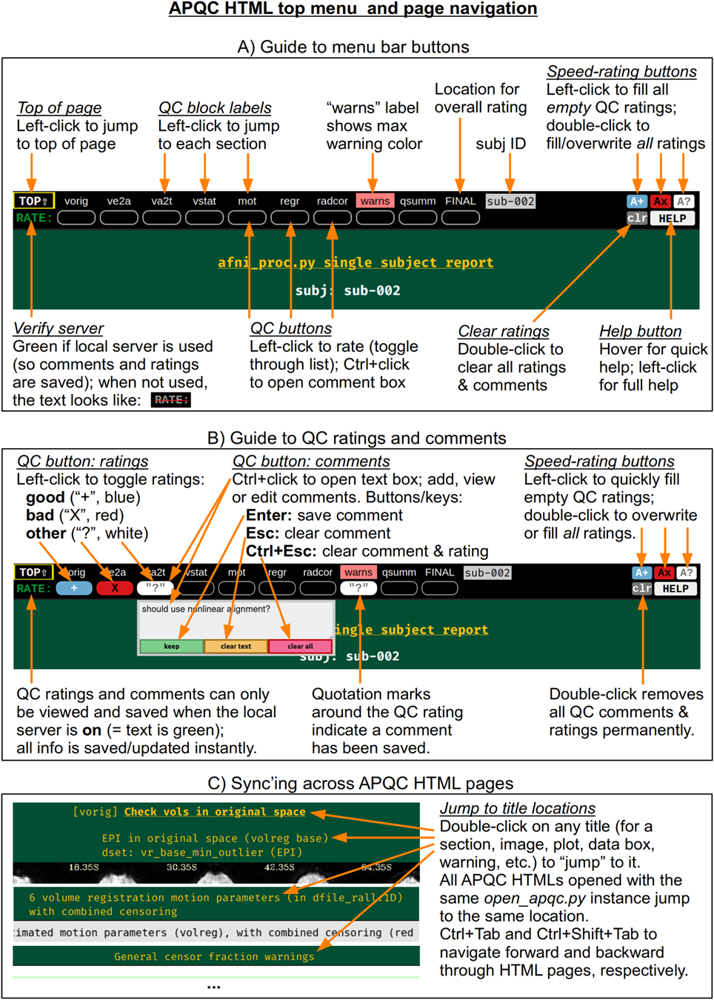
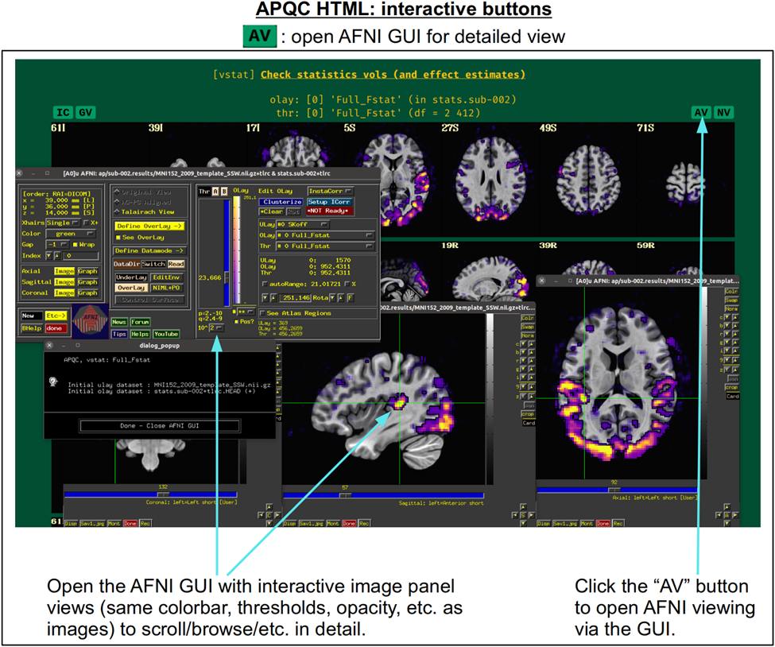
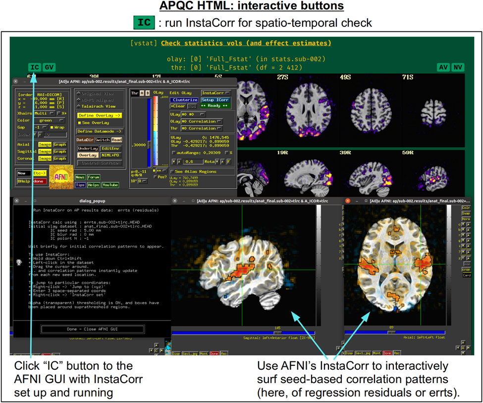
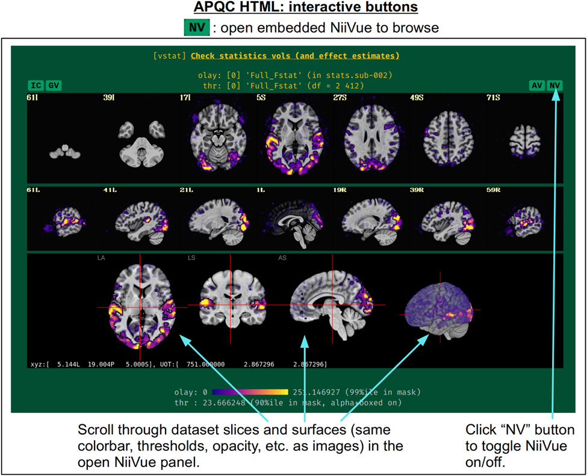
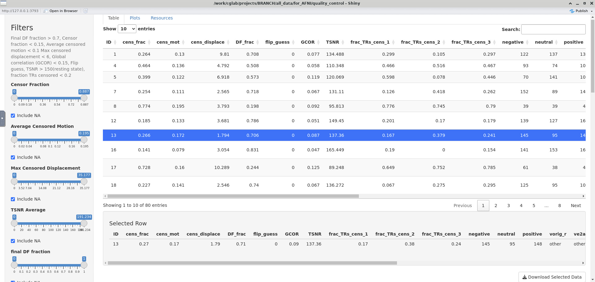
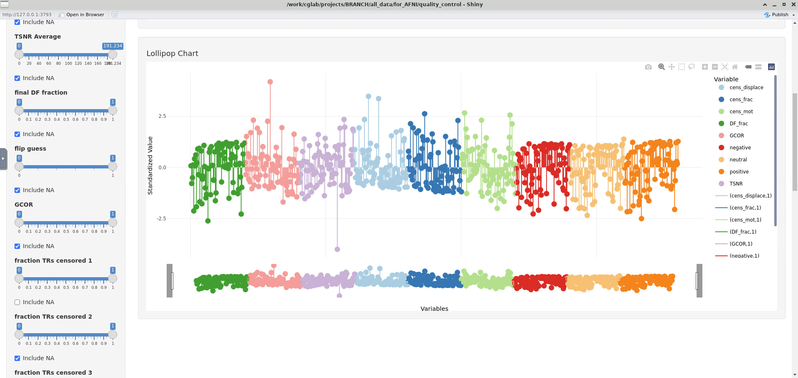
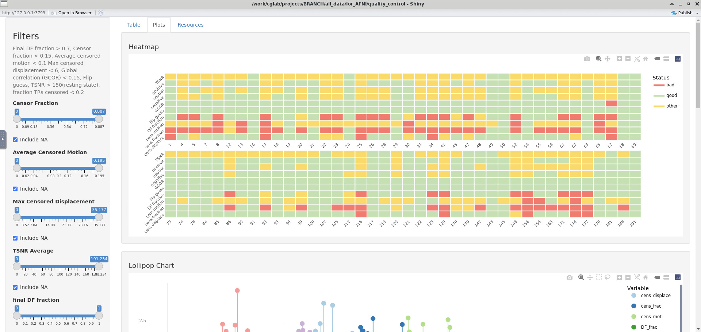

# 06 Quality Control in AFNI

# Introduction

MRI data is not only difficult to collect, it can also produce various noises and artifacts during the collection process. Hence, after finishing the preprocessing we need to control the data quality. We have discussed some common noise that we hope to decrease in the processing chapter [03 Preprocessing & afni_proc.py](03_Preprocessing.md), This section will not delve deeply into artifact generation and recognition; however, you are encouraged to explore relevant literature to broaden your understanding.  Often, when examining an image of a structure or function, artifacts will stand out as abnormalities—such as distortions, missing regions, or interference—that deviate from what is considered normal.

Why is quality control necessary? MRI is widely known to be both time-consuming and costly, making quality control essential to minimize the risk of acquiring data that is difficult or impossible to use. Moreover, quality control is not merely about classifying data as "good" or "bad" (Taylor et al., 2024). It also provides researchers with the opportunity to refine data collection strategies and address errors promptly, ultimately improving the efficiency and reliability of the entire process.

Next, I will introduce the quality control tool in AFNI and the basic procedure.

:::{note}
These website provide some cases for artifacts:

[https://radiopaedia.org/articles/mri-artifacts-1?lang=us](https://radiopaedia.org/articles/mri-artifacts-1?lang=us)

[https://mrimaster.com/mri-artifacts/](https://mrimaster.com/mri-artifacts/)
:::


# Procedure and [Programs](https://afni.nimh.nih.gov/pub/dist/doc/htmldoc/programs/classified_progs.html#quality-checks-for-3d-time-datasets-or-results) in AFNI

AFNI uses [afni_proc.py quality control](https://afni.nimh.nih.gov/pub/dist/doc/htmldoc/tutorials/apqc_html/main_toc.html) as the tool. The basic process recommended by AFNI includes: `gtykd_check` - run `afni_proc.py` or `ap_run_simple*.tcsh` - check `APQC_HTML` - run `gen_ss_review_table.py`. 

Specifically, once the basic information about the data has been checked upfront, quality checks are performed using `afni_proc.py` (or `ap_run_simple*.tcsh` if you want to run faster), a program that generates a series of scripts and ultimately produces an interactive HTML web page containing multiple blocks. Next, you can check how each step of the preprocessing turned out (qualitatively or quantitatively) and rate it. Eventually, you can use [`gen_ss_review_table.py`](https://afni.nimh.nih.gov/pub/dist/doc/program_help/gen_ss_review_table.py.html) to summarize the results of the quality testing for all subjects and filter the data according to conditions. In addition, you can combine `gen_ss_review_table.py` and `extra_info/out.ss_review.${subj}.json` to export a final table that contains ratings since quality control ratings are saved in JSON files.

In the quality control block, `afni_proc.py` generates [`gen_epi_review.py`](https://afni.nimh.nih.gov/pub/dist/doc/program_help/gen_epi_review.py.html), [`gen_ss_review_scripts.py`](https://afni.nimh.nih.gov/pub/dist/doc/program_help/gen_ss_review_scripts.py.html), [`apqc_make_tcsh.py`](https://afni.nimh.nih.gov/pub/dist/doc/program_help/apqc_make_tcsh.py.html), and `apqc_make_html.py`. Of these, `gen_epi_review.py` can be used to review EPI data by generating `@epi_review` script.  `gen_ss_review_scripts.py` can generate single subject analysis review scripts and figure out basic details (sid, trs, xmat, censor stats files, etc.) by automatically generating the scripts including `@ss_review_basic`, `@ss_review_driver`, and `@ss_review_driver_commands`. You can use `./` to run these scripts, such as `./@epi_review.$subj`. Moreover, scripts start with **"run_qc",** which drives AFNI GUI to visualize a particular processing aspect (these are added in APQC html). Last, `apqc_make_tcsh.py`, and `apqc_make_html.py` will generate HTML files. These programs also generate some txt and JSON files (`out.ss_review.$subj.txt`, `out.ss_review_uvars.json`) that contain quantities of output and important identification of output files. Although in `afni_proc.py` you only need to type `-html_review_style pythonic` to run these programs automatically, AFNI also retains the code files for these programs in the final output, which adds flexibility to the data processing.

Open the `proc.$subj` file, you will see the detailed syntax, below is part of it:

```bash
# ========================= auto block: QC_review ==========================
# generate quality control review scripts and HTML report

# generate a review script for the unprocessed EPI data
gen_epi_review.py -script @epi_review.$subj \
    -dsets pb00.$subj.r*.tcat+orig.HEAD

# -------------------------------------------------
# generate scripts to review single subject results
# (try with defaults, but do not allow bad exit status)

# write AP uvars into a simple txt file
cat << EOF > out.ap_uvars.txt
  mot_limit          : 0.3
  out_limit          : 0.05
  copy_anat          : anatSS.s091+orig.HEAD
  mask_dset          : mask_epi_anat.$subj+tlrc.HEAD
  template           : HaskinsPeds_NL_template1.0_SSW.nii
  ss_review_dset     : out.ss_review.$subj.txt
  max_4095_warn_dset : out.4095_warn.txt
  vlines_tcat_dir    : vlines.pb00.tcat
EOF

# and convert the txt format to JSON
cat out.ap_uvars.txt | afni_python_wrapper.py -eval "data_file_to_json()" \
  > out.ap_uvars.json

# initialize gen_ss_review_scripts.py with out.ap_uvars.json
gen_ss_review_scripts.py -exit0        \
    -init_uvars_json out.ap_uvars.json \
    -write_uvars_json out.ss_review_uvars.json

# ========================== auto block: finalize ==========================

# remove temporary files
\rm -f rm.*

# --------------------------------------------------
# if the basic subject review script is here, run it
# (want this to be the last text output)
if ( -e @ss_review_basic ) then
    ./@ss_review_basic |& tee out.ss_review.$subj.txt

    # generate html ss review pages
    # (akin to static images from running @ss_review_driver)
    apqc_make_tcsh.py -review_style pythonic -subj_dir . \
        -uvar_json out.ss_review_uvars.json
    apqc_make_html.py -qc_dir QC_$subj

    echo "\nconsider running: \n"
    echo "   afni_open -b $subj.results/QC_$subj/index.html"
    echo ""
endif
```

# **APQC HTML**

As we talked above `afni_proc.py` will eventually generate the APQC HTML file in `QC_${subj}` directory, and you can type `firefox index.html` in the terminal to review this file. You can choose other web browsers if you want. APQC HTML provides a lot of ways to assess the data quality by using [interactive buttons](https://afni.nimh.nih.gov/pub/dist/doc/htmldoc/tutorials/apqc_html/apqc_ex1.html). See [this](https://afni.github.io/qc-demo-repo/) as an example of APQC HTML. 

## Interactive use of APQC HTML

The image below tells how to score the data and you can save the results when you are done.



AFNI also provides four additional buttons in some blocks that allow you to interact with the AFNI GUI, Suma, NiiVue, etc. to view the data.

::::{grid} 2
:gutter: 2

:::{grid-item}

:::

:::{grid-item}

:::

:::{grid-item}

:::

:::{grid-item}

:::
::::


## Summary of APQC HTML


# Visualization of quality control

We can use [`gtkyd_check.py`](https://afni.nimh.nih.gov/pub/dist/doc/program_help/gtkyd_check.py.html) and `gen_ss_review_table.py` to extract head data from different participants. This is very helpful for pre-checking the consistency of the dataset, such as verifying whether the TRs and voxel sizes are the same.

```bash
#!/bin/bash

# For s* folders in /work/cglab/projects/BRANCH/all_data/for_AFNI/BRANCH_W1/, extract info from B*nii* files

gtkyd_check.py \
-infiles /work/cglab/projects/BRANCH/all_data/for_AFNI/BRANCH_W1/s*/derivatives/kidvid_output/B*nii* \
-outdir /work/cglab/projects/BRANCH/all_data/for_AFNI/quality_control/head_info
```

`gtkyd_check.py` uses [`3dinfo`](https://afni.nimh.nih.gov/pub/dist/doc/htmldoc/programs/alpha/3dinfo_sphx.html#dinfo) to generate this information in `dset_gtkyd_{$subj}_.txt` file. The definitions of abbreviations, such as nv and n3, are provided in 3dinfo.

```bash
subject ID           : BRCH-091-24-072_ECEV_A_6_
n3                   : 102 102 64
nv                   : 502
orient               : RPI
ad3                  : 2.509800 2.509800 2.499786
tr                   : 1.000000
is_slice_timing_nz   : 0
space                : ORIG
av_space             : +orig
is_oblique           : 1
obliquity            : 4.219
o3                   : -144.807007 111.462952 -90.350006
datum                : short
is_nifti             : 1
datatype             : 4
sform_code           : 1
qform_code           : 1
has_exts             : 0
has_afni_exts        : 0
has_sidecar          : 1
```

After finishing QC, both quantitative and qualitative rating information are saved in QC_{subj}/apqc_{subj}.json and QC_{subj}/extra_info/out.ss_review.{subj}.json .gen_ss_review_table.py can be used to generate an XSL table to retrieve quantitative and qualitative ratings. If you need to filter out some outliers and generate a review table, you can also use this command.

```bash
gen_ss_review_table.py -tablefile review_table.xls -infiles s*/derivatives/kidvid_output/*.results/out.ss_review.*txt
```

```bash
gen_ss_review_table.py \
-outlier_sep space \
-report_outliers 'ad3' VARY \
-report_outliers 'ad3' GT 2.8 \
-report_outliers 'orient' VARY \
-report_outliers 'is_slice_timing_nz' EQ 0 \
-infiles group_summary/dset*.txt \
-write_outliers group_summary.vary.txt

gen_ss_review_table.py \
-outlier_sep space \
-report_outliers 'final DF fraction' LE 0.6 \
-report_outliers 'censor fraction' GE 0.2 \
-report_outliers 'average censored motion' GE 0.15 \
-report_outliers 'max censored displacement' GE 8 \
-report_outliers 'global correlation (GCOR)' GE 0.20 \
-report_outliers 'flip guess' EQ DO_FLIP \
-infiles ${all_infiles}
```

The following commands, apqc_make_tcsh.py and  gen_ss_review_scripts.py can generate the QC folder independently, especially when the QC section fails.

```bash
apqc_make_tcsh.py -uvar_json /home/qy49547/practice/s110/derivatives/kidvid_output/110.results/out.ss_review_uvars.json \
-subj_dir /home/qy49547/practice/s110/derivatives/kidvid_output/110.results/

cd /home/qy49547/practice/s110/derivatives/kidvid_output/110.results/
gen_ss_review_scripts.py -subj_dir .

```

In addition, we developed [fMRI-QCtoolkit](https://github.com/QiuyuYu3/fMRI-QCtoolkit), a modular Python package for fMRI quality control, integrating quantitative metrics from MRIQC, fMRIPrep, and AFNI, along with manual scoring. The package includes an interactive dashboard with customizable filters and visualizations, a lightweight front-end for manual rating for fMRIPrep, and supports batch-level scoring for both fMRIPrep and AFNI outputs. An R-based version of the dashboard was also implemented for cross-platform flexibility. Attached are the screenshots from the R dashboard:








# Resource

Paul A. Taylor, Daniel R. Glen, Gang Chen, Robert W. Cox, Taylor Hanayik, Chris Rorden, Dylan M. Nielson, Justin K. Rajendra, Richard C. Reynolds; A Set of FMRI Quality Control Tools in AFNI: Systematic, in-depth, and interactive QC with afni_proc.py and more. *Imaging Neuroscience* 2024; 2 1–39. doi: [https://doi.org/10.1162/imag_a_00246](https://doi.org/10.1162/imag_a_00246)

Reynolds, R. C., Taylor, P. A., & Glen, D. R. (2023). Quality control practices in FMRI analysis: Philosophy, methods and examples using AFNI. *Frontiers in Neuroscience*, *16*, 1073800. https://doi.org/10.3389/fnins.2022.1073800

Richard C. Reynolds, Daniel R. Glen, Gang Chen, Ziad S. Saad, Robert W. Cox, Paul A. Taylor; Processing, evaluating, and understanding FMRI data with afni_proc.py. *Imaging Neuroscience* 2024; 2 1–52. doi: [https://doi.org/10.1162/imag_a_00347](https://doi.org/10.1162/imag_a_00347)

[https://youtu.be/mPSH5UROt98?si=hUI9VB3m98GKxDH6](https://youtu.be/mPSH5UROt98?si=hUI9VB3m98GKxDH6)

[https://youtu.be/fvv2dr3pT7I?si=_bwaz5PE0QRPnJUg](https://youtu.be/fvv2dr3pT7I?si=_bwaz5PE0QRPnJUg)

[https://github.com/complexbrains/fMRI_Quality_Analysis_Pipelines](https://github.com/complexbrains/fMRI_Quality_Analysis_Pipelines)

[https://afni.nimh.nih.gov/pub/dist/edu/latest/afni_handouts/afni43_qc_afni.pdf](https://afni.nimh.nih.gov/pub/dist/edu/latest/afni_handouts/afni43_qc_afni.pdf)

[https://andysbrainbook.readthedocs.io/en/latest/AFNI/AFNI_Short_Course/AFNI_03_LookingAtTheData.html](https://andysbrainbook.readthedocs.io/en/latest/AFNI/AFNI_Short_Course/AFNI_03_LookingAtTheData.html)

[https://www.frontiersin.org/research-topics/33922/demonstrating-quality-control-qc-procedures-in-fmri/articles](https://www.frontiersin.org/research-topics/33922/demonstrating-quality-control-qc-procedures-in-fmri/articles)

Provins, C., MacNicol, E., Seeley, S. H., Hagmann, P., & Esteban, O. (2023). Quality control in functional MRI studies with MRIQC and fMRIPrep. *Frontiers in Neuroimaging*, *1*, 1073734. https://doi.org/10.3389/fnimg.2022.1073734

Krupa, K., & Bekiesińska-Figatowska, M. (2015). Artifacts in Magnetic Resonance Imaging. *Polish Journal of Radiology*, *80*, 93-106. https://doi.org/10.12659/PJR.892628

Weerakkody Y, Murphy A, Baba Y, et al. MRI artifacts. Reference article, Radiopaedia.org (Accessed on 02 Sep 2024) https://doi.org/10.53347/rID-16585

Griffanti, L., Douaud, G., Bijsterbosch, J., Evangelisti, S., Alfaro-Almagro, F., Glasser, M. F., Duff, E. P., Fitzgibbon, S., Westphal, R., Carone, D., Beckmann, C. F., & Smith, S. M. (2017). Hand classification of fMRI ICA noise components. *Neuroimage*, *154*, 188. https://doi.org/10.1016/j.neuroimage.2016.12.036

[https://github.com/afni/apaper_afniqc_frontiers/tree/main](https://github.com/afni/apaper_afniqc_frontiers/tree/main)

Lepping, R. J., Yeh, H., McPherson, B. C., Brucks, M. G., Sabati, M., Karcher, R. T., Brooks, W. M., Habiger, J. D., Papa, V. B., & Martin, L. E. (2023). Quality control in resting-state fMRI: The benefits of visual inspection. *Frontiers in Neuroscience*, *17*, 1076824. https://doi.org/10.3389/fnins.2023.1076824

Teves, J. B., Holness, M., Spurney, M., Bandettini, P. A., & Handwerker, D. A. (2023). The art and science of using quality control to understand and improve fMRI data. *Frontiers in Neuroscience*, *17*, 1100544. https://doi.org/10.3389/fnins.2023.1100544