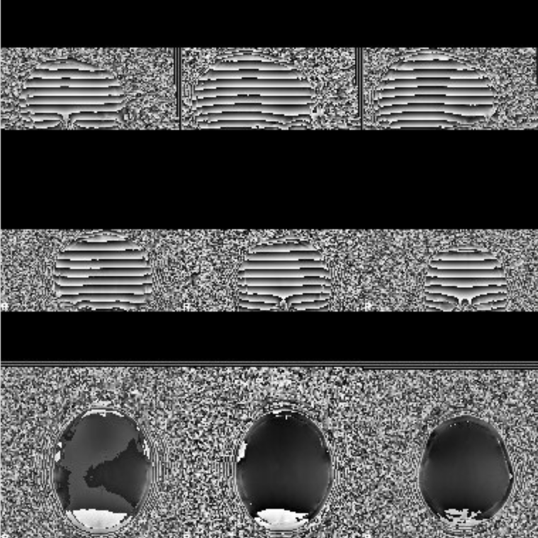
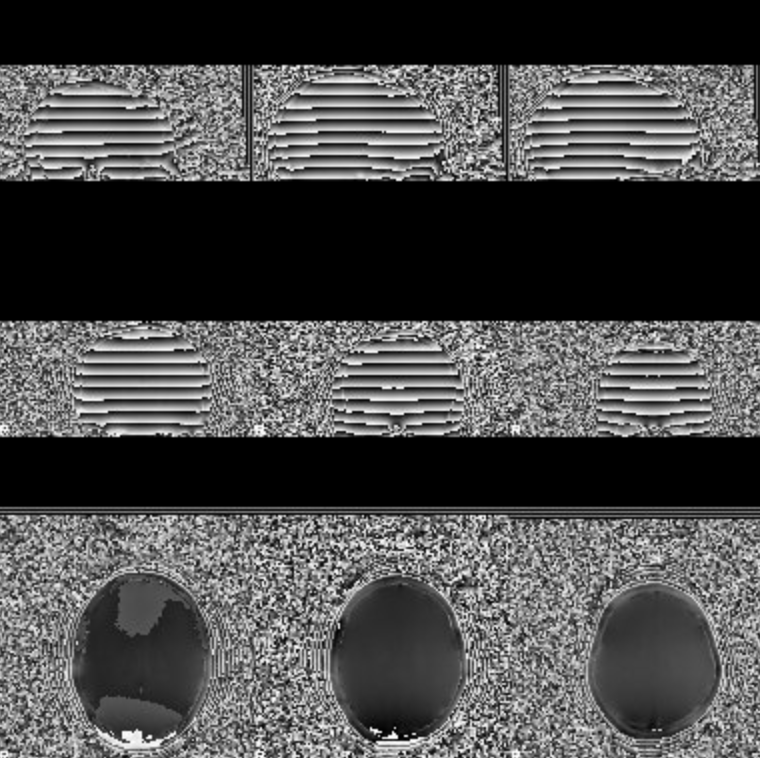
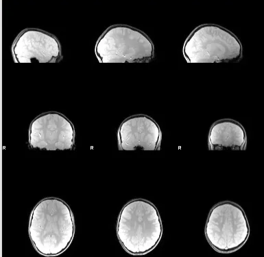
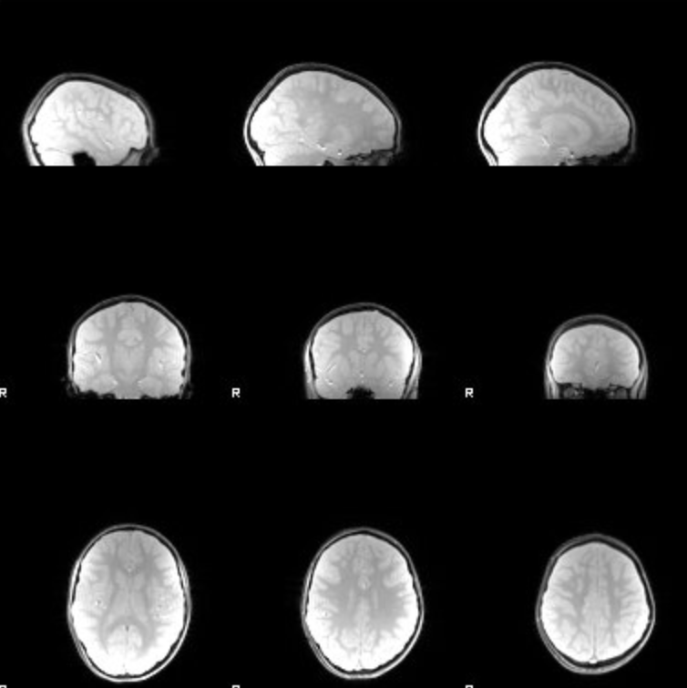
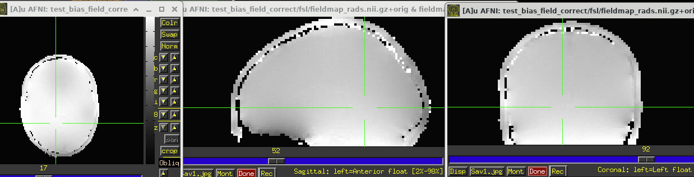
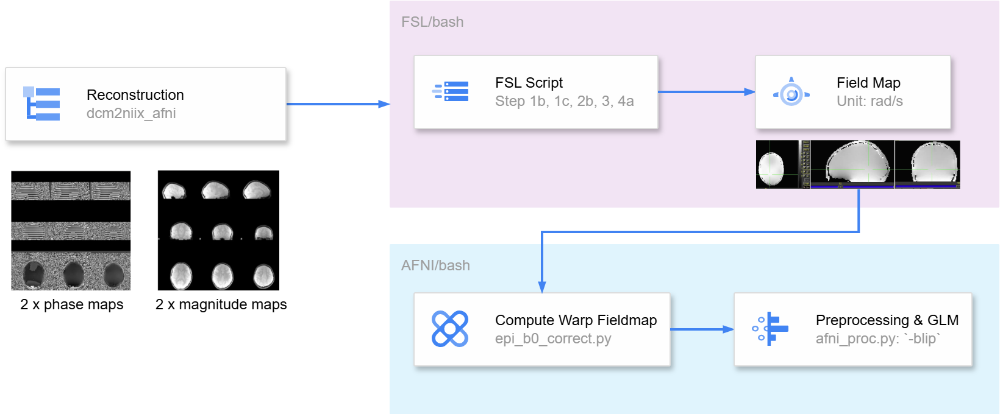

# Bias Field Correction (EPI distortion Correction)

In some cases, you may want to do EPI distortion correction. fSL, fMRI prep, AFNI, and other tools provide this feature. However, some special cases require you to compute the field map first. Here, I will introduce the use of FSL and AFNI to compute the field map first and then do the B0 magnetic field distortion correction.

Before you start, I suggest you get to know your scanner, including TE intervals and units, scanning method (reverse phase coding or dual echo?), and brand, which will help you compute the field map. If the operator doesn't know this information either, you can find it by looking at the information in the JSON file, which includes useful information, including `ImageType`, `EchoTime` , etc.

We are using [GE HealthCare](https://github.com/mr-jaemin/ge-mri/tree/main/B0fieldmap) scan, which is dual echo and theoretically generates a phase map and a magnitude map. However, our scan will output four files, two phase maps with two magnitude maps, corresponding to the long and short TEs. Furthermore, we don’t have a complex volume file, because our phase maps and magnitude images are separate, whereas a complex volume combines the phase map and magnitude images into a single file. Hence, we need to use FSL to compute these four files into a field map first, which is a subtraction of the two phase images from each echo. The two echoes generate two magnitude images, but which one to use doesn’t matter because it will be a mask for a field (or phase) map.

You can use `slices` command in FSL or `afni` in AFNI to look at the images:

::::{grid} 2
:gutter: 2

:::{grid-item}
  
Samples of two phase maps (wrapped)
:::

:::{grid-item}
  
Samples of two phase maps (wrapped)
:::

:::{grid-item}
  
Samples of two magnitude images
:::

:::{grid-item}
  
Samples of two magnitude images
:::
::::

Final field map:


## FSL + AFNI Pipeline

Based on the information provided by [FUGUE](https://web.mit.edu/fsl_v5.0.10/fsl/doc/wiki/FUGUE(2f)Guide.html#Non-SIEMENS_data) "For a pair of phase images you need to do steps 1b, 1c, 2b, 3, 4a, and 5."

Load FSL module first:

```bash
ml FSL/6.0.7.14-foss-2023a
source ${FSLDIR}/etc/fslconf/fsl.sh
```

1. Convert the DICOM files into NIFTI files. Get two phase maps and two magnitude maps.
2. Make sure the magnitude image and the phase maps have the same resolution by resampling (`flirt`) them with a reference image (better resolution or smaller pixdims). 
    1. `flirt -in B*_PM1_4_ph.nii.gz -ref B*_PM1_4_.nii.gz -applyxfm -out orig_phase0
    flirt -in B*_PM2_5_ph.nii.gz -ref B*_PM1_4_.nii.gz -applyxfm -out orig_phase1`
3. Check the range first by using AFNI command `3dinfo -min -max orig_phase0.nii.gz` or FSL command `fslstats orig_phase0.nii.gz -R`  and found the range is [-3141, 3141]. If you use `fslinfo`, you will find the data_type is INT16, if your file is a complex volume, then it should be INT32. Next, use `fslmaths` and ensure the final range of the `phase0_rad` image` is approximately 0 to 6.28; if not, change the value of `-add` , `-mul` , or `-div`.
    1. `fslmaths orig_phase0 -add 3141 -mul 3.14159 -div 3140 phase0_rad -odt float
    fslmaths orig_phase1 -add 3141 -mul 3.14159 -div 3140 phase1_rad -odt float`
4. Unwrap the phase map to reduce the phase wrapping by using `prelude`.
    1. `prelude -a B*_PM1_4_.nii.gz -p phase0_rad -o phase0_unwrapped_rad
    prelude -a B*_PM1_4_.nii.gz -p phase1_rad -o phase1_unwrapped_rad`
5. Get the final field map in rad/s by calculating the phase map difference and dividing by the TE interval. The delta TE (the difference of echo time) must be in units of milliseconds.
    1. `fslmaths phase1_unwrapped_rad -sub phase0_unwrapped_rad -mul 1000 -div 2.2 fieldmap_rads -odt float`
6. FSL team states that “Fieldmaps can often be noisy or be contaminated around the edges of the brain. To correct for this you can regularise the fieldmap using fugue. Note that the "best" regularisation will depend on many factors in the acquisition and must be determined separately for each site/scanner/sequence. Look at the fieldmap (e.g. using fslview) to decide what is the best regularisation to use - which could also be to do no regularisation.” - for our analysis it is true that if you don’t use the following syntax, the preprocessing results will be worse, especially around the edges of the brain.
    1. `fugue --loadfmap=fieldmap_rads -s 1 --savefmap=fieldmap_rads` `fugue --loadfmap=fieldmap_rads --despike --savefmap=fieldmap_rads` `fugue --loadfmap=fieldmap_rads -m --savefmap=fieldmap_rads`

In this way, we will get a field map, and then we can use the AFNI processing pipeline [`epi_b0_correct.py`](https://afni.nimh.nih.gov/pub/dist/doc/program_help/epi_b0_correct.py.html) to calculate the warp field map and put it into `afni_proc.py` to do the preprocessing step. 

*AFNI's description on the field diagram of what units to use can be a bit confusing, but the Notes section is clearly stated “It is important to have your input phase/frequency volume contain the correct units for this program.  Here, we expect them to be in units of angular frequency: "radians/second" (rad/s).”*

- `-in_epi_json` : use this syntax so that you don’t need to input other parameters, such as the direction (axis) of phase encoding.
- `in_anat` : use the anatomy image as the underlay for the automatically generated QC images.
- `do_recenter_freq MEAN` : recenter the phase (=freq) volume by the mean value within the brain mask.
- if use `*` then do not use " ", otherwise, AFNI cannot recognize it.



In the end, the script looks like this:

```bash
#!/bin/bash

echo "$1"
subj="s$(printf %03d $1)"

# Define the results directory for FSL and AFNI
fsl_results_dir="${base_dir}/${subj}/derivatives/bias_field_correct/FSL_results"
afni_results_dir="${base_dir}/${subj}/derivatives/bias_field_correct/AFNI_results"

# Create the result directories if they don't exist
mkdir -p "$fsl_results_dir"
mkdir -p "$afni_results_dir"

cd "${base_dir}/${subj}/derivatives/bias_field_correct"

# FSL pipeline, to generate a field map
flirt -in B*_PM1_4_ph.nii.gz -ref B*_PM1_4_.nii.gz -applyxfm -out "${fsl_results_dir}/orig_phase0"
flirt -in B*_PM2_5_ph.nii.gz -ref B*_PM1_4_.nii.gz -applyxfm -out "${fsl_results_dir}/orig_phase1"

fslmaths "${fsl_results_dir}/orig_phase0" -add 3141 -mul 3.14159 -div 3140 "${fsl_results_dir}/phase0_rad" -odt float
fslmaths "${fsl_results_dir}/orig_phase1" -add 3141 -mul 3.14159 -div 3140 "${fsl_results_dir}/phase1_rad" -odt float

prelude -a B*_PM1_4_.nii.gz -p "${fsl_results_dir}/phase0_rad" -o "${fsl_results_dir}/phase0_unwrapped_rad"
prelude -a B*_PM1_4_.nii.gz -p "${fsl_results_dir}/phase1_rad" -o "${fsl_results_dir}/phase1_unwrapped_rad"

fslmaths "${fsl_results_dir}/phase1_unwrapped_rad" -sub "${fsl_results_dir}/phase0_unwrapped_rad" -mul 1000 -div 2.2 "${fsl_results_dir}/fieldmap_rads" -odt float

# I used 3mm as smoothing because in the old version of fmriprep they also use this parameter: kernel_size=3
fugue --loadfmap="${fsl_results_dir}/fieldmap_rads" -s 3 --savefmap="${fsl_results_dir}/fieldmap_rads"
fugue --loadfmap="${fsl_results_dir}/fieldmap_rads" --despike --savefmap="${fsl_results_dir}/fieldmap_rads"
fugue --loadfmap="${fsl_results_dir}/fieldmap_rads" -m --savefmap="${fsl_results_dir}/fieldmap_rads"

# AFNI pipeline, you need to use the WRAP file in afni_proc.py once you finish it
# note: # if use `*`` then do not use " "
epi_b0_correct.py \
  -in_epi_json B*CEV*.json \
  -in_freq "${fsl_results_dir}/fieldmap_rads.nii.gz" \
  -in_magn B*_PM1_4_.nii.gz \
  -in_epi B*CEV*.nii.gz \
  -in_anat ${base_dir}/${subj}/derivatives/sswarp2/B*T1*nii* \
  -prefix "${afni_results_dir}/b0_corr_${subj}" \
  -do_recenter_freq MEAN
```

Finally, use the warp file in `afni_proc.py` : put the `-blip_warp_dset "${base_dir}"/"s${subj}"/derivatives/kidvid_output/bias_field_correct/b0_corr_WARP.nii.gz \` between `tcat_remove_first_trs` and `tshift_interp`.

## Quality Control
After completing preprocessing, you can perform qualitative quality control. Generally, alignment will be improved and geometric distortion will be reduced.
Of note, distortion correction does not provide a significant improvement in data quality, and if it does, then you may need to contact a scanner engineer to improve this. It does, however, it potentially help with the alignment of EPI data and anatomy data (Reynolds et al., 2024).

:::{tip}
"First, I would check whether the direction of unwarping matches what you would expect based on the phase encoding direction. I would also see if there are any warps that are being corrected (e.g., focal points of indents or expansions that are not biologically plausible), in other words is the final product more brain like? Then I would check whether the unwarping leads to better EPI alignment with the t1 image, which should be another part of the HTML report."

[https://neurostars.org/t/fmriprep-how-do-i-determine-the-quality-of-distortion-correction/31107](https://neurostars.org/t/fmriprep-how-do-i-determine-the-quality-of-distortion-correction/31107)

Interestingly, based on my practical experience, I found if I did distortion correction the data seems to be worse, it could due to motion, or maybe phase differences cause more distortion.

Attached are the discussion I found:

[https://neurostars.org/t/increased-distortions-following-distortion-correction-in-fmriprep/26838/2](https://neurostars.org/t/increased-distortions-following-distortion-correction-in-fmriprep/26838/2)

[https://bids-specification.readthedocs.io/en/stable/modality-specific-files/magnetic-resonance-imaging-data.html#types-of-fieldmaps](https://bids-specification.readthedocs.io/en/stable/modality-specific-files/magnetic-resonance-imaging-data.html#types-of-fieldmaps)

[https://neurostars.org/t/fmriprep-20-2-3-directly-measured-b0-map-sdc-correction-created-worse-functional-images/22057/10](https://neurostars.org/t/fmriprep-20-2-3-directly-measured-b0-map-sdc-correction-created-worse-functional-images/22057/10)

[https://fmriprep.org/en/20.2.0/sdc.html#eq-fieldmap](https://fmriprep.org/en/20.2.0/sdc.html#eq-fieldmap)

[https://discuss.afni.nimh.nih.gov/t/to-blip-or-not-to-blip/1787/3](https://discuss.afni.nimh.nih.gov/t/to-blip-or-not-to-blip/1787/3)

[https://discuss.afni.nimh.nih.gov/t/epi-b0-correct-py-help-improvements-feature-request/2172](https://discuss.afni.nimh.nih.gov/t/epi-b0-correct-py-help-improvements-feature-request/2172)
:::

## Using [SDC Workflow](https://www.nipreps.org/sdcflows/master/index.html) to compute fieldmap

Download singularity first:

```bash
singularity build /work/cglab/containers/sdcflows-2.10.0.sif docker://nipreps/sdcflows:2.10.0
```
Make sure the phase and magnitude maps are in [BIDS format](https://bids-specification.readthedocs.io/en/latest/modality-specific-files/magnetic-resonance-imaging-data.html#case-2-two-phase-maps-and-two-magnitude-images).

Submit slurm scripts:

```bash
#!/bin/bash

# Name of the job
#SBATCH --job-name=fieldmap_sdc

# Partition on GACRC to run job
#SBATCH --partition=batch 

# Number of tasks
#SBATCH --ntasks=1

# Number of compute nodes
#SBATCH --nodes=1

# Number of CPUs per task
#SBATCH --cpus-per-task=16

# Request memory
#SBATCH --mem=32G

# save logs 
#SBATCH --output=/scratch/%u/workDir/log/fieldmap_sdc/fieldmap_sdc_log_array_%A-%a.out
#SBATCH --error=/scratch/%u/workDir/log/fieldmap_sdc/fieldmap_sdc_error_array_%A-%a.err

# Walltime (job duration)
#SBATCH --time=1:00:00

# Array jobs (* change the range according to # of subject; % = number of active job array tasks)
#SBATCH --array=1-3%15

participants=(174 177 191)
PARTICIPANT_LABEL=${participants[(${SLURM_ARRAY_TASK_ID} - 1)]}
BIDS_DIR=/scratch/qy49547/workDir/BIDS/
OUTPUT_DIR=/scratch/qy49547/workDir/BIDS/fieldmap_derivatives/
WORK_DIR=/scratch/qy49547/workDir/sdc_work/sub-${PARTICIPANT_LABEL}

echo "array id: " ${SLURM_ARRAY_TASK_ID}, "subject id: " ${PARTICIPANT_LABEL}

mkdir -p ${WORK_DIR}
mkdir -p ${OUTPUT_DIR}

singularity run --cleanenv \
    -B ${BIDS_DIR}:/data \
    -B ${WORK_DIR}:/work \
    -B ${OUTPUT_DIR}:/output \
    /work/cglab/containers/sdcflows-mriqc-2.10.0.sif \
    sdcflows /data /output \
    participant --participant-label ${PARTICIPANT_LABEL} \
    -w /work \
    -v --debug

```

You need to use `WORK_DIR=/scratch/qy49547/workDir/sdc_work/sub-${PARTICIPANT_LABEL}` to create separate folders, otherwise it may report erros.


# Reference and Resource
[https://mriquestions.com/making-an-sw-image.html](https://mriquestions.com/making-an-sw-image.html)

[https://discuss.afni.nimh.nih.gov/t/non-linear-warp-of-epi-to-experimental-t1-for-multiple-epi-runs-concatenating-affine-non-linear/7684/7](https://discuss.afni.nimh.nih.gov/t/non-linear-warp-of-epi-to-experimental-t1-for-multiple-epi-runs-concatenating-affine-non-linear/7684/7)

[https://neurostars.org/t/increased-distortions-following-distortion-correction-in-fmriprep/26838/2](https://neurostars.org/t/increased-distortions-following-distortion-correction-in-fmriprep/26838/2)

[https://bids-specification.readthedocs.io/en/stable/modality-specific-files/magnetic-resonance-imaging-data.html#types-of-fieldmaps](https://bids-specification.readthedocs.io/en/stable/modality-specific-files/magnetic-resonance-imaging-data.html#types-of-fieldmaps)

Richard C. Reynolds, Daniel R. Glen, Gang Chen, Ziad S. Saad, Robert W. Cox, Paul A. Taylor; Processing, evaluating, and understanding FMRI data with afni_proc.py. *Imaging Neuroscience* 2024; 2 1–52. doi: https://doi.org/10.1162/imag_a_00347

Hutton, C., Bork, A., Josephs, O., Deichmann, R., Ashburner, J., & Turner, R. (2002). Image Distortion Correction in fMRI: A Quantitative Evaluation. *NeuroImage*, *16*(1), 217-240. https://doi.org/10.1006/nimg.2001.1054

Roopchansingh, V., French, J. J., Nielson, D. M., Reynolds, R. C., Glen, D. R., D’ Souza, P., Taylor, P. A., Cox, R. W., & Thurm, A. E. (2020). *EPI Distortion Correction is Easy and Useful, and You Should Use It: A case study with toddler data*. Biophysics. https://doi.org/10.1101/2020.09.28.306787

[https://github.com/mr-jaemin/ge-mri/tree/main/B0fieldmap](https://github.com/mr-jaemin/ge-mri/tree/main/B0fieldmap)

[https://neurostars.org/t/ge-fieldmap-correction-with-real-imaginary-files/28537/7](https://neurostars.org/t/ge-fieldmap-correction-with-real-imaginary-files/28537/7)

[https://bids-specification.readthedocs.io/en/stable/modality-specific-files/magnetic-resonance-imaging-data.html#case-2-two-phase-maps-and-two-magnitude-images](https://bids-specification.readthedocs.io/en/stable/modality-specific-files/magnetic-resonance-imaging-data.html#case-2-two-phase-maps-and-two-magnitude-images)

[https://web.mit.edu/fsl_v5.0.10/fsl/doc/wiki/FUGUE(2f)Guide.html#Non-SIEMENS_data](https://web.mit.edu/fsl_v5.0.10/fsl/doc/wiki/FUGUE(2f)Guide.html#Non-SIEMENS_data)

[https://crnl.readthedocs.io/fieldmaps/index.html#tips](https://crnl.readthedocs.io/fieldmaps/index.html#tips)

[https://www.caroline-nettekoven.com/post/how-to-fieldmap-correct/](https://www.caroline-nettekoven.com/post/how-to-fieldmap-correct/)

[https://lcni.uoregon.edu/wiki/acquiring-and-using-field-maps/](https://lcni.uoregon.edu/wiki/acquiring-and-using-field-maps/)

[https://andysbrainbook.readthedocs.io/en/latest/FrequentlyAskedQuestions/FrequentlyAskedQuestions.html](https://andysbrainbook.readthedocs.io/en/latest/FrequentlyAskedQuestions/FrequentlyAskedQuestions.html)

[https://www.fmrib.ox.ac.uk/primers/intro_primer/ExBox19/IntroBox19.html](https://www.fmrib.ox.ac.uk/primers/intro_primer/ExBox19/IntroBox19.html)

