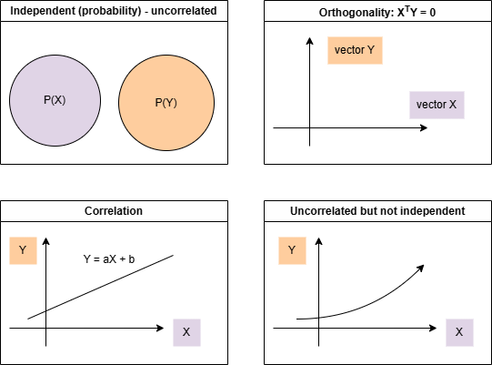
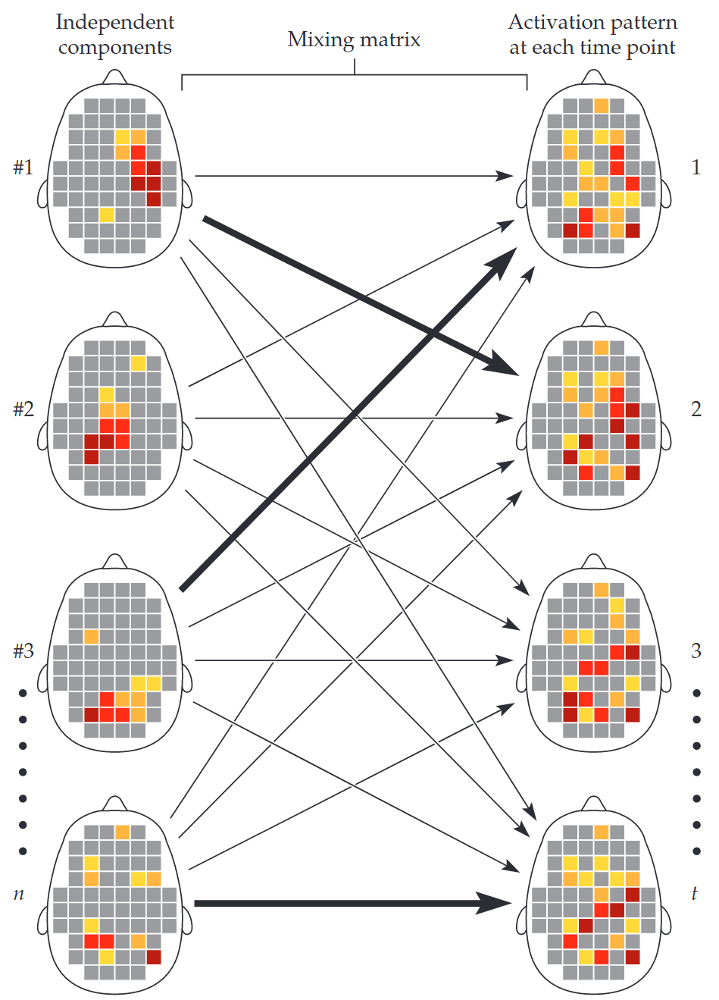
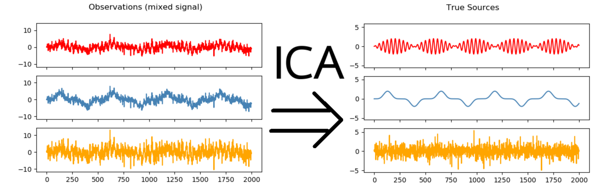
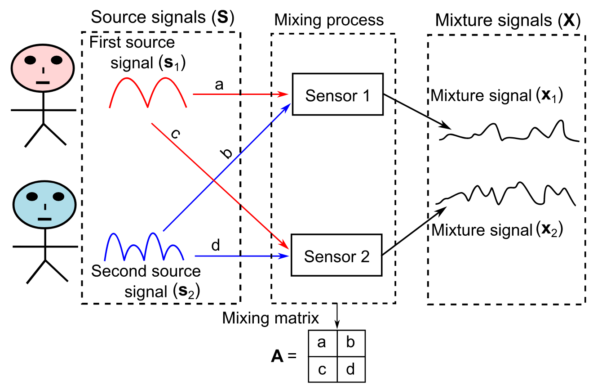
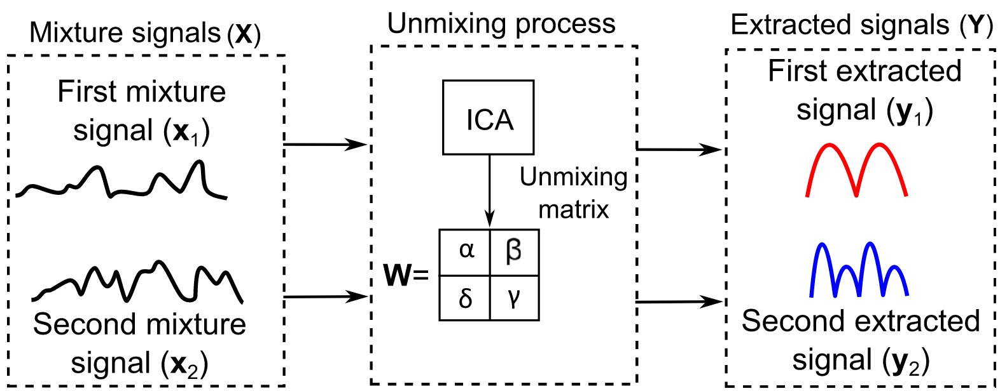
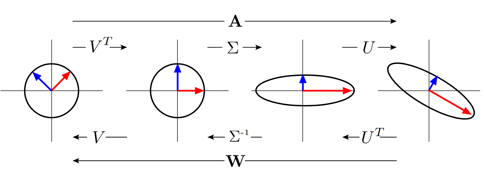
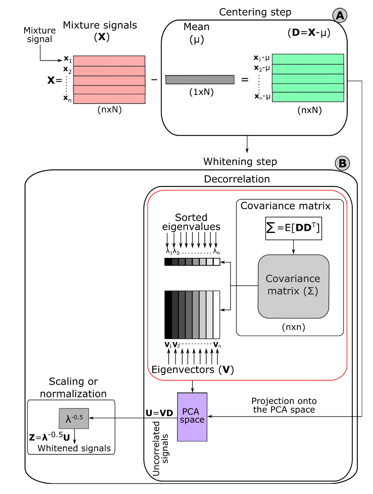
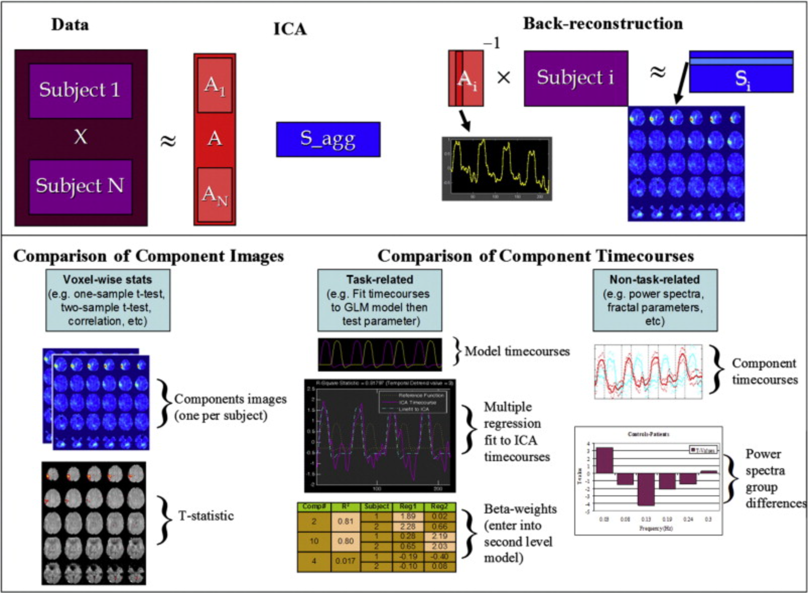
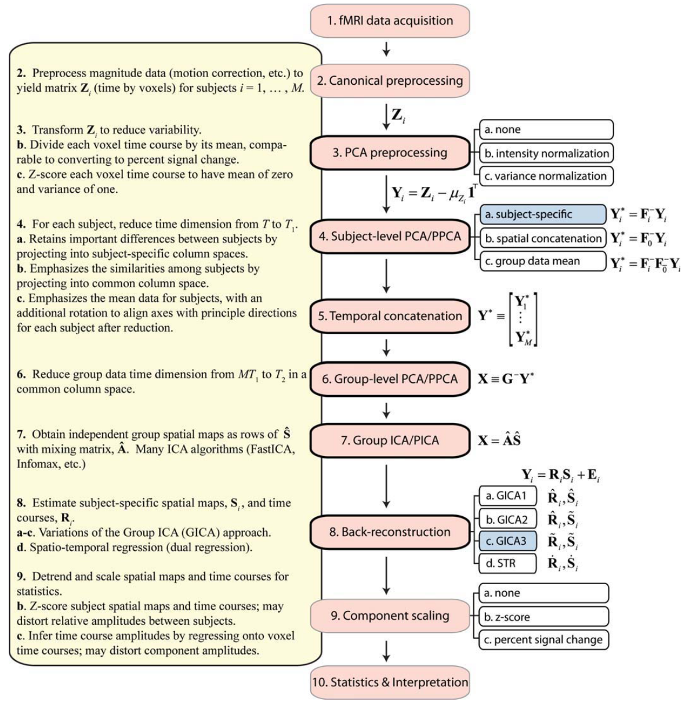

# Independent Component Analysis (ICA)

# Introduction of Principles

## Conceptual Path

### Principal Components Analysis (PCA)

Before we talk about ICA, let’s discuss PCA (principal components analysis) first. Although preprocessing can sometimes reduce the impact of noise, in many cases, we encounter challenges such as noise originating from complex backgrounds or containing multiple components, especially when we lack knowledge about the properties of the noise—or even worse, the properties of the signal. In such situations, PCA helps reduce data complexity (lower dimensionality) by identifying the component that accounts for the largest variance in the dataset. After extracting this component, PCA proceeds iteratively: it removes the effect of the extracted component, identifies the next component with the largest remaining variance, and continues until either the desired number of components is extracted or the cumulative explained variance is sufficient to describe the data.

Therefore, each component is orthogonal to the others (statistically independent of each other and does not share explained variance) but is logically related to the previous components (since each principal component is calculated based on the residual variance after removing the effect of earlier components). Each component explains a portion of the variance, quantified by its eigenvalue, where a larger eigenvalue indicates that the component explains more variance. The selection of meaningful components can be guided by methods such as the Kaiser criterion (eigenvalues greater than 1) or by observing a scree plot to identify where the curve flattens out.

When applied to fMRI data, PCA can extract a set of components representing activation patterns across voxels. These components may reflect underlying functional activities, allowing researchers to explore distributed functional systems that are not easily accessible through hypothesis-driven methods.

### Independent Component Analysis (ICA)

However, as ideal as PCA might seem, fMRI data often contains a greater proportion of noise than signal, meaning PCA could sometimes extract noise instead of meaningful signals. Therefore, we need to use ICA. ICA divides the data into separate components, each of which contributes differently to the activation pattern at different points in time. These independent components may spatially overlap because the brain is complex, and a single brain region cannot fully explain the activation. PCA, on the other hand, focuses on ensuring that the components do not share variance, meaning it enforces orthogonality between components. However, this method ignores potential nonlinear relationships. In contrast, ICA focuses on statistical (probabilistic) independence, meaning that the components are statistically independent, and the extraction of each component does not depend on the previous one as it does in PCA.

:::{figure} images/ICA/ica2.png
*Uncorrelated does not necessarily mean independent, as there may be a nonlinear relationship between the variables. However, independence implies uncorrelation.*

[https://bernstein-network.de/wp-content/uploads/2021/03/Lecture-16-Independent-component-analysis-2020.pdf](https://bernstein-network.de/wp-content/uploads/2021/03/Lecture-16-Independent-component-analysis-2020.pdf)
:::

There are two forms of ICA: **Spatial ICA**, which reduces spatial overlap between components to enhance their independence, and **Temporal ICA**, which reduces temporal overlap or similarity between components, ensuring that each component’s activation pattern behaves as a distinct temporal trajectory. The choice between spatial ICA and temporal ICA typically depends on the characteristics of the data and the design of the experiment. Unlike other statistical methods we are familiar with, ICA does not have preconceived assumptions and is therefore based on a data-driven approach. However, ICA also faces challenges, such as how to match the extracted components to noise or signal activities, and how to integrate components from different subjects when each subject has a unique pattern of components.

:::{figure} images/ICA/ica3.png
Ashby, F. G. (2011). Statistical analysis of fMRI data. MIT Press.
:::

In terms of purpose, PCA aims to maximize the variance that can explain the results. However, because the task-related signal might be small, this signal may be lost if it is overshadowed by other variances in the data (often noise). On the other hand, ICA attempts to isolate each variable or component independently, allowing each independent component to explain the results without being influenced by others.

:::{note}
Now, let's summarize ICA and PCA with an analogy: When we paint an oil painting, we choose different paint cans (ingredients) that are individually packaged and do not mix. We use these paints in different moments and spaces, and each paint reflects a different brain network. In ICA, each paint (representing an independent component) is applied separately, and the patterns of activation in the brain correspond to these distinct, independent components. PCA, on the other hand, is like focusing on which colors (or ingredients) on the canvas will cover the entire range of colors in the painting. These colors can be mixed together, and the goal is to represent the largest amount of variation in the painting with just a few primary colors. For example, blue might represent the sea in the painting, which maximally explains the color variation in that area, similar to how PCA captures the largest variance in the data.

Huettel, Scott A, et al. Functional Magnetic Resonance Imaging. Sunderland, Mass., Sinauer Associates, Publishers, 2004.

[https://team.inria.fr/parietal/research/statistical-and-machine-learning-methods-for-large-scale-data/faster-independent-component-analysis-for-real-data/](https://team.inria.fr/parietal/research/statistical-and-machine-learning-methods-for-large-scale-data/faster-independent-component-analysis-for-real-data/)
:::

## Quantitative Path

### Fundamental Principle

In ICA, the goal is to find the unmixing matrix W and then project the whitened data onto that matrix for extracting independent signals (Tharwat, 2022). 

Suppose we have the original signal data X matrix that varies with time t. To find the true signal matrix S, we can use the constant matrix A multiplied by the S matrix to obtain the matrix X (assuming that X is a linear mixture of S):

$$
A \begin{bmatrix}s_{1}(t) \\s_{2}(t) \\... \\s_{n}(t)\end{bmatrix} = \begin{bmatrix}x_{1}(t) \\x_{2}(t) \\... \\x_{n}(t)\end{bmatrix}\\As = x
$$

Find the inverse or the unmixing matrix **W**: $s = A^{-1} x =Wx$

:::{figure}

Tharwat, A. (2021), "Independent component analysis: An introduction", Applied Computing and Informatics, Vol. 17 No. 2, pp. 222-249. https://doi.org/10.1016/j.aci.2018.08.006
:::

However, since we have two unknowns, A and S, this is an under-constrained problem because the number of unknowns exceeds the number of observations (Shlens, 2014). By focusing on solving A, we will use [singular value decomposition (SVD)](https://www.geeksforgeeks.org/singular-value-decomposition-svd/) to divide A into several simpler pieces. Then we examine the covariance of the data x in order to calculate U and Σ, and further return to the assumption of independence of s to solve for V (Shlens, 2014).

$$
A = U \Sigma V^{T} \\ W = A^{-1} = V \Sigma ^{-1} U^{T}
$$

Any matrix is decomposed into three “simpler” linear operations: a **rotation V**, a **stretch** along the axes Σ, and a **second rotation U**. Each matrix in the SVD is “simpler” because each matrix contains fewer parameters to infer and each matrix is trivial to invert: U and V are rotation matrices (or orthogonal matrices) and Σ is a diagonal matrix with real, non-negative values (Shlens, 2014).

### Assumption

- **Independence**: every source is independent.
- **Gaussianity**: non-Gaussian distribution (not bell-shaped or normal).
    - ***Central Limit Theorem:***
        - Independent and non-Gaussian sources with a sufficient number of samples, the distribution of sample means will eventually converge to a normal distribution.
        - The mixture of normal distributions remains normal and centrosymmetric, so it is impossible to find the original signal.
- **Complexity**: mixed signals are more complex than source signals.

### Preprocessing Phase

Whitening + non-Gaussianity = independence

- **Centering data**: removing mean, and placing data to the center of the axes.
- **Whitening process**: sphere data
    - Decorrelation: remove all linear dependencies in a data set and normalize the variance along all dimensions. Colloquially, this operation is termed sphereing the data as intuitively, whitening maps the data into a spherically symmetric distribution (Shlens, 2014).
    - Scale variables: make sure each vector in U has a unit length (variance =1) by rescaling (multiplying $\mathrm {D}^{-\frac{1}{2}}$).
- Optimization algorithm to maximize non-Gaussianity of each source.

Data is projected on the principal components, $\mathrm {E}^{T}\mathrm {x}$  . Each axis is then scaled that every direction has unit variance, $\mathrm {D}^{-\frac{1}{2}} \mathrm {E}^{T}\mathrm {x}$. The red arrow indicates the transformation of the eigenvector with the largest variance (Shlens, 2014).

:::{figure} images/ICA/ica10.png
:align: center
:width: 30%
Tharwat, A. (2021), "Independent component analysis: An introduction", Applied Computing and Informatics, Vol. 17 No. 2, pp. 222-249. https://doi.org/10.1016/j.aci.2018.08.006
:::

### Find the Unmixing Matrix W

- **Measure non-Gaussian (Kurtosis, negentropy):**
    - Kurtosis = 0 Gaussian, Kurtosis > 0 Super-Gaussian, Kurtosis < 0 Sub-Gaussian.
    - However, it is sensitive to outliers.

$$
k = \frac{E(x - \mu )^{4} }{\sigma ^{4} } -3
$$

- **Minimization of mutual information**
- **Maximum Likelihood (ML)**

# Application of ICA in MRI Studies

- Reduce Noise
- Resting state analysis
- Functional connectivity
- functional MRI - temporal ICA

## Group Analysis

Since ICA is data-driven, we do not have explicit regressors of interest compared to GLM, and it is difficult to assume that all subjects in the same group have the same regressors or time course, so we need to take a different approach to group inference. However, we assume that every participant performs the same task sequence. As a result, the time courses of the individual source images that correspond to the task performance should be comparable. Secondly, a larger sample with N independent sources is easily obtained by combining two samples from N different sources, even if the two samples come from different sources (Svensén et al., 2002).

### Quantitative Path

Here, we first introduce the principle of GIFT processing group ICA. GIFT incorporates temporal concatenation and back-reconstruction by first merging every subject’s time-series matrix as a new group matrix, and then using PCA dimensionality reduction to reduce the computational effort of ICA (Calhoun et al. 2009). 

$Y_{i}$ is a $K \times V$ matrix, in which K is the time series and V is the number of voxels. $F_{i}^{-1}$ is a $L \times K$ matrix that has undergone PCA dimensionality reduction. **L is the size of the time dimension** following reduction. The $LM \times V$ reduced, concatenated matrix for the M subjects is:

$$
\mathrm {X} =  \mathrm {G}^{-1} \begin{bmatrix}F_{1}^{-1}Y_{1}  \\... \\F_{M}^{-1}Y_{M}\end{bmatrix}
$$

Here, $X_{i}$ is the reduced data and $G^{-1}$ is the matrix that helps to reduce the LM dimension to the N dimension.

Thus:

$$
X = AS\\\begin{bmatrix}G_{1} \\... \\G_{M}\end{bmatrix}AS = \begin{bmatrix}F_{1}^{-1}Y_{1}  \\... \\F_{M}^{-1}Y_{M}\end{bmatrix}
$$

In order to compute the component maps for each subject, we next compute the mixing matrix A, which has partitions specific to each subject. We then project the data from the single subject onto the inverse of the partition of the mixing matrix corresponding to that subject, and this is the back-reconstruction step (Calhoun et al. 2009).

We calculate the matrix $S_{i}$ containing the single subject maps for subject i, and compute $Y_{i}$ which provides the ICA decomposition of the data from subject i:

$$
G_{i}AS = F_{i}^{-1} Y_{i}\\\hat{S_i} = (G_{i}\hat{A})^{-1}F_{i}^{-1}Y_{i}\\Y_{i}\approx F_{i}G_{i}\hat{A}\hat{S_i}
$$

Note, $\hat{S_i}$ indicates estimation of $S_i$, and $\hat{A}$ indicates estimation value of matrix $A$ because we don’t know the real value of S and A.

:::{figure}

Calhoun, V. D., Liu, J., & Adalı, T. (2009). A review of group ICA for fMRI data and ICA for joint inference of imaging, genetic, and ERP data. *NeuroImage*, *45*(1), S163-S172. https://doi.org/10.1016/j.neuroimage.2008.10.057

Erhardt, E. B., Rachakonda, S., Bedrick, E. J., Allen, E. A., Adali, T., & Calhoun, V. D. (2011). Comparison of multi-subject ICA methods for analysis of fMRI data. *Human Brain Mapping*, *32*(12), 2075–2095. https://doi.org/10.1002/hbm.21170
:::

# Resource and Reference

[https://dartbrains.org/content/ICA.html](https://dartbrains.org/content/ICA.html)

[https://dartbrains.org/content/Introduction_to_ICA.html](https://dartbrains.org/content/Introduction_to_ICA.html)

[https://www.newbi4fmri.com/tutorial-10-ica](https://www.newbi4fmri.com/tutorial-10-ica)

[https://www.nitrc.org/projects/gift](https://www.nitrc.org/projects/gift)

[https://youtu.be/RSWuYpjTrk0?si=x32cqxa74dHzRjxN](https://youtu.be/RSWuYpjTrk0?si=x32cqxa74dHzRjxN)

[https://youtu.be/R0yRIDLrNNc?si=prqyT7U3shZBZx7z](https://youtu.be/R0yRIDLrNNc?si=prqyT7U3shZBZx7z)

Tharwat, A. (2021), "Independent component analysis: An introduction", Applied Computing and Informatics, Vol. 17 No. 2, pp. 222-249. https://doi.org/10.1016/j.aci.2018.08.006

Huettel, Scott A, et al. *Functional Magnetic Resonance Imaging*. Sunderland, Mass., Sinauer Associates, Publishers, 2004.

Shlens, J. (2014). A Tutorial on Independent Component Analysis. *ArXiv*. https://arxiv.org/abs/1404.2986

Calhoun, V. D., Liu, J., & Adalı, T. (2009). A review of group ICA for fMRI data and ICA for joint inference of imaging, genetic, and ERP data. *NeuroImage*, *45*(1), S163-S172. https://doi.org/10.1016/j.neuroimage.2008.10.057

Svensén, M., Kruggel, F., & Benali, H. (2002). ICA of fMRI Group Study Data. *NeuroImage*, *16*(3), 551–563. https://doi.org/10.1006/nimg.2002.1122

Erhardt, E. B., Rachakonda, S., Bedrick, E. J., Allen, E. A., Adali, T., & Calhoun, V. D. (2011). Comparison of multi-subject ICA methods for analysis of fMRI data. *Human Brain Mapping*, *32*(12), 2075–2095. https://doi.org/10.1002/hbm.21170