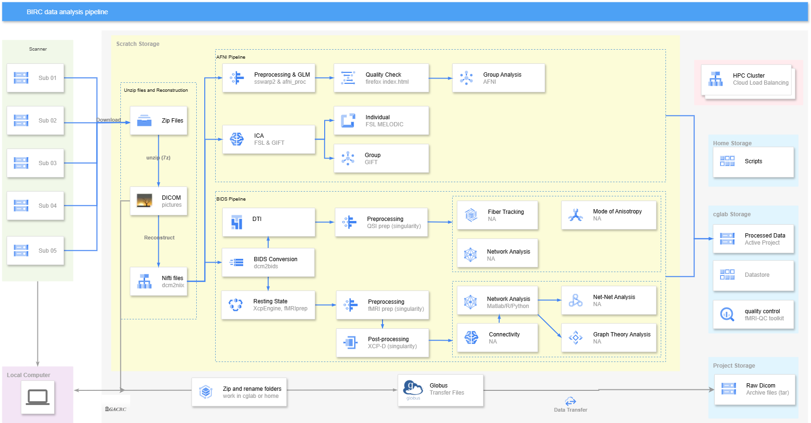

# fMRI-functional-Magnetic-Resonance-Imaging-Data-Processing-Manual

This manual is still being updated periodically. The preprocessing tools are AFNI, fMRIPrep, and XCP-D. Post-processing primarily utilizes Python.

**Handbook:** https://qiuyuyu3.github.io/fMRI-Data-Processing-Manual-on-HPC/

## Overview Pipeline

## Table of Contents
### Task_based
[00 fMRI Resource](00_fMRI_Resource.md)

[01 Introduction to Linux, GACRAC, and AFNI](01_Introduction.md)

[02 Reconstruction: Convert 2D images to 3D (anatomical) or 4D (functional)](02_Reconstruction.md)

[03 Preprocessing & afni_proc.py](03_Preprocessing.md)

[04 General Linear Regression & Experimental Design](04_Regression.md) *This section is still in development*

[05 Preprocessing Pipeline: convert DICOM to Nifiti, sswarper2 & afni_proc.py](05_Preprocessing_Pipeline.md)

[06 Quality Control](06_Quality_Control.md)

[07 Group Analysis](07_Group_Analysis.md) *This section is still in development*

### Resting State
[fMRI Prep, XCP-D, MRIQC, and Resting State fMRI](RS1.md)

[Functional Connectivity and Graph Theory](RS2.md) *This section is still in development*

### Other
[Bias Field Correction (EPI distortion Correction)](BFC.md)

[Special Issues](Special_Issues.md)

[Freesurfer and SUMA](Freesurfer_and_SUMA.md) *This section is still in development*

[Independent Component Analysis (ICA)](ICA.md)

