# fMRI Prep, XCP-D, MRIQC, and Resting State fMRI

## [fmriprep](https://fmriprep.org/en/stable/index.html)

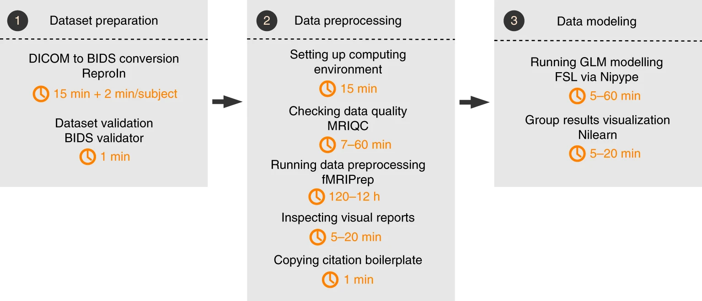

Esteban, O., Ciric, R., Finc, K. et al. Analysis of task-based functional MRI data preprocessed with fMRIPrep. Nat Protoc 15, 2186–2202 (2020). https://doi.org/10.1038/s41596-020-0327-3

### Notes:

- We use singularity so we need to define data (input BIDS files), work (temporary directory), and output directory.
- Number of nonsteady-state volumes (6 TRs): `--dummy-scans 6` Note that in fMRIPrep dummy TRs will not be actually removed. You need to remove them in post-analysis.
- Use bias field correction: `--use-syn-sdc warn \ --force-syn \`
- Export cifiti (freesurfer) files : `--cifti-output 91k`
- Align to templates: `--output-spaces T1w HaskinsPeds MNI152NLin2009cAsym`
    - fmriprep only support certain [templates](https://www.templateflow.org/)
    - If you want to use your own template, see:[https://fmriprep.org/en/stable/spaces.html#custom-standard-spaces](https://fmriprep.org/en/stable/spaces.html#custom-standard-spaces)

```bash
#!/bin/bash

# Name of the job
#SBATCH --job-name=branch_w1_rs_fmriprep

# Partition on GACRC to run job
#SBATCH --partition=batch 

# Number of tasks
#SBATCH --ntasks=1

# Number of compute nodes
#SBATCH --nodes=1

# Number of CPUs per task
#SBATCH --cpus-per-task=16

# Request memory
#SBATCH --mem=64G

# save logs 
#SBATCH --output=/scratch/%u/workDir/RS_BIDS/log/fmriprep/fmriprep_log_array_%A-%a.out
#SBATCH --error=/scratch/%u/workDir/RS_BIDS/log/fmriprep/fmriprep_error_array_%A-%a.err

# Walltime (job duration)
#SBATCH --time=12:00:00

# Array jobs (* change the range according to # of subject; % = number of active job array tasks)
#SBATCH --array=1-2%20

participants=(116 121)
PARTICIPANT_LABEL=${participants[(${SLURM_ARRAY_TASK_ID} - 1)]}

BIDS_DIR=/scratch/$USER/workDir/RS_BIDS/
OUTPUT_DIR=/scratch/$USER/workDir/RS_BIDS/derivatives/
WORK_DIR=/scratch/$USER/workDir/work/fmriprep/sub-${PARTICIPANT_LABEL}/
FMRIPREP_RESOURCES_PATH=/work/PATH/containers/

echo "array id: " ${SLURM_ARRAY_TASK_ID}, "subject id: " ${PARTICIPANT_LABEL}

mkdir -p ${WORK_DIR}
mkdir -p ${OUTPUT_DIR}

singularity run \
                --cleanenv \
                -B ${FMRIPREP_RESOURCES_PATH}:/resources \
                -B ${BIDS_DIR}:/data \
                -B ${WORK_DIR}:/work \
                -B ${OUTPUT_DIR}:/output \
        ${FMRIPREP_RESOURCES_PATH}/fmriprep-23.2.1.sif /data /output \
        participant --participant_label $PARTICIPANT_LABEL \
        -w /work \
        --nthreads 16 \
        --fs-license-file /resources/.licenses/freesurfer/license.txt \
        --skip_bids_validation \
        --dummy-scans 6 \
        --use-syn-sdc warn \
        --force-syn \
        --write-graph \
        --debug all \
        -vv \
        --cifti-output 91k \
        --output-spaces T1w MNI152NLin2009cAsym
```

### **Troubleshooting:**

- If you want to perform a reanalysis, remember to clear the cache, especially the freesurfer cache, otherwise fmriprep will report an error.
    - Remember to clean `/path/sourcedata/freesurfer` if you run into any errors, otherwise, it will keep reporting errors even when you fix the bugs.
- Since fmriprep traverses all root directories to find BIDS files during analysis, do not use the following file structure, otherwise, fmriprep will read BIDS files in subdirectories and cause errors.

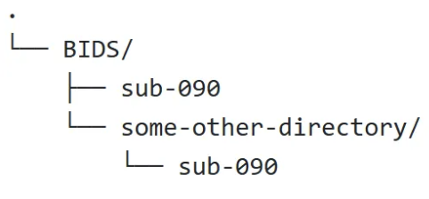

- Create a separate work directory or space for each participant to avoid reporting error: `WORK_DIR=/scratch/$USER/workDir/work/fmriprep/sub-${PARTICIPANT_LABEL}/`
- fmriprep uses freesurfer and it requires a liscense from freesurfer: `--fs-license-file /resources/.licenses/freesurfer/license.txt`
- Sometimes the fmriprep pipeline gets stuck or hangs. High motion can potentially cause errors in the Freesurfer and then lead to the "cannot finish" situation. This occurs with approximately a 1% probability. Check the logs in the cache and check the T1w images to see if they have any artifacts. [https://github.com/nipreps/fmriprep/issues/1478](https://github.com/nipreps/fmriprep/issues/1478)

### **Custom standard spaces**

Convert AFNI file to `nii.gz` format, and create a mask.

```bash
3dAFNItoNIFTI -prefix /home/qy49547/.cache/templateflow/tpl-HaskinsPeds/tpl-HaskinsPeds_res-1_T1w.nii.gz HaskinsPeds_NL_template1.0+tlrc
fslmaths /home/qy49547/.cache/templateflow/tpl-HaskinsPeds/tpl-HaskinsPeds_res-1_T1w.nii.gz -thr 0.5 -bin /home/qy49547/.cache/templateflow/tpl-HaskinsPeds/tpl-HaskinsPeds_res-1_desc-brain_mask.nii.gz

3dAFNItoNIFTI -prefix tpl-HaskinsPeds_atlas.nii HaskinsPeds_NL_atlas1.01+tlrc

```

```bash
qy49547@ra6-14 tpl-HaskinsPeds$ fslinfo tpl-HaskinsPeds_res-1_desc-brain_mask.nii.gz
qy49547@c1-5 tpl-HaskinsPeds$ fslinfo tpl-HaskinsPeds_res-1_T1w.nii.gz
data_type	UINT8
dim1		179
dim2		218
dim3		182
dim4		1
datatype	2
pixdim1		1.000000
pixdim2		1.000000
pixdim3		1.000000
pixdim4		0.000000
cal_max		0.000000
cal_min		0.000000
file_type	NIFTI-1+
```

**Troubleshooting:** 

- If you want to use template from AFNI, note that `SSW` template is specially for `sswarper2` and `afni_proc.py` and has 4 volumes, which is not applicable for fmriprep becasue `SSW` is only used for `sswarper` program in AFNI…You should use the template without `SSW`.
    - [https://afni.nimh.nih.gov/pub/dist/doc/htmldoc/template_atlas/sswarper_base.html#id2](https://afni.nimh.nih.gov/pub/dist/doc/htmldoc/template_atlas/sswarper_base.html#id2)
- For [nonstandard spaces](https://fmriprep.org/en/stable/spaces.html#nonstandard-spaces)**,** "Modifiers are not allowed when providing nonstandard spaces."
- Download full templates from templateflow in `/home/$USER/.cache/templateflow/tpl-HaskinsPeds`; otherwise all the templates will be 0kb.

**Resources**

Molfese, P. J., Glen, D., Mesite, L., Cox, R. W., Hoeft, F., Frost, S. J., Mencl, W. E., Pugh, K. R., & Bandettini, P. A. (2020). The Haskins pediatric atlas: A magnetic-resonance-imaging-based pediatric template and atlas. *Pediatric Radiology*, *51*(4), 628. https://doi.org/10.1007/s00247-020-04875-y

[https://brainybehavior.com/neuroimaging/2015/02/brain-template-creation-with-ants/](https://brainybehavior.com/neuroimaging/2015/02/brain-template-creation-with-ants/)

[https://www.youtube.com/playlist?list=PL_CD549H9kgqsb1Core6DhdCIw9vhQhQP](https://www.youtube.com/playlist?list=PL_CD549H9kgqsb1Core6DhdCIw9vhQhQP)

# Quality Control for Resting State fMRI with fMRIPrep and MRIQC

## MRIQC

MRIQC provides fast data quality checks before preprocessing with fMRIprep. We can use array jobs for individual-level processing, and then use group-level processing after all participants have been processed. After group-level processing, you can click on the interactive image to jump to the individual-level results.

### Individual Level

- Change the array job numbers. If you have 1 subject, then put `#SBATCH --array=1%20`. If you have 2 subjects, then put `#SBATCH --array=1-2%20`.  `%20` means that HPC will simultaneously process up to 20 participants in parallel.
- Change participants, which is numeric IDs. If you have multiple subjects, try `participants=(090 091 100)`
- Change `work_dir` and `output_dir`.
- Change `log dir`.
- `Session-id`: I set it to 01 because I have one wave of data and the BIDS use `ses-01` format. If you don't have any sessions or want to process all wave data, then remove this syntax.

```python
#!/bin/bash

# Name of the job
#SBATCH --job-name=MRIQC

# Partition on GACRC to run job
#SBATCH --partition=batch 

# Number of tasks
#SBATCH --ntasks=1

# Number of compute nodes
#SBATCH --nodes=1

# Number of CPUs per task
#SBATCH --cpus-per-task=16

# Request memory
#SBATCH --mem=64G

# save logs 
#SBATCH --output=/scratch/%u/workDir/log/MRIQC/MRIQC_log_array_%A-%a.out
#SBATCH --error=/scratch/%u/workDir/log/MRIQC/MRIQC_error_array_%A-%a.err

# Walltime (job duration)
#SBATCH --time=4:00:00

# Array jobs (* change the range according to # of subject; % = number of active job array tasks)
#SBATCH --array=1-2%20

participants=(090 100)
PARTICIPANT_LABEL=${participants[(${SLURM_ARRAY_TASK_ID} - 1)]}

# The outputdir of group analysis should be same same of individual level

BIDS_DIR=/PATH/BIDS
OUTPUT_DIR=CHANGE_HERE
WORK_DIR=CHANGE_HERE/sub-${PARTICIPANT_LABEL}
CONTAINER=/work/PATH/containers/

echo "array id: " ${SLURM_ARRAY_TASK_ID}, "subject id: " ${PARTICIPANT_LABEL}

mkdir -p ${WORK_DIR}
mkdir -p ${OUTPUT_DIR}

singularity run \
                --cleanenv \
                -B ${CONTAINER}:/resources \
                -B ${BIDS_DIR}:/data \
                -B ${WORK_DIR}:/work \
                -B ${OUTPUT_DIR}:/output \
        ${CONTAINER}/mriqc_24.0.2.sif /data /output \
        participant --participant_label $PARTICIPANT_LABEL \
        -w /work \
        --no-sub \
        --nprocs 16 \
        --verbose-reports \
        --notrack \
        --session-id 01 \
        --omp-nthreads 4 \
        --write-graph \
        -vv
```

### Group

Change `work_dir` and `output_dir` (use the individual MRIQC output directory as the group output directory). Changes to other paths and parameters are consistent at the individual level.

```python
#!/bin/bash

# Name of the job
#SBATCH --job-name=branch_w1_rs_MRIQC

# Partition on GACRC to run job
#SBATCH --partition=batch 

# Number of tasks
#SBATCH --ntasks=1

# Number of compute nodes
#SBATCH --nodes=1

# Number of CPUs per task
#SBATCH --cpus-per-task=16

# Request memory
#SBATCH --mem=64G

# save logs 
#SBATCH --output=/scratch/%u/workDir/log/MRIQC/MRIQC_log_array_%A-%a.out
#SBATCH --error=/scratch/%u/workDir/log/MRIQC/MRIQC_error_array_%A-%a.err

# Walltime (job duration)
#SBATCH --time=1:00:00

BIDS_DIR=/PATH/BIDS
OUTPUT_DIR=CHANGE_HERE
WORK_DIR=CHANGE_HERE
CONTAINER=/work/cglab/containers/

mkdir -p ${WORK_DIR}
mkdir -p ${OUTPUT_DIR}

singularity run \
                --cleanenv \
                -B ${CONTAINER}:/resources \
                -B ${BIDS_DIR}:/data \
                -B ${WORK_DIR}:/work \
                -B ${OUTPUT_DIR}:/output \
        ${CONTAINER}/mriqc_24.0.2.sif /data /output \
        group \
        -w /work \
        --no-sub \
        --nprocs 16 \
        --notrack \
        --session-id 01 \
        --omp-nthreads 4 \
        --verbose-reports \
        --write-graph \
        -vv
```

## Exclusion Criteria
After processed by MRIQC in group level, it will generates some tsv files that contain quantitative indicators. The generated HTML file content is similar to that of fMRIPrep and provides a simple interface for researchers to perform scoring. The following documentation also provides detailed exclusion criteria:

:::{note}
[https://www.slideshare.net/slideshow/fmriprep-mriqc-focus-mriqc/71001704](https://www.slideshare.net/slideshow/fmriprep-mriqc-focus-mriqc/71001704)

[https://mriqc.readthedocs.io/en/stable/measures.html](https://mriqc.readthedocs.io/en/stable/measures.html)

[https://docs.ccv.brown.edu/bnc-user-manual/bids/mriqc](https://docs.ccv.brown.edu/bnc-user-manual/bids/mriqc)

Hagen, M. P., Provins, C., MacNicol, E., Li, J. K., Gomez, T., Garcia, M., Seeley, S. H., Legarreta, J. H., Norgaard, M., Bissett, P. G., Poldrack, R. A., Rokem, A., & Esteban, O. (2024). Quality assessment and control of unprocessed anatomical, functional, and diffusion MRI of the human brain using MRIQC. bioRxiv : the preprint server for biology, 2024.10.21.619532. https://doi.org/10.1101/2024.10.21.619532
:::

fMRIPrep generates multiple visual HTML reports.
- **Brain mask and brain tissue segmentation of the T1w:** This panel shows the final, preprocessed T1-weighted image, with contours delineating the detected brain mask and brain tissue segmentations.
    - Brain mask (red lines): The skull was well preserved, and the brain structure was intact.
    - Segmentation (blue lines): The gray matter and white matter inside the brain are well separated.
    - If there is a missing brain or excessive skull preservation, exclusion may be considered. However, it is recommended to examine the entire volume, as the issue may sometimes stem from a single slice or an angle-related visual artifact. This can also occur during AFNI visual inspection.

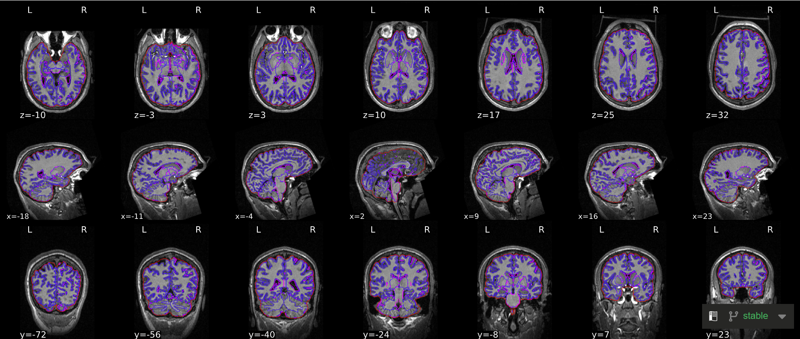

- **Spatial normalization of the anatomical T1w reference:** Results of nonlinear alignment of the T1w reference one or more template space(s). Hover on the panels with the mouse pointer to transition between both spaces.
    - Whether there are obvious defects or distortions in the brain.
    - The boundaries between gray matter, white matter, and gyrus are clear and stable.
    - Left-right symmetry is okay, and brain orientation is correct.

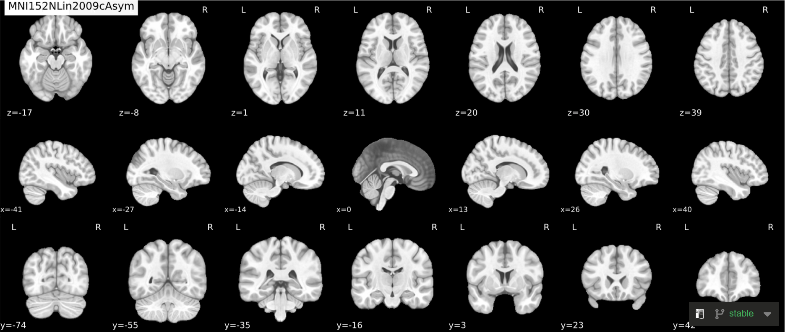

- **Surface reconstruction:** Surfaces (white and pial) reconstructed with FreeSurfer (recon-all) overlaid on the participant's T1w template.
    - Similar to segmentation, red lines and blue lines divide gray matter and white matter (but not including the cerebellum).

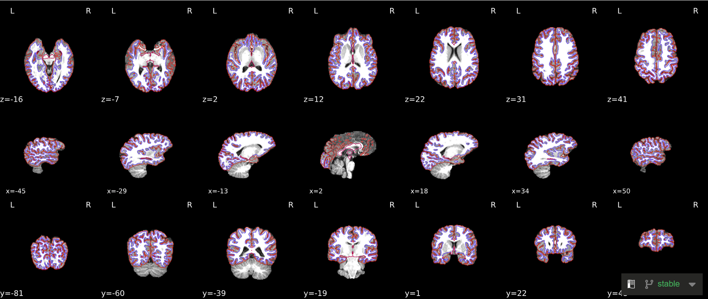

- **B0 field mapping:** Preprocessed estimation by nonlinear registration to an anatomical scan (“fieldmap-less”).
- **Alignment between the anatomical reference of the fieldmap and the target EPI:** The estimated fieldmap was aligned to the corresponding EPI reference with a rigid-registration process of the fieldmap reference image, using antsRegistration. Overlaid on top of the co-registration results, the final BOLD mask is represented with a red contour for reference.
- **Susceptibility distortion correction (SDC):** Results of performing susceptibility distortion correction (SDC) on the BOLD reference image. The "distorted" image is the image that would be used to align to the anatomical reference if SDC were not applied. The "corrected" image is the image that was used.
- The purpose of bias field correction is to achieve better alignment between T2w and T1w. Therefore, [SDCflow](https://www.nipreps.org/sdcflows/master/methods.html#fieldmap-less-approaches) uses an artificially calculated magnetic field to estimate a field of nonlinear displacements that accounts for susceptibility-derived distortions.
    - After the previous bias field correction, co-registration improved: there were no sizable geometric deviations in the brain's limbic system, and the brain aligned better with the mask. Internally, the red line division will be more accurate.

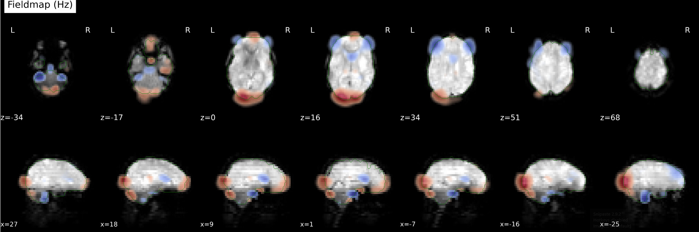
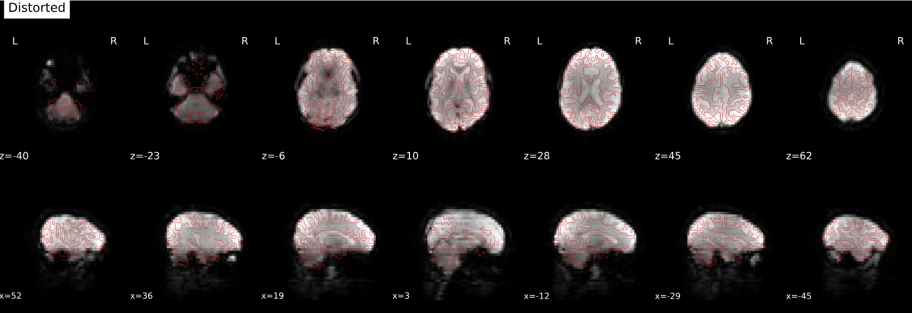


- **Brain mask and (anatomical/temporal) CompCor ROIs:** Brain mask calculated on the BOLD signal (red contour), along with the regions of interest (ROIs) used for the estimation of physiological and movement confounding components that can be then used as nuisance regressors in analysis. The anatomical CompCor ROI (magenta contour) is a mask combining CSF and WM (white-matter), where voxels containing a minimal partial volume of GM have been removed. The temporal CompCor ROI (blue contour) contains the top 2% most variable voxels within the brain mask. The brain edge (or crown) ROI (green contour) picks signals outside but close to the brain, which are decomposed into 24 principal components.
    - [CompCor](https://fmriprep.org/en/latest/outputs.html#confounds) is a PCA method that can detect noise patterns from the ROIs that are not likely to have signals related to neural activity, such as CSF and WM masks, which can be used for reducing noise in the post-analysis.
    - As stated above, the ROIs include an eroded white matter mask, an eroded CSF mask, and a combined mask derived from the union of these (magenta contour, inside the brain). The red contour represents the whole brain mask, as long as it correctly envelops the brain instead of severing brain regions. Because the blue contour contains the top 2% most variable voxels, [it normally should be areas with high CSF or blood flow, such as between the hemispheres, in ventricles, and between the cortex and the cerebellum.](https://github.com/transatlantic-comppsych/fmriprep_qa_guide?tab=readme-ov-file#brain-mask-and-temporalanatomical-compcor-rois) Last, green contour estimates noise from the brain’s outer edge (crown).

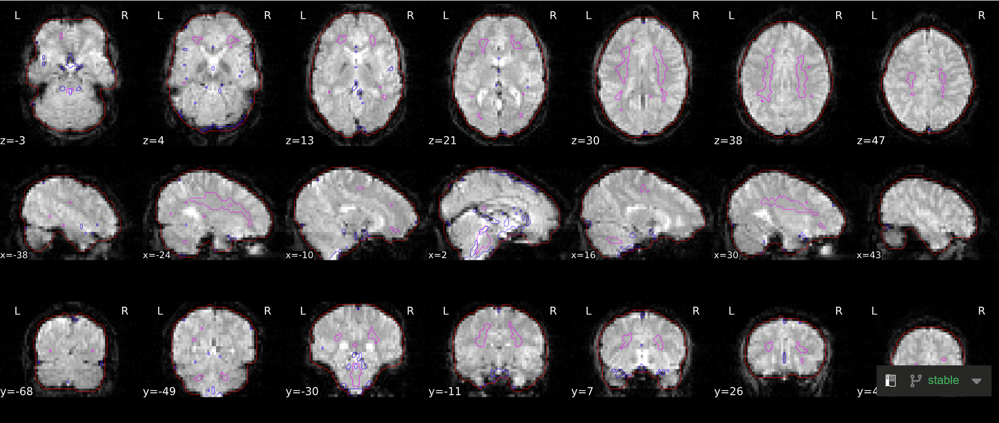

- **Variance explained by t/aCompCor components:** The cumulative variance explained by the first k components of the t/aCompCor decomposition, plotted for all values of k. The number of components that must be included in the model in order to explain some fraction of variance in the decomposition mask can be used as a feature selection criterion for confound regression.
    - The figure below shows the cumulative explained variance, for example, for white matter mask, around 30 components can explain 50% variance, and around 60 components can explain 70% variance. This provide reference for choosing the components to do denoise. Normally fmriprep will keep components that contributes to explaining the top 50 percent of variance.

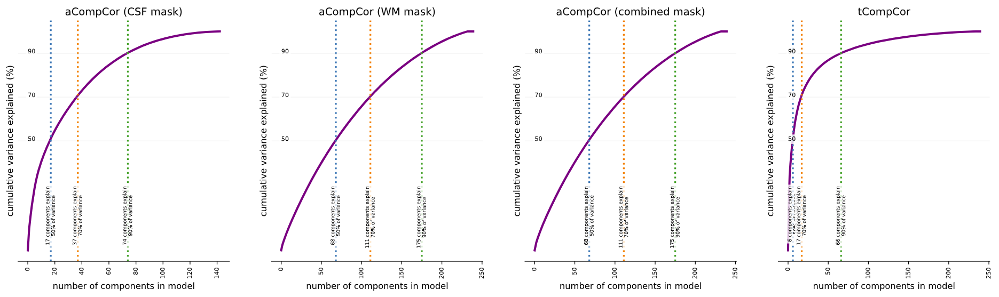

- **BOLD Summary:** Summary statistics are plotted, which may reveal trends or artifacts in the BOLD data. Global signals calculated within the whole-brain (GS), within the white-matter (WM) and within cerebro-spinal fluid (CSF) show the mean BOLD signal in their corresponding masks. DVARS and FD show the standardized DVARS and framewise-displacement measures for each time point. A carpet plot shows the time series for all voxels within the brain mask, or if --cifti-output was enabled, all grayordinates. See the figure legend for specific color mappings. "Ctx" = cortex, "Cb" = cerebellum, "WM" = white matter, "CSF" = cerebrospinal fluid. "d" and "s" prefixes indicate "deep" and "shallow" relative to the cortex. "Edge" indicates regions just outside the brain.
    - Global signal: global signal (GS), global signal of CSF (GSCSF), global signal of white matter (GSWM); motion: DVARS and framewise displacement (FD).
    - Typically, good line plots and carpet patterns should be uniform and smooth, meaning that there should not be too much head movement or other artifacts. Sudden changes in values, such as peaks, will appear vertically across both plots in the same column.
        - Line plots: big spikes or peaks related to motion, especially peaks in one single slice.
        - Carpet plot: abrupt changes that are related to motion, periodic modulations, but is not related to motion (could be respiration), and clustered rows (could be artifacts).
        - FD mean should ideally be less than 0.3 or 0.2 (typically required for resting-state data), but exclusion should be based on qualitative image assessment.

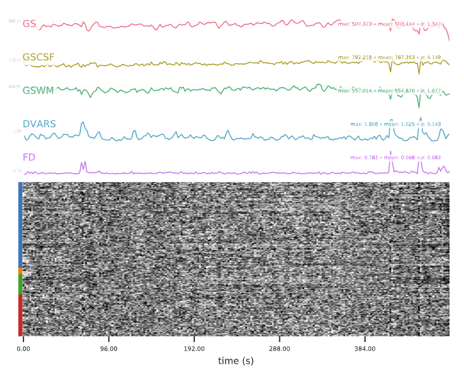

:::{tip} More Infomation
Provins, C., MacNicol, E., Seeley, S. H., Hagmann, P., & Esteban, O. (2023). Quality control in functional MRI studies with MRIQC and fMRIPrep. *Frontiers in Neuroimaging*, *1*, 1073734. https://doi.org/10.3389/fnimg.2022.1073734

Power, J. D. (2017). A simple but useful way to assess fMRI scan qualities. *NeuroImage*, *154*, 150-158. https://doi.org/10.1016/j.neuroimage.2016.08.009
:::

- **Correlations among nuisance regressors:** Left: Heatmap summarizing the correlation structure among confound variables. (Cosine bases and PCA-derived CompCor components are inherently orthogonal.) Right: magnitude of the correlation between each confound time series and the mean global signal. Strong correlations might be indicative of partial volume effects and can inform decisions about feature orthogonalization prior to confound regression.
    - The heat map on the left shows the correlations between different confound nuisance variables, while the bar chart on the right shows the correlations between the global signal and other confound nuisance variables. Hence, high correlation with the global signal can be viewed as a regressor and added in post-analysis. Altough high motion can cause to high correlation, if every component has high correlation with the global signal, then the dataset might have some issues…
    - `trans_x`, `trans_y`, `trans_z`, `rot_x`, `rot_y`, `rot_z` are the six rigid-body motion parameters, 3 translations and 3 rotation.
    - `t_comp_cor_XX` : temporal CompCor, computes for one time; `a_comp_cor_XX` : anatomical CompCor, computes for three times, generates `c_comp_cor_XX` and `w_comp_cor_XX`, which indicates an eroded white matter mask, an eroded CSF mask, and a combined mask derived from the union of these (`csf` and `white_matter` are the average signal).
    - You can find the confound variables in `func/desc-confounds_regressors.json` and `func/desc-confounds_regressors.tsv` and these variables can be used in the post-processing step. For more information, see: [https://fmriprep.org/en/stable/outputs.html#confounds](https://fmriprep.org/en/stable/outputs.html#confounds)

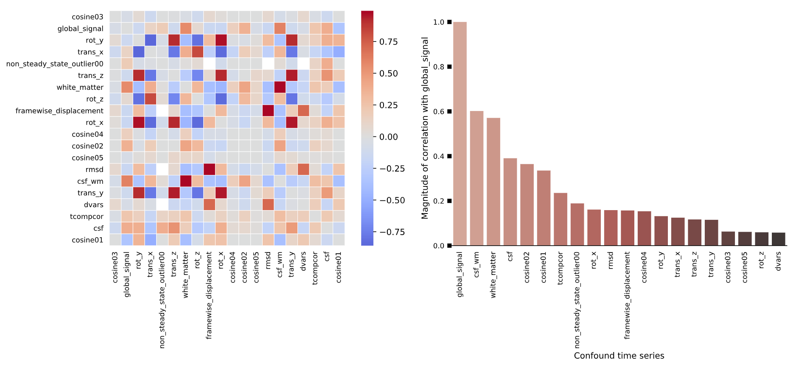

## Post-analysis (functional connectivity): XCP-D

```bash
#!/bin/bash

# Name of the job
#SBATCH --job-name=dorry_w2_rs_xcpd

# Partition on GACRC to run job
#SBATCH --partition=batch 

# Number of tasks
#SBATCH --ntasks=1

# Number of compute nodes
#SBATCH --nodes=1

# Number of CPUs per task
#SBATCH --cpus-per-task=16

# Request memory
#SBATCH --mem=64G

# save logs 
#SBATCH --output=/PATH/xcpd_log_array_%A-%a.out
#SBATCH --error=/PATH/xcpd_error_array_%A-%a.err

# Walltime (job duration)
#SBATCH --time=24:00:00

# Array jobs (* change the range according to # of subject; % = number of active job array tasks)
#SBATCH --array=1-2%20

participants=(1003 1004)

PARTICIPANT_LABEL=${participants[(${SLURM_ARRAY_TASK_ID} - 1)]}
BIDS_DIR=/PATH/fMRIPrep_derivatives/
OUTPUT_DIR=/PATH/derivatives_xcpd/
WORK_DIR=/PATH/sub-${PARTICIPANT_LABEL}/
CONTAINER=/PATH/containers/

echo "array id: " ${SLURM_ARRAY_TASK_ID}, "subject id: " ${PARTICIPANT_LABEL}

mkdir -p ${WORK_DIR}
mkdir -p ${OUTPUT_DIR}

singularity run \
                --cleanenv \
                -B $HOME:/home/xcp \
                --home /home/xcp \
                -B ${CONTAINER}:/resources \
                -B ${BIDS_DIR}:/data \
                -B ${WORK_DIR}:/work \
                -B ${OUTPUT_DIR}:/output \
        ${CONTAINER}/xcp_d-0.11.0rc1.sif /data /output \
        participant --participant_label $PARTICIPANT_LABEL \
        -w /work \
        --mode abcd \
        --dummy-scans 6 \
        --motion-filter-type notch \
        --band-stop-min 15 \
        --band-stop-max 25 \
        --nuisance-regressors 36P \
        --create-matrices all \
        --nprocs 4 \
        --omp-nthreads 4 \
        --write-graph \
        --fs-license-file /resources/.licenses/freesurfer/license.txt
```

## Resource and Reference

Lepping, R. J., Yeh, H., McPherson, B. C., Brucks, M. G., Sabati, M., Karcher, R. T., Brooks, W. M., Habiger, J. D., Papa, V. B., & Martin, L. E. (2023). Quality control in resting-state fMRI: The benefits of visual inspection. *Frontiers in Neuroscience*, *17*, 1076824. https://doi.org/10.3389/fnins.2023.1076824

Birn, R. M. (2023). Quality control procedures and metrics for resting-state functional MRI. *Frontiers in Neuroimaging*, *2*, 1072927. https://doi.org/10.3389/fnimg.2023.1072927

Provins, C., MacNicol, E., Seeley, S. H., Hagmann, P., & Esteban, O. (2023). Quality control in functional MRI studies with MRIQC and fMRIPrep. *Frontiers in Neuroimaging*, *1*, 1073734. https://doi.org/10.3389/fnimg.2022.1073734


Esteban, O., Ciric, R., Finc, K., Blair, R. W., Markiewicz, C. J., Moodie, C. A., Kent, J. D., Goncalves, M., DuPre, E., Gomez, D. E., Ye, Z., Salo, T., Valabregue, R., Amlien, I. K., Liem, F., Jacoby, N., Stojić, H., Cieslak, M., Urchs, S., . . .  Gorgolewski, K. J. (2020). Analysis of task-based functional MRI data preprocessed with fMRIPrep. *Nature Protocols*, *15*(7), 2186-2202. https://doi.org/10.1038/s41596-020-0327-3

Morfini, F. (2023). Functional connectivity MRI quality control procedures in CONN. *Frontiers in Neuroscience*, *17*, 1092125. https://doi.org/10.3389/fnins.2023.1092125

Behzadi, Y., Restom, K., Liau, J., & Liu, T. T. (2007). A component based noise correction method (CompCor) for BOLD and perfusion based fMRI. *NeuroImage*, *37*(1), 90-101. https://doi.org/10.1016/j.neuroimage.2007.04.042

[https://drive.google.com/file/d/1TMg9MRvBwZO8HB1UJmH0gm4tYaBVnvcQ/view](https://drive.google.com/file/d/1TMg9MRvBwZO8HB1UJmH0gm4tYaBVnvcQ/view)

[https://www.axonlab.org/hcph-sops/processing/qaqc-criteria-preprocessed/](https://www.axonlab.org/hcph-sops/processing/qaqc-criteria-preprocessed/)

[https://andysbrainbook.readthedocs.io/en/latest/OpenScience/OS/fMRIPrep_Demo_3_ExaminingPreprocData.html](https://andysbrainbook.readthedocs.io/en/latest/OpenScience/OS/fMRIPrep_Demo_3_ExaminingPreprocData.html)

[https://fmriprep.org/en/20.2.3/outputs.html](https://fmriprep.org/en/20.2.3/outputs.html)

[https://sites.brown.edu/cnrc-core/resources-and-help/](https://sites.brown.edu/cnrc-core/resources-and-help/)

[https://www.axonlab.org/frontiers-qc-sops/exclusion_criteria/](https://www.axonlab.org/frontiers-qc-sops/exclusion_criteria/)

[https://github.com/transatlantic-comppsych/fmriprep_qa_guide?tab=readme-ov-file](https://github.com/transatlantic-comppsych/fmriprep_qa_guide?tab=readme-ov-file)
