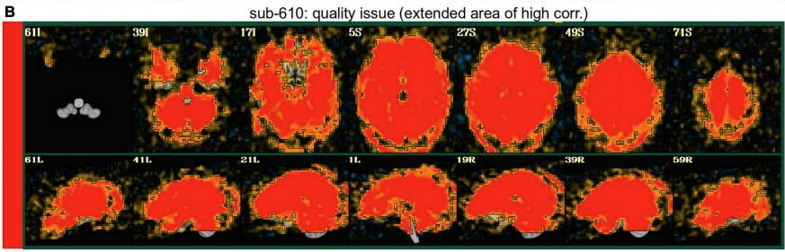
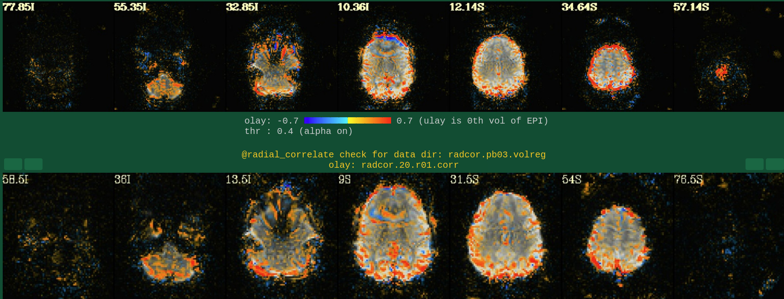
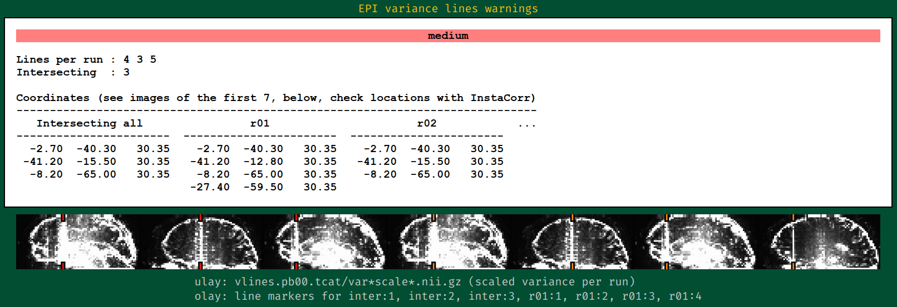
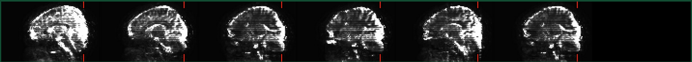
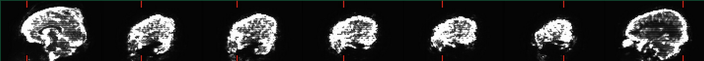
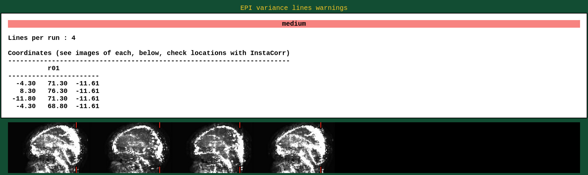
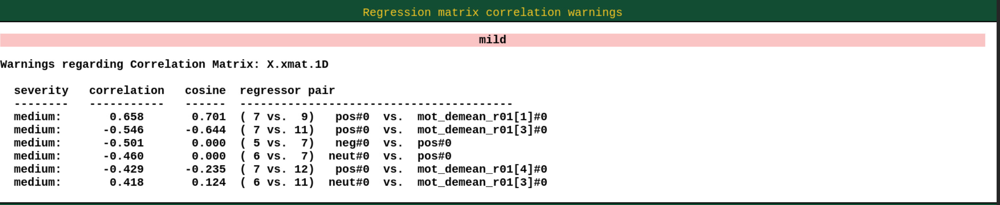

# Special Issues

## **Correct Uneven Brightness:** [3dUnifize](https://afni.nimh.nih.gov/pub/dist/doc/htmldoc/programs/alpha/3dUnifize_sphx.html#ahelp-3dunifize) and [3dLocalUnifize](https://afni.nimh.nih.gov/pub/dist/doc/program_help/3dLocalUnifize.html)

[3dUnifize](https://afni.nimh.nih.gov/pub/dist/doc/htmldoc/programs/alpha/3dUnifize_sphx.html#ahelp-3dunifize) and [3dLocalUnifize](https://afni.nimh.nih.gov/pub/dist/doc/program_help/3dLocalUnifize.html) can improve the results of alignment and segmentation by reducing the tissue contrast of the images. [3dUnifize](https://afni.nimh.nih.gov/pub/dist/doc/htmldoc/programs/alpha/3dUnifize_sphx.html#ahelp-3dunifize) is for structural images and [3dLocalUnifize](https://afni.nimh.nih.gov/pub/dist/doc/program_help/3dLocalUnifize.html) is for functional (EPI) images.

`sswarper2` has correct uneven brightness for users, you don’t need to do this step (but it is good to know this program).  `3dLocalUnifize` can be specifically used to reduce brightness inhomogeneity patterns and improve tissue contrast, further enhancing coregistration for human datasets (Reynolds et al., 2024). However, for non-human datasets, it is not recommended because nonbrain features in the field of view (FOV) can interfere with the processing results (Reynolds et al., 2024). To use `3dLocalUnifize` in preprocessing, add `-align_unifize_epi local` to `afni_proc.py`.

```bash
3dUnifize -prefix anat_correct.nii -input anat_brain.nii -gm -ssave bias_field.nii
```
Example:

https://youtu.be/LxApX0Ijg5w?si=miGD5AiBO3-XGq4w

### Reference and Resource

Reynolds, R. C., Glen, D. R., Chen, G., Saad, Z. S., Cox, R. W., & Taylor, P. A. (2024). Processing, evaluating and understanding FMRI data with afni_proc.py. *Imaging Neuroscience*, *2*, 1–52. https://doi.org/10.1162/imag_a_00347

[https://www.youtube.com/watch?v=LxApX0Ijg5w](https://www.youtube.com/watch?v=LxApX0Ijg5w)

## High Global Correlation across the Brain: Radcor

The whole brain volume correlates highly with the global average, suggestive of strong non-physiological signals remaining in the data:



If you don’t remove TRs this situation will appear as well….

The reasons why not removing the first few TRs (`-tcat removefirst trs 0`) may cause radcor to turn all red are mainly related to the effects of magnetization steady-state (if you don’t remove TRs AFNI will also report warning about pre-steady state) and head movement/non-brain signal contamination.

During an fMRI acquisition, the signal does not reach a steady state in the first few seconds because the radiofrequency field (RF) is still adjusting, and BOLD is not stable, which may result in a non-physiologically high correlation signal.

Radcor calculates the correlation between each voxel and the average brain-wide signal. At the beginning of the scan, the data may have uneven signal strength, especially in the CSF, scalp, or air regions, which may have high signal.  If the signals from the first few TRs are abnormal, they can affect the entire data, causing the correlation to become abnormally high at all points in time, which can result in a reddening of the radcor for the entire brain.


:::{note}
Steps to troubleshoot: 

1. Troubleshoot scanner problems (e.g. drift, bad coils, magnetic field problems.) 

2. check the head movement results.

3. Check the number of TSNR's (not too small, normally 150 is normal.) 

4. Look at the raw EPI data (usually only the head edges will be red because of head motion) and check `radcor.pb00.tcat`, `radcor.pb03.volreg` and `radcor.pb06.regress` folders in the QC output results one by one, as this is where radcor checks the whole-brain correlations after each preprocessing step. Once you notice a problem comes up in a particular step, then there may be an issue in the preprocessing step.
:::



If you find that it is the physiological data (such as CSF or large vessel signaling contamination) causes the problem, then you might consider using [**ANATICOR**](https://afni.nimh.nih.gov/pub/dist/doc/program_help/@ANATICOR.html) program and filtering the physiological metrics (note that you will need to have data that records physiological changes).

```bash
Add the ricor regressors to a normal regression-based processing
   stream.  Apply the RETROICOR regressors across runs (so using 13
   concatenated regressors, not 13*9).  Note that concatenation is
   normally done with the motion regressors too.

   To example #3, add -do_block and three -ricor options.

last mod date : 2009.05.28
keywords      : obsolete, physio, rest

afni_proc.py                                                         \
    -subj_id                 sb23.e5b.ricor                          \
    -dsets                   sb23/epi_r??+orig.HEAD                  \
    -do_block                despike ricor                           \
    -copy_anat               sb23/sb23_mpra+orig                     \
    -tcat_remove_first_trs   3                                       \
    -ricor_regs_nfirst       3                                       \
    -ricor_regs              sb23/RICOR/r*.slibase.1D                \
    -ricor_regress_method    across-runs                             \
    -volreg_align_to         last                                    \
    -regress_stim_times      sb23/stim_files/blk_times.*.1D          \
    -regress_stim_labels     tneg tpos tneu eneg epos eneu fneg fpos \
                             fneu                                    \
    -regress_basis           'BLOCK(30,1)'                           \
    -regress_est_blur_epits                                          \
    -regress_est_blur_errts

   Also consider adding -regress_bandpass.
```

### Reference and Resource

Jo, H. J., Saad, Z. S., Simmons, W. K., Milbury, L. A., & Cox, R. W. (2010). Mapping sources of correlation in resting state FMRI, with artifact detection and removal. *NeuroImage*, *52*(2), 571–582. https://doi.org/10.1016/j.neuroimage.2010.04.246

[https://cbmm.mit.edu/video/30-resting-state-instacorr-part-1-2](https://cbmm.mit.edu/video/30-resting-state-instacorr-part-1-2)

[https://discuss.afni.nimh.nih.gov/t/strange-radcor-output/6216/2](https://discuss.afni.nimh.nih.gov/t/strange-radcor-output/6216/2)

[https://discuss.afni.nimh.nih.gov/t/radcor-image-retains-noise-after-volreg/3022/4](https://discuss.afni.nimh.nih.gov/t/radcor-image-retains-noise-after-volreg/3022/4)

## EPI Variance Lines

AFNI team provides very detailed answers to assess EPI variance lines. In summary, if it's a solid straight line through the brain, then this is worrisome; but if it's a warning at the left and right ends of the brain, then this is likely a false positive. Also, there is no good way to fix this.

You can go to `${subj}.results/vlines.pb00.tcat` in the QC output directory and check the results:


Warnings with solid lines (concerning):



These are not concerning:





Attached are the discussion from AFNI team:
> “The variance line warnings can happen as **false positives** at times, which is why we include the visual check. **Edges of high variance can trigger a warning**. Indeed, having such vertical patches at the front is not indicative of any problem, but often leads to a warning.”
> 
> 
> “Variance lines are high variance voxels that span the brain mask from top to bottom. One possible cause of them is a device in the scanner room that is emitting "noise" at a specific frequency. That frequency might translate to a single voxel (or more), per slice. We try to detect this by looking for such high noise at single voxels across all slices, subject to a brain mask.
> 
> Only the first of those 5 images shows clearly what what we view as these high variance lines, **the solid vertical bars through the brain**. The other images are hard to say, and so would not imply any concern.
> 
> It is difficult (to fix the lines). Note that this is detected in the original space, before even volume registration. Noise at a frequency may correspond to a voxel location and have nothing to do with brain location. While this report helps to detect issues in already-acquired data, it is perhaps more useful in correcting problems at the scanner before too much data has been acquired. For example, this warning might suggest trying to remove an offending device from the scanner room.
> 
> Registration transformations would not only blur these lines (as would the blurring step itself :), but they would warp them, usually in a non-linear manner. Dealing with that would be a mess in final space, even for one subject, and it would vary across subjects. Even if the lines are in the same locations in orig space, they would be warped differently due to motion (every time point is warped differently) and all of the other alignment steps.
> 
> One can picture ways to (try to) mask this out, or possibly even mitigate the effects, but each would seem to come with its own set of issues to fight with.
> 
> So perhaps the conclusion is that if the problem does not seem too bad, just live with it, since these are old scans rather than ongoing ones. If there are just a few bad subjects out of many, perhaps you can afford to drop the ones that might dilute real results. If most of the subjects have this (which would be common if they were all acquired at a single scanner in a small time window), you will have to decide whether the scans are useful.”
> 
> "I suspect that that is a false positive for variance lines. Basically, there are just patches of high-variability there---we try to find only *narrow* lines of high variances, but larger regions can also get identified/highlighted, as well."

### Reference and Resource

[https://discuss.afni.nimh.nih.gov/t/output-warnings-by-sswarper-and-afni-proc/7154/3](https://discuss.afni.nimh.nih.gov/t/output-warnings-by-sswarper-and-afni-proc/7154/3)

[https://discuss.afni.nimh.nih.gov/t/epi-variance-line-warnings/6500](https://discuss.afni.nimh.nih.gov/t/epi-variance-line-warnings/6500)

Teves, J. B., Holness, M., Spurney, M., Bandettini, P. A., & Handwerker, D. A. (2023). The art and science of using quality control to understand and improve fMRI data. *Frontiers in Neuroscience*, *17*, 1100544. https://doi.org/10.3389/fnins.2023.1100544

[https://discuss.afni.nimh.nih.gov/t/questions-about-epi-variance-line-warnings/6529/2](https://discuss.afni.nimh.nih.gov/t/questions-about-epi-variance-line-warnings/6529/2)

[https://discuss.afni.nimh.nih.gov/t/relationship-between-epi-variance-line-warning-and-voxel-signal/7284](https://discuss.afni.nimh.nih.gov/t/relationship-between-epi-variance-line-warning-and-voxel-signal/7284)

[https://discuss.afni.nimh.nih.gov/t/why-do-epis-show-obvious-horizental-variance-lines/6879/14](https://discuss.afni.nimh.nih.gov/t/why-do-epis-show-obvious-horizental-variance-lines/6879/14)

Teves, J. B., Holness, M., Spurney, M., Bandettini, P. A., & Handwerker, D. A. (2023). The art and science of using quality control to understand and improve fMRI data. *Frontiers in Neuroscience*, *17*, 1100544. https://doi.org/10.3389/fnins.2023.1100544

## Regression Matrix Correlation Warnings

Some of the regression coefficients are moderately correlated, which may be due to excessive TRs removed by motion during the preprocessing stage. As long as the experimental design does not lead to a strong correlation between stimuli, we do not need to worry too much about the correlation of the regression. In addition, this warning may be encountered on the individual analysis, but we can disregard it as long as it doesn't affect the group analysis too much.



AFNI provides solutions to fix this issue:

> In the original analysis (Schonberg et al., 2012), the duration modulated regressors were made to be orthogonal to the average response regressors. This pre-modeling step alleviates the concern over such instability, while effectively merging the duration modulated responses into the average one. That could be done in AFNI by generating and orthogonalizing the duration-modulated regressors before giving them to afni_proc.py. Note that this pre-orthogonalization would affect the final model results (as the regressors themselves are changed) and have to be described in detail (e.g., the order in which regressors are orthogonalized changes their values).
> 
> FMRI processing with AFNI: Some comments and corrections on “Exploring the Impact of Analysis Software on Task fMRI Results”
Paul A. Taylor, Gang Chen, Daniel R. Glen, Justin K. Rajendra, Richard C. Reynolds, Robert W. Cox
bioRxiv 308643; doi: https://doi.org/10.1101/308643